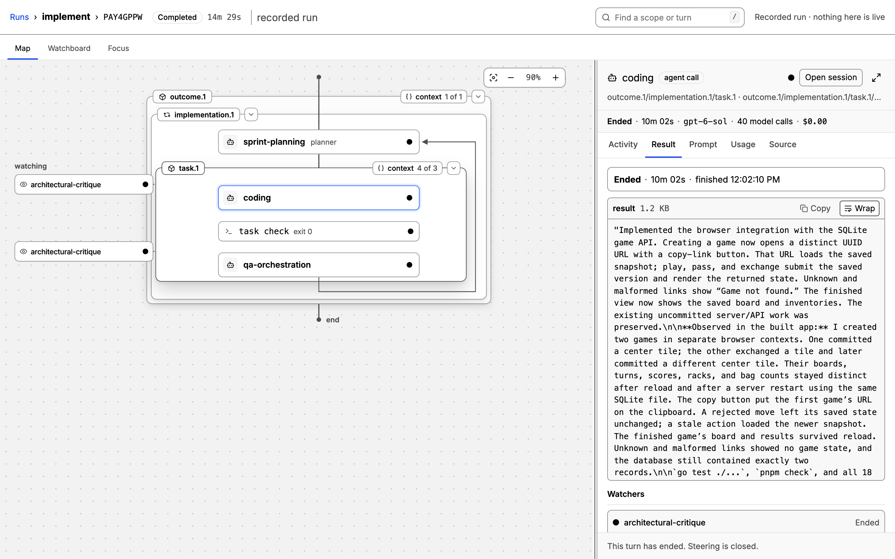

# Gimble

**Agent workflows that read like pseudocode.** Gimble is a Go runtime for
multi-agent workflows: write the workflow as a plain Go function, and Gimble
gives it scoped context, planner loops, supervision, and a live console, on
Codex, Claude Code, Antigravity, OpenCode, or your own harness.

[](https://tylergannon.github.io/gimble/)

- **[Live multi-agent console](https://tylergannon.github.io/gimble/docs/console/)** — watch every scope, turn, and command on one map; steer an agent, answer its questions, or stop it.
- **[Workflows that read like pseudocode](https://tylergannon.github.io/gimble/docs/workflows/)** — the whole process is one Go function, with prompts visible at the call site.
- **[Primitives for agent work](https://tylergannon.github.io/gimble/docs/primitives/)** — scoped context delivery, promise loops, supervision, and a graph read from your source.
- **[Curated roles, bound to models](https://tylergannon.github.io/gimble/docs/roles/)** — workflows name kinds of cognitive work; a run binds each to a harness, model, and effort.
- **[Built-in workflows](https://tylergannon.github.io/gimble/docs/built-in/)** — `implement`, `review`, `research-document`, and `pyramid-summary` from the command line.
- **[Any harness](https://tylergannon.github.io/gimble/docs/harnesses/)** — Codex, Claude Code, Antigravity, and OpenCode adapters ship in the box; five methods add another.

Start with the [quickstart](https://tylergannon.github.io/gimble/docs/quickstart/).
The public programming contract is the root package's Godoc and compiling
examples:

```sh
go doc -all github.com/tylergannon/gimble
```

The persistent instance starts the SvelteKit web application automatically.
It listens on loopback port 8080 by default; `web.WithPort`, `web.WithUDS`, and
`web.WithNoWeb` select another listener shape. Node is a build-time dependency
only.

## Build and run

This project uses Justfile for its build commands. It requires Go 1.27, Node 24,
pnpm 11, and just. From a source checkout:

```sh
just build
./bin/gimble
```

`just build` runs Go generation and the skgo/SvelteKit production build before
compiling the CLI. It checks for `web/build/skgo.manifest.json` and packages the
web app into `web/build.zip`, which the binary embeds. To install from a checkout,
run `go install ./cmd/gimble` after `just build`. Starting with v0.12.1, a
versioned `go install github.com/tylergannon/gimble/cmd/gimble@<version>` uses
the packaged web app and needs no frontend build at install time.

Then open http://127.0.0.1:8080. The page's heading, the Go version below it, and the
greeting counter all come from `web/src/routes/hello.remote.go` — the
`hello.remote.ts` beside it is generated and every one of its bodies throws, so
anything that renders is proof that Go answered.

For development, build once and run these in separate terminals:

```sh
just dev-web
just dev-go
```

## Run a workflow

Start an instance, then use the same build of the binary to submit a workflow
compiled into it:

```sh
./bin/gimble --instance-dir /tmp/gimble-instance --project /absolute/project
./bin/gimble run --help
./bin/gimble run <workflow> --help
./bin/gimble run review --instance-dir /tmp/gimble-instance --project /absolute/project --goal "Review the current changes" --follow
```

Run the first command in its own terminal. A start command admits its `--project`
repository on first use, even if the instance did not open it at startup;
`--instance-dir` holds instance control and discovery, separately from the
project's `.gimble/runs` and conversation files. Repeat `--project` to admit
more repositories at startup. Each generated subcommand calls its workflow's
typed SKGO Form endpoint, the same handler used by its generated browser binding.
A project has one active instance owner; a
second instance refuses it, including through a path alias. Different projects
can run on independently configured instances, and a project can reopen after
its owner exits. `--work-dir` controls execution independently of the owning
project and defaults to that project. `--follow` waits for the
terminal result. The instance executes the compiled body, owns live controls,
and uses its startup PATH, executables, and provider configuration. The CLI
does not send or execute a Go closure. A server build without that workflow
cannot run it.

The binary includes the `implement`, `review`, `validate-product`,
`research-document`, and `pyramid-summary` workflows. Each role's model defaults from
`cmd/gimble/defaults.json`; pass the role's flag, such as `--code-review`, to
override it.

Select the legacy OpenCode adapter with `opencode/<model-id>`, or name an
explicit OpenCode provider with `opencode/<provider>/<model-id>`. The same
forms work with `gimble run-prompt --model` and every workflow role-model flag:

```sh
gimble run-prompt --model opencode/ling-3.0-flash-fin-free "Reply exactly OK"
gimble run review --code-review opencode/opencode/ling-3.0-flash-fin-free --goal "Review the current changes."
```

The shared server starts on first use and remains running when a session
closes. `gimble opencode start` is idempotent; `gimble opencode stop` stops the
server and interrupts its active work. Runtime state defaults to
`~/.gimble/opencode`; set `GIMBLE_OPENCODE_DIR` for another default or pass
`--state-dir` to those lifecycle commands. Raw request, result, and SSE capture
files are under `<state-dir>/captures/` for correlating native events with
completed turns.

Workflow roles name cognitive work, not positions in a workflow. Gimble's
prescribed `WorkflowRole` constants and their descriptions live together in
`roles.go`; applications may define additional typed constants when they need
a role the catalog does not provide.

`go generate ./...` regenerates workflow graphs, the stock Form handlers and
CLI commands selected in `internal/builtin/workflows.go`, and the SKGO browser
and Go bindings. `internal/generate/gimblegen` emits workflow graph metadata;
`internal/generate/stockgen` emits the five built-in start entrypoints from one
selection.

The generated file also registers the workflow graph under the run's workflow
name. The run page requires that graph to match the recorded structure. After
changing a workflow's shape, regenerate it, rebuild the binary that serves the
project, and restart that binary; missing or stale generated graph code is
reported on the run page with those corrective steps instead of a graphless
history view.

The supported built-in authoring path is in this Gimble checkout. Add a package
under `internal/workflows/`, using `internal/workflows/review/` as the small
example. Give it an entry such as `func Name(ctx context.Context, env
gimble.Env, params NameParams) error` and a `//go:generate` directive for
`gimblegen`. For structured result types, add a `//go:build jsonschema` file
and Polytype generation as the review package does. Add the built-in to
`internal/builtin/workflows.go`; `go generate ./...` produces its graph, typed
Form handler, CLI command and Go client binding from that selection. The
handler calls the workflow directly and the CLI calls the matching generated
SKGO client. Rebuild and restart the instance with that binary. The graph's
registration comes from the generated file compiled into the instance.
An unknown role is required on the command line when
`cmd/gimble/defaults.json` has no default for it. The generator uses Gimble
internal packages and the application web build; generation in arbitrary
external Go modules and submitting an arbitrary closure are not supported
hosted paths.

Standalone `gimble.Run(gimble.Project(ctx, dir), ...)` executes in its caller's
process and writes durable state under `dir/runs`; it does not join a running
instance's live registry or controls. `gimble run-prompt` runs its own headless
runtime in the CLI process. Its logs default to a temporary directory; `--logs`
must name a fresh, empty directory. Both inherit the caller's environment,
not the hosted instance's environment. Keep these directories separate from
projects admitted to a running instance: concurrent shared-state use is not a
supported contract. Their records are local durable state, not live hosted
runs, even while an instance happens to be running elsewhere.

Use `Iterate(ctx, name, items)` to give each item in a finite slice its own
scope. Use `PromiseLoop(ctx, name, goal, planner)` and range over its `Tasks`
when a planner chooses work adaptively; check `Err()` afterward.

## Lint workflows

The distributed `gimble` binary also checks deterministic workflow authoring
mistakes:

```sh
./bin/gimble lint ./...
go vet -vettool="$(pwd)/bin/gimble" ./...
```

The second command is the direct Go vet-tool protocol path. A custom vet tool
replaces Go's ordinary analyzers for that invocation, so `just vet` first runs
ordinary `go vet ./...`, builds the same `bin/gimble`, and then runs
`bin/gimble lint ./...`.

Read the [lint rule reference](internal/gimblelint/rules.md) for the accepted
rules, diagnostics, rewrites, and analysis limits. The same text is printed by
`gimble lint -help` and is available at [docs/lint-rules.md](docs/lint-rules.md).

The runtime derives the public origin from the TCP listener, including when
port 0 selects an available port.

## Where things are

| | |
| --- | --- |
| `web/` | an ordinary SvelteKit app: kit's tooling, kit's conventions |
| `@skgo/sveltekit-adapter` | kit's adapter, an ordinary devDependency paired with the skgo version `go.mod` requires |
| `web/src/routes/*.remote.go` | server logic, colocated with the routes that call it |
| `web/src/routes/**/server.go` | ordinary Go HTTP handlers for SvelteKit `+server.ts` routes |
| `internal/skgo/` | skgo's generated Go implementation; never edited by hand |
| `cmd/gimble/` | the binary |
| `web/server.go` | the one composition the binary and any test both use |

Write a remote function by adding a Go function to a `*.remote.go` file beside
the route that needs it and marking it with `skgo.Query` or `skgo.Command`, then
run `just build`. skgo writes the `.remote.ts` module kit compiles, the
TypeScript types its callers see, and the Go registration the server mounts.

Write a server route with an ordinary `net/http` handler in `server.go` beside
the route and mark it with `skgo.GET`, `skgo.POST` or another HTTP method. The
same build gesture writes the throwing `+server.ts` stub Kit compiles and the Go
registration the server answers in both production and development.

## The listener

`web.NewRuntime` owns the project's runs and starts the web application before
it returns. TCP is loopback-only. A Unix-domain socket is removed when the
runtime context ends, and headless workflows use `web.WithNoWeb`.

## Development

`just build` once, then two terminals:

```sh
just dev-web   # vite, on 127.0.0.1:5173
just dev-go    # the Go server, rendering from vite's modules
```

`#lib` is a Node subpath import (`package.json` → `imports`), and TypeScript
resolves those without probing for extensions: write `#lib/model.ts`, not
`#lib/model`. Vite accepts both, so only the type check would tell you.

Go answers loads, remote functions and server routes in both modes. In
production the binary renders pages from the embedded frontend build. In
development it still renders each document in Go, using modules transformed by
Vite; modules, styles, static assets and HMR continue through to Vite.

## Browser acceptance

The Playwright-BDD suite in `e2e/` checks browser behavior. Build the application,
then run:

```sh
just build
just e2e
```

By default, Playwright starts `bin/gimble` with its embedded frontend on a free
port, waits for its listening address, and stops it after the suite. It uses the
existing build, so rebuild after changes. To check a server you have already
started, use `BASE_URL=http://127.0.0.1:8080 just e2e`; Playwright then leaves that
server running. The scenarios need a recorded run in the project's `.gimble/runs/`;
for a clean checkout, seed the existing test fixture first:

```sh
mkdir -p .gimble/runs/e2e-cancelled
cp internal/observation/testdata/cancelled-run.jsonl .gimble/runs/e2e-cancelled/run.jsonl
```

Each outcome leaves a screenshot under `e2e/screenshots/` so a successful run can
be inspected.
