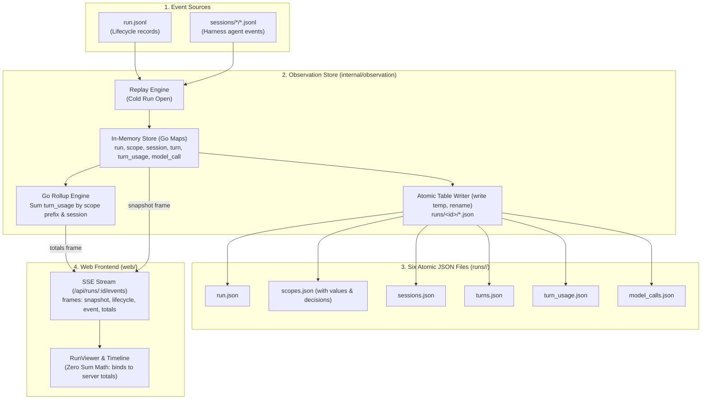

# Sprint Plan: The Run Store (Gemini Draft)

Drafted 2026-09-13 following the concentrated intent in `docs/sprints/drafts/RUN-STORE-INTENT.md`.

---

## Pyramid Index

- **L0**: Replace `observation.json` with a deliberate, file-based fact store of seven tables across six atomic JSON array files under `runs/<id>/`, unifying live and finished runs under one Go-calculated rollup engine and eliminating all sum math from the browser.
- **L1**:
  - **Seven Tables, Six Files**: Store facts, not aggregates (`run`, `scope`, `scope_value`, `decision`, `session`, `turn`, `turn_usage`, `model_call`). Persist them as six `jq`-greppable JSON files (`run.json`, `scopes.json`, `sessions.json`, `turns.json`, `turn_usage.json`, `model_calls.json`), atomically rewritten on row changes. Times are Unix ms integers.
  - **Single Path for Live and Replay**: In-memory store is Go maps of the seven tables. Finished runs replay the durable log (`run.jsonl` and session `.jsonl`) through the same store on open, rebuilding any missing table files automatically as a byproduct. `observation.json` and `checkpoint.go` are deleted.
  - **Server-Driven Rollups**: Prefix-containment rollups (tokens and stated costs per model per scope) run exclusively in Go over `turn_usage`. When a `turn_usage` row changes, the server broadcasts a `totals` frame. The browser implements zero sum rules.
  - **Placement Correction**: Turns are charged to the scope where they ran (`turn.scope`), decoupling turn execution from session creation (`session.scope`).
  - **Zero Bloat & No Proof Machinery**: No database, no message table, no new exported names in the root package `gimble`, and no ad-hoc reconcile scripts. Validation relies on manual `jq` one-liners and an unadorned cheap-tier proof run.
- **L2**:
  - Architecture: Table schemas (§ Table Schemas & JSON File Layout), Storage & Replay (§ Storage Engine & Replay on Open), Rollup Engine (§ Rollup Engine & SSE Protocol).
  - Implementation Plan: Phases 1 to 5 with explicit file targets and tasks.
  - Open Questions: Definitive recommendations for transcript loading, snapshot shapes, write cadence, and Go package layout.

---

## Overview

Today, Gimble's persistence for workflow observation relies on `observation.json`, an ad-hoc snapshot dumped at `Store.Close()`. As Tyler observed, `observation.json` is *"a name without a meaning, a file without a name, a data store that feels too improvised to really be able to work with it."* It accumulates aggregates, buries raw lifecycle facts, and fails to support clean relational queries or hierarchical rollups.

Furthermore, token accounting currently contains architectural deficiencies:
1. **Wrong Attribution Key**: `RunInfo.ScopeUsage` sums usage by `session.scope` (where the session was created) rather than `turn.scope` (where the work executed). Sessions created at the root and used across loop laps attribute all costs to the root.
2. **Brittle Live/Finished Divergence**: Live runs read in-memory maps while finished runs deserialize a static checkpoint. If the checkpoint is missing or corrupt, observation fails.
3. **Redundant Client-Side Math**: The browser attempts to mirror Go's accounting logic, leading to duplicate sum implementations and drift.

This sprint replaces `observation.json` with a structured, file-based fact store composed of **seven relational tables** written to **six JSON array files** under `runs/<id>/`. The store records atomic facts (scopes, sessions, turns, per-model turn usages, and individual model calls) with Unix ms timestamps. All rollups are computed on-the-fly by Go over `turn_usage` and streamed to the frontend. The log files (`run.jsonl` and `sessions/*.jsonl`) remain the durable source of truth: opening a finished run replays the log through the store, populating the in-memory maps and regenerating the table files if they are missing.



---

## Use Cases

### 1. Granular Fact Extraction via `jq`
A developer or validator inspects a finished run directly on the filesystem without launching a web server or database:
- Running `jq` over `turns.json` and `turn_usage.json` answers *"what were the total input and cache read tokens for model X inside scope `sprint.1/task.2`?"* with a single portable query.
- Table rows are self-contained and uniformly structured as JSON arrays.

### 2. Live Run Observation with Server-Streamed Totals
An operator watches a running multi-agent workflow in the browser:
- As turns progress and individual model steps end, the server recomputes per-scope and per-session totals over `turn_usage` and pushes a `totals` frame over SSE.
- The web UI immediately updates the run header and session cards without executing any aggregation loops or maintaining duplicate rollup state.

### 3. Accurate Scope Attribution (Placement Correction)
A long-running planner session created at the root (`session.scope = ""`) is dispatched to execute work inside child scopes `lap.1` and `lap.2`:
- Each turn's execution records `turn.scope = "lap.1"` or `"lap.2"`.
- Token expenditures in `turn_usage` are indexed by `turn`, ensuring usage rolls up into `lap.1` and `lap.2` by prefix match, rather than leaking to the root alone.

### 4. Self-Healing Cold Run Rebuild
An old run directory (such as `ephemeral/attest/issue-149`) containing only `run.jsonl` and session transcripts is opened:
- The store recognizes that table files are absent, replays the event logs through `Store.Lifecycle` and `Store.Event`, populates memory, and materializes all six `.json` table files to disk as a byproduct.
- The run page renders completely without errors.

### 5. Granular Model Call Auditing
An operator drills into an expensive turn that failed:
- `model_calls.json` contains the exact start/end timestamps, model, message ID pointer, and token usage for each individual step.
- Model calls remain discrete audit entries and are never rolled up, preventing double-counting with `turn_usage`.

---

## Architecture

### Table Schemas & JSON File Layout

All seven tables are defined as plain Go structs in `internal/observation`. Timestamps are normalized to integer Unix milliseconds (`int64`).

```text
run          id, name, status, error, started, ended
scope        run, key, name, status, error, task, began, ended
scope_value  run, scope, key, value
decision     run, scope, seq, body
session      run, id, name, adapter, model, scope, parent, created
turn         run, id, session, scope, prompt, output_type, result,
             error, interrupted, started, ended, duration
turn_usage   run, turn, model, input, cache_read, cache_write,
             output, reasoning, stated_cost
model_call   run, turn, message, model, input, cache_read, cache_write,
             output, reasoning, started, ended
```

The seven conceptual tables map to **six JSON files** in `runs/<id>/`:
1. `run.json`: Array containing the single run record `[RunRow]`.
2. `scopes.json`: Array of `ScopeRow` objects. Following Decision 2, each scope's associated `scope_value` and `decision` records are embedded directly within the scope's row:
   ```json
   [
     {
       "run": "20260913-120000.sample",
       "key": "sprint.1/task.2",
       "name": "task.2",
       "status": "ended",
       "error": "",
       "task": { "name": "build store" },
       "began": 1789320000000,
       "ended": 1789320015000,
       "values": { "output_path": "/tmp/out" },
       "decisions": [ { "seq": 1, "body": { "action": "proceed" } } ]
     }
   ]
   ```
3. `sessions.json`: Array of `SessionRow` objects.
4. `turns.json`: Array of `TurnRow` objects.
5. `turn_usage.json`: Array of `TurnUsageRow` objects. Written incrementally from steps and replaced wholesale by the harness report on `TurnEnded`.
6. `model_calls.json`: Array of `ModelCallRow` objects. One row per `session.step.ended` (or `session.step.failed` with cost and tokens).

### Storage Engine & In-Memory Representation

Within `internal/observation/store.go`, the `Store` struct maintains these tables as Go maps protected by `sync.RWMutex`:

```go
type Store struct {
    mu          sync.RWMutex
    id          string
    dir         string
    registry    *Registry
    
    // The Seven Tables
    run         RunRow
    scopes      map[string]*ScopeRow         // key -> ScopeRow
    sessions    map[string]*SessionRow       // session id -> SessionRow
    turns       map[string]*TurnRow          // turn id -> TurnRow
    turnUsage   map[string]map[string]*TurnUsageRow // turn id -> model -> TurnUsageRow
    modelCalls  []*ModelCallRow              // append-only log of model calls
    
    // Projections for transcript rendering (live and replayed)
    invocations map[string]*invocation
    subs        map[*Subscription]struct{}
    closed      bool
}
```

### Atomic File Persistence

Whenever a row changes in memory:
1. The table's rows are serialized to a temporary file: `filepath.Join(dir, tableName + ".json.tmp")`.
2. The temporary file is flushed and renamed atomically: `os.Rename(temp, target)`.
3. File writes occur outside the primary mutex lock to prevent blocking live event reduction.
4. Scale assumption holds: with tens of scopes and at most a few hundred turns, file sizes remain small (<100KB), making atomic renames take <0.5ms.

### Ingestion Rules

1. **Lifecycle Ingestion (`Store.Lifecycle`)**:
   - `RunStarted`: Populates `run.id`, `run.name`, `run.status = "running"`, `run.started`. Writes `run.json`.
   - `ScopeBegan`: Inserts or updates `ScopeRow` with `key`, `name`, `status = "running"`, `task`, `began`. Writes `scopes.json`.
   - `ScopeEnded`: Updates `ScopeRow` with `status = "ended"`, `error`, `ended`. Writes `scopes.json`.
   - `ValueSet`: Inserts key/value into the scope's `values` map. Writes `scopes.json`.
   - `PlannerDecision`: Appends decision into the scope's `decisions` slice. Writes `scopes.json`.
   - `SessionCreated`: Inserts `SessionRow` with `id`, `name`, `adapter`, `model`, `scope` (creation scope), `parent`, `created`. Writes `sessions.json`.
   - `TurnStarted`: Inserts `TurnRow` with `id`, `session`, `scope` (placement scope), `prompt`, `output_type`, `started`. Writes `turns.json`.
   - `TurnEnded`: Updates `TurnRow` with `result`, `error`, `interrupted`, `ended`, `duration`. Replaces all `turn_usage` rows for this `turn` with the harness's per-model report (or empty if zero). Writes `turns.json` and `turn_usage.json`. Triggers server totals recomputation and broadcasts `totals` frame.
   - `RunEnded` / `RunCancelled`: Updates `run.status`, `run.error`, `run.ended`. Writes `run.json`.

2. **Agent Event Ingestion (`Store.Event`)**:
   - `session.step.ended` (and `session.step.failed` with usage):
     - Appends a `ModelCallRow` to `modelCalls`. Writes `model_calls.json`.
     - Updates/inserts `TurnUsageRow` for `(turn, model)` with the step's tokens and cost. Writes `turn_usage.json`.
     - Triggers server totals recomputation and broadcasts `totals` frame.
   - Transcript projections: Folded into `invocations[turn].projection` exactly as today, preserving transcript rendering in `SessionTimeline.svelte`.
   - Provenance: Stored per message ID in the turn's invocation.

### The Sum Rule (Server-Side Rollup Engine)

All token and cost aggregations are derived **strictly from `turn_usage`**:
1. **Scope Usage**:
   $$\text{ScopeUsage}(S) = \sum \{ U \mid U \in \text{turn\_usage}, \text{inScope}(S, \text{turn}(U).\text{scope}) \}$$
   Where $\text{inScope}(S, \text{target})$ is true if $S = \text{""}$, $S = \text{target}$, or $\text{target}$ starts with $S + "/"$.
2. **Session Total**:
   $$\text{SessionUsage}(sid) = \sum \{ U \mid U \in \text{turn\_usage}, \text{turn}(U).\text{session} = sid \}$$
3. **Run Total**: Equivalent to $\text{ScopeUsage}(\text{""})$.

Whenever `turn_usage` changes (on step completion or turn end):
- Go recomputes `ScopeTotals` for all known scopes and `SessionTotals` for all known sessions.
- Go dispatches an SSE frame: `Frame{Name: "totals", Data: jsonMarshal(TotalsPayload)}`.
- The browser reducer receives `totals`, updates its reactive state, and re-renders.

### Replay on Open (Log Derivation)

`observation.json` is entirely eradicated.
When `Registry.Snapshot(id)` is requested for a cold (non-live) run:
1. `Registry` checks if the run is active in memory. If so, it returns `store.Snapshot()`.
2. If not active, `Registry` instantiates a `Store` for the run directory and invokes `store.Replay(ctx)`.
3. `store.Replay` reads `run.jsonl` using `runlog.Read` and invokes `store.Lifecycle`. It then reads each `sessions/<id>/*.jsonl` file and invokes `store.Event`.
4. As a natural byproduct of replaying the canonical logs:
   - All seven in-memory tables are fully populated.
   - All invocation projections are fully reconstructed.
   - Any missing or outdated JSON table files are atomically written to `runs/<id>/`.
5. The store returns the detached snapshot. Subsequent requests can be served directly from memory or reloaded without custom file parsers.

---

## Implementation Plan

### Phase 1: Storage Layer & Table Schemas (`internal/observation`)

Establish the seven table structures, atomic file persistence, and in-memory map representation.

**Files:**
- `internal/observation/tables.go` (new)
- `internal/observation/snapshot.go`
- `internal/observation/store.go`
- `internal/observation/tables_test.go` (new)

**Tasks:**
1. Define the row structs in `tables.go`: `RunRow`, `ScopeRow`, `SessionRow`, `TurnRow`, `TurnUsageRow`, `ModelCallRow`. Ensure all timestamps are `int64` (Unix ms).
2. Implement `writeJSONAtomic(dir string, filename string, data any) error` in `tables.go` (write to `.tmp`, sync, rename).
3. Extend `Store` in `store.go` with table maps (`scopes`, `sessions`, `turns`, `turnUsage`, `modelCalls`).
4. Implement the sum rule in `tables.go`:
   - `ScopeTotals(scope string) (Usage, map[string]Usage)`
   - `AllScopeTotals() map[string]ScopeTotals`
   - `AllSessionTotals() map[string]Usage`
5. Update `RunSnapshot` in `snapshot.go` to expose the tables, server-computed `Totals`, `SessionTotals`, and `Invocations`.
6. Write unit tests in `tables_test.go`:
   - Prefix match containment (`attempt.1` vs `attempt.10`).
   - Atomic file writer verification and `jq`-parseable array formatting.
   - Correct sum rule calculation over synthetic `turn_usage` rows.

### Phase 2: Runtime Ingestion & Wholesale Report Replacement (`internal/observation`, `run.go`)

Connect lifecycle records and native agent events to the new table store, enforcing the wholesale replacement rule for `turn_usage`.

**Files:**
- `internal/observation/store.go`
- `run.go`
- `internal/observation/store_test.go`

**Tasks:**
1. Update `run.go:observeLifecycle`:
   - Pass `TurnStarted` to `Store.Lifecycle` (capturing prompt, output type, started time).
   - Pass `TurnEnded` to `Store.Lifecycle` (capturing result, error, duration, interrupted, ended time, and harness model usage report).
2. In `Store.Lifecycle`:
   - Insert `TurnRow` on `TurnStarted`.
   - Update `TurnRow` on `TurnEnded` and replace all `turn_usage` rows for the turn with the harness report.
   - Persist modified tables atomically (`run.json`, `scopes.json`, `sessions.json`, `turns.json`, `turn_usage.json`).
3. In `Store.Event`:
   - Extract usage and model from `session.step.ended` and qualifying `session.step.failed` events.
   - Insert `ModelCallRow` and write `model_calls.json`.
   - Update `TurnUsageRow` and write `turn_usage.json`.
   - Publish `totals` SSE frame (`FrameTotals = "totals"`) to subscribers.
4. Update `store_test.go`:
   - Validate that a session created at root with a turn placed in `task.2` attributes usage to `task.2` and root, but not to sibling scopes.
   - Verify that step usage during turn execution is replaced wholesale by the harness turn report at turn end.
   - Verify that model calls record granular execution steps without double-counting.

### Phase 3: Log Replay & Elimination of `observation.json` (`internal/observation`, `run.go`)

Unify cold run loading and missing-file reconstruction by replaying the durable event logs through the store. Delete obsolete checkpoint machinery.

**Files:**
- `internal/observation/replay.go` (new)
- `internal/observation/registry.go`
- `internal/observation/checkpoint.go` (delete)
- `run.go`
- `internal/observation/replay_test.go` (new)

**Tasks:**
1. Implement `ReplayRun(ctx context.Context, dir string, registry *Registry) (*Store, error)` in `replay.go`:
   - Open a fresh `Store`.
   - Replay `run.jsonl` using `runlog.Read[LifecycleRecord]`, mapping each record through `Store.Lifecycle`.
   - Find all `sessions/<id>/*.jsonl` files and replay their agent records through `Store.Event`.
   - File writes happen as a natural consequence, materializing table files if they were missing.
2. In `Registry.Snapshot(id)`:
   - If not live, invoke `ReplayRun` to build the store in memory and return `store.Snapshot()`.
3. In `run.go`:
   - Remove `r.recordFailure("close observation", r.store.Close())`. `Store.Close()` now only closes subscriber channels and marks the store closed.
4. Delete `internal/observation/checkpoint.go`.
5. Write `replay_test.go`:
   - Replay `ephemeral/attest/issue-149/logs/runs/20260912-205306.issue-149/` (which has no table files).
   - Assert that all six table files are created on disk.
   - Assert that the resulting snapshot matches the expected turn and scope structure.

### Phase 4: Frontend Simplification & Remote Query Removal (`web/`)

Strip all token summing and rollup logic from the frontend. Bind the existing run page directly to server-provided totals.

**Files:**
- `web/src/lib/observation/index.ts`
- `web/src/lib/observation/RunViewer.svelte`
- `web/src/lib/observation/SessionTimeline.svelte`
- `web/src/routes/runs/[runID]/+page.svelte`
- `web/src/routes/runs/[runID]/usage.remote.go` (delete)
- `web/src/routes/runs/[runID]/usage.remote.ts` (delete)
- `web/src/lib/observation/index.test.ts`

**Tasks:**
1. In `web/src/lib/observation/index.ts`:
   - Update `RunSnapshot` to include `totals: Record<string, ScopeTotals>` and `sessionTotals: Record<string, Usage>`.
   - In `RunObservation.apply`, handle `{ type: 'totals', data: TotalsPayload }` by updating `this.totals` and `this.sessionTotals`.
   - Delete all client-side token summing helper functions (`rollup`, `contains`, manual scope reduction).
2. In `web/src/routes/runs/[runID]/+page.svelte`:
   - Replace the `scopeUsage` remote query with `snapshot.totals['']`.
   - Render run totals directly from `snapshot.totals['']`.
3. In `web/src/lib/observation/SessionTimeline.svelte`:
   - Bind session header totals directly to `observation.sessionTotals[sessionID]`.
4. Delete `web/src/routes/runs/[runID]/usage.remote.go` and `web/src/routes/runs/[runID]/usage.remote.ts`.
5. Run `svelte-autofixer` on modified Svelte files.
6. Update `web/src/lib/observation/index.test.ts` to test `totals` frame reception and verify zero client math.

### Phase 5: Verification & Proof Run

Validate the complete system end-to-end against all success criteria.

**Files:**
- `ephemeral/attest/run-store-proof/main.go` (temporary proof script)

**Tasks:**
1. Execute formatting and static analysis:
   - `just build`
   - `go test -count=1 ./...`
   - `go vet ./...`
   - `cd web && pnpm test`
   - `cd web && pnpm run check`
2. Run one cheap-tier live proof run (`claude-haiku-4-5-20251001`, `gpt-5.6-luna`, `gemini-3.8-flash-low`):
   - Create a session in a parent scope and execute turns in a child scope.
   - Run a `Group` of two concurrent candidate sessions.
3. Validate Success Criteria:
   - Inspect `runs/<id>/`: confirm presence of all six `.json` table files and complete absence of `observation.json`.
   - Run `jq` filter over `turns.json` and `turn_usage.json` to calculate scope tokens by hand; confirm it matches the web page.
   - Verify in the browser that the parent session's turns appear under the child scope and bill to the child scope.
   - Restart the server on the run directory; confirm the run page renders identically from cold reload.

---

## Files Summary

| File | Status | Description |
| --- | --- | --- |
| `internal/observation/tables.go` | **New** | Table row schemas (`RunRow`, `ScopeRow`, `SessionRow`, `TurnRow`, `TurnUsageRow`, `ModelCallRow`), atomic writer, and Go rollup engine. |
| `internal/observation/replay.go` | **New** | Replay engine using `runlog.Read` to rebuild memory maps and table files from raw logs. |
| `internal/observation/tables_test.go` | **New** | Unit tests for table schemas, atomic persistence, and prefix-containment sum rules. |
| `internal/observation/replay_test.go` | **New** | Replay tests asserting log reconstruction on cold runs (including issue-149). |
| `internal/observation/snapshot.go` | **Modified** | Updates `RunSnapshot` to expose table rows, server-calculated `Totals`, and `SessionTotals`. |
| `internal/observation/store.go` | **Modified** | Table map state, `Lifecycle` folding for turns, `Event` recording for model calls, and `totals` frame publishing. |
| `internal/observation/registry.go` | **Modified** | `Snapshot(id)` invokes `ReplayRun` for finished/cold runs instead of loading a checkpoint. |
| `internal/observation/checkpoint.go` | **Deleted** | Removed legacy `observation.json` serialization and loading. |
| `run.go` | **Modified** | Emits `TurnStarted` and `TurnEnded` in `observeLifecycle`; removes checkpoint flush on close. |
| `web/src/lib/observation/index.ts` | **Modified** | Updates types for table snapshots and `totals` frame; strips client-side rollup math. |
| `web/src/lib/observation/RunViewer.svelte` | **Modified** | Binds to server-provided totals; removes redundant local calculations. |
| `web/src/lib/observation/SessionTimeline.svelte` | **Modified** | Displays session totals directly from `observation.sessionTotals`. |
| `web/src/routes/runs/[runID]/+page.svelte` | **Modified** | Replaces `scopeUsage` remote query with `snapshot.totals['']`. |
| `web/src/routes/runs/[runID]/usage.remote.go` | **Deleted** | Obsolete remote query replaced by snapshot totals. |
| `web/src/routes/runs/[runID]/usage.remote.ts` | **Deleted** | Obsolete remote query client bindings. |
| `web/src/lib/observation/index.test.ts` | **Modified** | Tests `totals` frame handling and ensures absence of client rollup errors. |

### Files Explicitly Left Untouched
- **Harness Adapters**: `agy/`, `claude/`, `codex/` (normalization and ports untouched).
- **Core Event Grammar**: `events.go` (no modifications to event union).
- **Root Package API**: `gimble` root exports remain strictly unchanged (no new exported names).
- **Reducer Ports**: `internal/sessionstate/` and `web/src/lib/sessionstate/` (ports remain intact).
- **Tree and Cells**: `#173` remains deferred to the subsequent sprint.

---

## Definition of Done

Gated strictly against the success criteria in `docs/sprints/drafts/RUN-STORE-INTENT.md`:

1. **Six Table Files on Disk**:
   - Following a live run, `runs/<id>/` contains `run.json`, `scopes.json`, `sessions.json`, `turns.json`, `turn_usage.json`, and `model_calls.json`.
   - `observation.json` does not exist on disk.
2. **`jq` Greppability & Arithmetic Proof**:
   - Running `jq` over `turns.json` and `turn_usage.json` computes the tokens per model for any scope in a single filter pipeline.
   - The validator verifies the arithmetic by hand against the proof run.
3. **Run Page Parity (No Visual Regression)**:
   - The run page renders unchanged: run header shows root totals, scope list renders, session cards show session totals, and message transcripts stream live.
   - The header displays server-provided totals; `scopeUsage` remote query is completely removed.
4. **Placement Correction**:
   - A turn executed in child scope `lap.1` by a session created at root `""` records `turn.scope = "lap.1"`.
   - The turn's tokens in `turn_usage` are billed to `lap.1`, not to root alone.
5. **Cold Run Rebuild**:
   - Opening `ephemeral/attest/issue-149/logs/runs/20260912-205306.issue-149/` (which has no table files) succeeds, materializes all six `.json` table files, and renders the run page.
6. **Zero Browser Sum Math**:
   - Per-scope and per-session totals arrive via the `totals` SSE frame whenever `turn_usage` changes. The browser contains no prefix-matching or sum functions.
7. **Clean Verification Suite**:
   - `just build`, `go test ./...`, `go vet ./...`, `cd web && pnpm test`, and `cd web && pnpm run check` pass with zero errors.
   - One live proof run on the cheap tier (`claude-haiku-4-5-20251001`, `gpt-5.6-luna`, `gemini-3.8-flash-low`) is observed live and after restart.
   - No proof machinery, reconcile scripts, or fixture harnesses introduced.

---

## Risks & Mitigations

| Risk | Mitigation |
| --- | --- |
| **Disk I/O contention during rapid steps** | Atomic rewrites (`write temp, rename`) are fast (<0.5ms) and handled by the OS page cache. File writing runs outside the store lock. At a scale of tens of scopes and hundreds of turns, write contention does not occur. |
| **Step usage model differing from turn report model** | In-flight step tokens are recorded under the session's default model. When `TurnEnded` arrives, the harness's per-model report replaces `turn_usage` rows wholesale, ensuring the final accounting reflects provider truth. |
| **Large replay overhead on cold runs** | At our target scale, run logs and session transcripts total a few megabytes. Replaying in Go using `bufio.Scanner` completes in under 20ms—fast enough for an initial SSR page load. |
| **Accidental re-introduction of `observation.json`** | All references to `checkpoint.go`, `loadCheckpoint`, and `writeCheckpoint` are removed from the codebase and build graph. |
| **Drift between live and finished sum rules** | Live and finished runs read the exact same Go maps. The sum rule is defined once in `tables.go` and executed by Go in both scenarios. |

---

## Dependencies

- **Base Commit**: Main at `ad6f2f6` (incorporating OpenCode accounting #156 and scope snapshots #146).
- **Harness Credentials**: Valid local authentication for Codex (`gpt-5.6-luna`), Claude (`claude-haiku-4-5-20251001`), and Antigravity (`gemini-3.8-flash-low`).
- **Tooling**: Go 1.24+, Node 20+, pnpm, and `just`.

---

## Open Questions & Recommendations

### Question 1: Finished-run transcripts
> *The page needs a turn's transcript projection for a finished run. The projection is not a table. Two candidates: replay the whole log through the store on open (tables and projections in one pass, files rewritten as a byproduct, no loader) or load the table files and rebuild a turn's projection from the session log on demand. Say which is less code and why.*

**Recommendation: Replay the whole log through the store on open.**

**Rationale:**
Replaying the log on open is substantially less code:
1. **Zero loader machinery**: There is no need to write, test, or maintain six separate JSON deserializers to reconstruct table maps from disk.
2. **Zero on-demand projection slicing**: Rebuilding projections on demand requires index pointers into `sessions/*.jsonl`, custom byte-range readers, or lazy-loading RPCs between the frontend and server.
3. **Reuses existing store logic**: Replay simply passes `LifecycleRecord` to `Store.Lifecycle` and `AgentRecord` to `Store.Event`. The same reduction pipeline that handles live runs populates the in-memory tables and projections in a single pass.
4. **Natural self-healing**: Fulfills Decision 4 automatically: opening any run directory lacking table files (such as `issue-149`) generates them as a byproduct without a distinct "rebuild" code path.
5. **Scale**: For runs with tens of scopes and hundreds of turns, reading a few megabytes of JSONL in Go takes <20ms, negligible for an HTTP load.

---

### Question 2: The snapshot shape
> *What `RunSnapshot` becomes (the tables plus per-scope totals plus projections for live turns?), and what frames the browser receives, so `index.ts` shrinks rather than grows.*

**Recommendation: Expose tables, server totals, and invocation projections in `RunSnapshot`; stream a dedicated `totals` frame.**

**Rationale:**
1. **Snapshot Shape**:
   ```go
   type RunSnapshot struct {
       Run           RunRow                  `json:"run"`
       Scopes        map[string]*ScopeRow    `json:"scopes"`
       Sessions      map[string]*SessionRow  `json:"sessions"`
       Turns         map[string]*TurnRow     `json:"turns"`
       Totals        map[string]ScopeTotals  `json:"totals"`        // Keyed by scope path ("" for root)
       SessionTotals map[string]Usage        `json:"sessionTotals"` // Keyed by session ID
       Invocations   map[string]Invocation   `json:"invocations"`   // Projections for transcripts
   }
   ```
2. **Frames Received by Browser**:
   - `snapshot`: The full initial `RunSnapshot`.
   - `lifecycle`: Raw lifecycle events for status updates.
   - `event`: Native agent events for streaming live message deltas into `invocations`.
   - `totals`: Sent whenever `turn_usage` changes, delivering updated `{ totals, sessionTotals }`.
3. **How `index.ts` Shrinks**:
   - All token rollup functions, prefix containment matches, and `session.usage.updated` accumulators are deleted from `index.ts`.
   - The browser treats `totals` and `sessionTotals` as pure display state. `index.ts` becomes a lean reactive store that applies server frames directly without business logic.

---

### Question 3: Write cadence
> *Every row change rewrites its file. Is any file hot enough on a live run (model_calls on every step) that the write should be coalesced, and if so how, without a second code path.*

**Recommendation: Keep writes direct (synchronous atomic write outside the store lock); do not coalesce in v1.**

**Rationale:**
1. **Model call rates are physically bounded by LLM latency**: Model steps take 1 to 10 seconds of network I/O. Even with 3–5 concurrent sessions in a `Group`, the write rate to `model_calls.json` and `turn_usage.json` will not exceed 2 to 5 writes per second.
2. **OS page cache eliminates disk stalls**: An atomic rewrite of a 50KB JSON file takes ~0.2ms on modern SSDs.
3. **Avoids second code path**: Implementing debouncing timers or background flush workers introduces trailing-flush races at shutdown, potential data loss on crashes, and complex synchronization in tests.
4. Direct atomic writes (`write temp, rename`) are simple, reliable, and adhere strictly to the scale assumptions.

---

### Question 4: Where the tables live in Go
> *`internal/observation` grows the maps and the writer, or a sibling package owns rows and files while `observation` keeps the fold and the subscribers. Which is less to read.*

**Recommendation: Keep everything in `internal/observation` (e.g., in `tables.go` and `store.go`).**

**Rationale:**
Keeping the tables within `internal/observation` is strictly less to read:
1. **No package boundary ceremony**: Creating a sibling package (e.g., `internal/runstore`) requires duplicate type declarations, cross-package conversions, and coordination wrappers.
2. **Respects `AGENTS.md`**: The project rule explicitly states: *"No high-level wrappers of functionality that obscures the meaning of the code."* A sibling package would force `Store` to wrap `RunStore`.
3. **Codebase compactness**: `internal/observation` currently contains only ~1,100 lines of Go. Deleting `checkpoint.go` and adding `tables.go` and `replay.go` keeps the entire package under 1,500 lines—cohesive, easily searchable, and readable in a single sitting.
