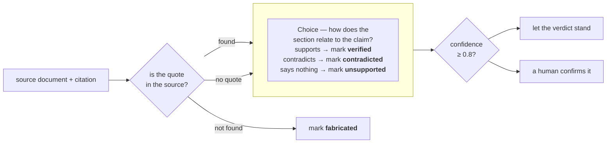

> ## Documentation Index
> Fetch the complete documentation index at: https://docs.typesafe.ai/llms.txt
> Use this file to discover all available pages before exploring further.

# Double-checking citations

> Catch wrong or hallucinated citations by checking against the source document. One TypeSafe Choice question decides whether the quote's context supports the claim, and its confidence can flag the citation for human review.

An LLM answers a question and attaches citations: for each claim, a section of a source
document and the quote it rests on. Some of those citations are wrong or hallucinated:
the quote can be missing from the document altogether, or sit in it word for word while
its context says the opposite of the claim.

Checking one by hand is slow: find the document, find the quote inside it, then read
enough of its context to tell whether it backs the claim up.

To automate that check, we first look for missing quotes with an ordinary string match,
and then we use a `Choice` question to read each surviving quote's context and decide
whether it supports the claim.



Below, eight citations from an LLM's answer about RFC 7519 (JSON Web Token) go through the
check. The four accurate ones came back `verified` at confidence 0.93 or higher. All four
planted failures were caught: a fabricated quote, a contradicted claim, and two unsupported
citations sent to a human.

`check_citation()`, the function you build here, takes a source document and one citation
and returns one of four verdicts: `verified`, `unsupported`, `contradicted`, or
`fabricated`. It also returns a confidence that flags the ones a human should look at.

## Setup

```bash theme={null}
pip install ipython "typesafe-sdk>=0.5.7" cooksafe --extra-index-url https://pypi.typesafe.ai/
```

then set `TYPESAFE_API_KEY`. Every API call is cached in `json_cache.json`, which ships
with the cookbook, so re-running replays the published numbers instead of calling the
API. Delete that file to run everything live.

Numbers below came from `jev-1.12` on 2026-08-16.

```python theme={null}
import json
import os
import re
from pathlib import Path
from time import perf_counter

from cooksafe import JsonCache, make_playground_link
from IPython.display import Markdown, display
from typesafe_sdk import Choice, TypeSafeClient

TYPESAFE_MODEL = "jev-1.12"
AUTO_ACCEPT = 0.8  # start high for more human review as you build trust in the model

client = TypeSafeClient(
    api_key=os.environ.get("TYPESAFE_API_KEY", "cache-only"),
    base_url=os.environ.get("TYPESAFE_ENDPOINT"),
    timeout=120.0,
)
json_cache = JsonCache(Path("json_cache.json"))
```

## Load the source and the citations

The source is [RFC 7519](https://www.rfc-editor.org/rfc/rfc7519.html) (JSON Web Token),
fetched from rfc-editor.org and committed next to this cookbook as `rfc7519.txt`. The code
below strips the page headers and footers, then splits the text into numbered sections.

The eight citations in `citations.json` were written by an LLM against the RFC. Four are
accurate; we edited the other four to fail the check.

```python expandable theme={null}
def load_source() -> str:
    """RFC 7519 verbatim, minus the page headers and footers that interrupt its paragraphs."""
    lines = []
    for line in Path("rfc7519.txt").read_text().splitlines():
        bare = line.lstrip("\f")
        if re.match(r"Jones, et al\.\s.*\[Page \d+\]$", bare):
            continue
        if re.match(r"RFC 7519\s+JSON Web Token \(JWT\)\s+May 2015$", bare):
            continue
        lines.append(bare)
    return re.sub(r"\n{3,}", "\n\n", "\n".join(lines))


def split_sections(source: str) -> dict[str, str]:
    """Map each numbered section ("4.1.3") to its text, split on the RFC's header lines."""
    boundary = re.compile(r"(?m)^(?:(\d+(?:\.\d+)*)\.  .+|Appendix [A-Z]\..*)$")
    marks = list(boundary.finditer(source))
    sections = {}
    for mark, nxt in zip(marks, marks[1:] + [None]):
        if mark.group(1) is None:  # an appendix header only terminates the section before it
            continue
        sections[mark.group(1)] = source[mark.start() : nxt.start() if nxt else len(source)].strip()
    return sections


SOURCE = load_source()
SECTIONS = split_sections(SOURCE)
CITATIONS = json.loads(Path("citations.json").read_text())

print(f"{len(SOURCE):,} characters, {len(SECTIONS)} numbered sections, {len(CITATIONS)} citations")
print("\nA citation with a quote:")
print(json.dumps(CITATIONS[1], indent=2))
print("\nA claim-only citation:")
print(json.dumps(next(c for c in CITATIONS if c["quote"] is None), indent=2))
```

```
58,365 characters, 45 numbered sections, 8 citations

A citation with a quote:
{
  "id": "aud_reject",
  "claim": "If a validator does not find itself in a token's audience list, it has to reject the token.",
  "quote": "If the principal processing the claim does not identify itself with a value in the \"aud\" claim when this claim is present, then the JWT MUST be rejected.",
  "section": "4.1.3"
}

A claim-only citation:
{
  "id": "iat_future",
  "claim": "The \"iat\" claim requires validators to reject tokens whose issue time is in the future.",
  "quote": null,
  "section": "4.1.6"
}
```

## Find each quote in the source

A quote that is not in the source is fabricated, and no model is needed to find that out.
Normalize whitespace and curly quotes so a quote still matches across the RFC's line
wraps, then look for it as a substring. A match also says which section the quote came
from, and that section is the text the model reads in the next step.

A citation can name a section without quoting anything from it. There is nothing to match
in that case, so take the section the citation names and go straight to the model.

```python theme={null}
def normalize(text: str) -> str:
    """Collapse whitespace and fold curly quotes, so a quote matches across line wraps."""
    table = str.maketrans({"“": '"', "”": '"', "‘": "'", "’": "'"})
    return re.sub(r"\s+", " ", text.translate(table)).strip()


def find_quote(sections: dict[str, str], quote: str) -> str | None:
    """The number of the section that contains the quote verbatim, or None."""
    needle = normalize(quote)
    for number in sorted(sections, key=lambda n: [int(p) for p in n.split(".")]):
        if needle in normalize(sections[number]):
            return number
    return None


def locate(sections: dict[str, str], citation: dict) -> tuple[str, str | None]:
    """Step 1 for one citation: a status, plus the section step 2 will read."""
    if citation["quote"] is None:
        return "section-only", sections[citation["section"]]
    number = find_quote(sections, citation["quote"])
    if number is None:
        return "missing", None
    return "found", sections[number]


for citation in CITATIONS:
    status, section = locate(SECTIONS, citation)
    where = f"section of {len(section):,} chars" if section else "not in the source"
    print(f"{citation['id']:<18}{status:<14}{where}")
```

```
epoch_seconds     found         section of 3,122 chars
aud_reject        found         section of 761 chars
sig_reporting     missing       not in the source
clock_skew        found         section of 529 chars
exp_required      found         section of 529 chars
pii_encryption    found         section of 1,653 chars
iat_future        section-only  section of 270 chars
duplicate_names   found         section of 918 chars
```

## Verify whether the source supports the claim

A citation that still has a quote at this point matches the source word for word. That is
not enough: the quote can be accurate and the claim built on top of it still wrong.
Deciding that takes the quote's context, the section step 1 found.

One `Choice` question per surviving citation covers the three ways a section can relate
to a claim.
The option with the highest probability is the verdict, and `AUTO_ACCEPT` (0.8 in the
code above) decides what happens to it:

* confidence at or above 0.8: the verdict stands on its own;
* below 0.8: a human confirms the verdict before anything acts on it.

Start high, and lower the threshold as you see how the model does on your own documents.

```python expandable theme={null}
QUESTIONS = {
    "relation": Choice(
        instructions="How does the section relate to the claim?",
        criteria={
            "supports": "The section states the claim or directly implies that it is true",
            "contradicts": "The section states the opposite of the claim or implies it is false",
            "says_nothing": "The section does not address what the claim asserts, either way",
        },
    ),
}

RELATION_TO_VERDICT = {
    "supports": "verified",
    "contradicts": "contradicted",
    "says_nothing": "unsupported",
}


@json_cache
def ask(claim: str, section: str) -> dict:
    started = perf_counter()
    response = client.system_one(
        state={"claim": claim, "section": section},
        questions=QUESTIONS,
        model=TYPESAFE_MODEL,
    )
    answer = response.answers["relation"]
    return {
        "choice": answer.choice,
        "probabilities": answer.probabilities,
        "confidence": answer.confidence,
        "seconds": round(perf_counter() - started, 2),
        "input_tokens": response.usage.input_tokens or 0,
        "output_tokens": response.usage.output_tokens or 0,
    }


def verdict(status: str, answer: dict | None) -> dict:
    """Fold step 1 and step 2 into one of the four labels, plus an auto-or-review flag."""
    if status == "missing":
        # confidence None: no model was called, so there is no model confidence to report
        return {"verdict": "fabricated", "confidence": None, "auto": True}
    return {
        "verdict": RELATION_TO_VERDICT[answer["choice"]],
        "confidence": answer["confidence"],
        "auto": answer["confidence"] >= AUTO_ACCEPT,
    }


def check_citation(sections: dict[str, str], citation: dict) -> dict:
    status, section = locate(sections, citation)
    answer = ask(citation["claim"], section) if section is not None else None
    return {"id": citation["id"], "status": status, "answer": answer, **verdict(status, answer)}
```

## Check every citation

All eight citations through the same check:

```python theme={null}
print(f"{'citation':<18}{'quote':<14}{'relation':<14}{'conf':>6}  {'verdict':<13}{'action':>7}")
for citation in CITATIONS:
    result = check_citation(SECTIONS, citation)
    answer = result["answer"]
    relation = answer["choice"] if answer else "-"
    conf = f"{answer['confidence']:.2f}" if answer else "-"
    action = "auto" if result["auto"] else "review"
    print(
        f"{result['id']:<18}{result['status']:<14}{relation:<14}{conf:>6}"
        f"  {result['verdict']:<13}{action:>7}"
    )
```

```
citation          quote         relation        conf  verdict       action
epoch_seconds     found         supports        0.93  verified        auto
aud_reject        found         supports        0.95  verified        auto
sig_reporting     missing       -                  -  fabricated      auto
clock_skew        found         supports        0.99  verified        auto
exp_required      found         contradicts     0.99  contradicted    auto
pii_encryption    found         says_nothing    0.27  unsupported   review
iat_future        section-only  says_nothing    0.56  unsupported   review
duplicate_names   found         supports        0.99  verified        auto
```

Four citations came back `verified`, one `fabricated`, one `contradicted`, and two
`unsupported`.

* `epoch_seconds`, `aud_reject`, `clock_skew`, and `duplicate_names` are the accurate four.
  All of them came back `verified` at confidence 0.93 or higher, well above `AUTO_ACCEPT`.
* `sig_reporting` never reached the model. Its quote is not in the RFC, so the string
  match alone marks it `fabricated`.
* `exp_required` quotes section 4.1.4 word for word, and the same section says "Use of
  this claim is OPTIONAL", so it is `contradicted`, at confidence 0.99.
* `pii_encryption` and `iat_future` came back `unsupported` at 0.27 and 0.56, both under
  the threshold, so both went to a human. `pii_encryption` shows why the string match is
  not enough on its own: its quote is in the source word for word, and the section it
  came from says nothing about the claim.

To point this at your own data, replace `rfc7519.txt` and `citations.json`.
`load_source()` and `split_sections()` are written for an RFC's layout, so a document of
another shape needs its own parsing.

The string match is exact after normalization: a quote that is truncated or lightly
reworded comes back as `fabricated`. A production system that tolerates sloppy quoting
would need fuzzy matching instead.

## Open it in the playground

The link holds one citation's claim and section, plus the question. Open it to run the same
call live in the browser.

```python theme={null}
example = next(c for c in CITATIONS if c["id"] == "exp_required")
_, example_section = locate(SECTIONS, example)
playground_link = make_playground_link(
    {"claim": example["claim"], "section": example_section}, QUESTIONS, models=[TYPESAFE_MODEL]
)
display(Markdown(f"🔗 [Open one citation's claim + section in the TypeSafe playground]({playground_link})"))
```

<a href="https://console.typesafe.ai/playground#share/N4IgJg9gxgrgtgUwHYBcAqCAeKQC4AEIwAOiFADYCGAlnKQaQKIBuCATgJ74BSA6mvjgwAzinzUkFGGAT5KSfFgAO1NpRTUICjYgDcc-CggBrZPgDu1FAAsIMMcUchlj0uOH4kEMc0rlqYAB0pAA0+KTCCFAaWvThIAAsgQCMgUn44U4uTvgAFIyYKmoxCmi0CACU+ADCVLSOSA0Z+GjWsq7OhR15yqrqmtrlVRQ0cOIyqNQAZtQIHjayvcUDhuX4scQKGRBsclMo7BbW1FDWhm08-PgAsgCqAMoCAHIA8gIARrKUUFAISgdgfBTHb4JRsaBzYQSADmgQyrQQTQyYIhwihSGh6ym53aWS6ORGtHwbAQAEcYKo5ud1Dj8LA2CTUPgwOoEAB6HSIzbNO6PfCffkIYEk2lLfpaZmsjlrfyiBCAiS0jrZNyEuDBTZI-AASTgSnICEQqHYHmuAEEAJqg8HMAKyYX4YQQRCOuB+cj4A0IcyUDhhEQwd1cLyCHayGzyLWUIHewQSexzMJGOQ-OxMh0UaDGR2mcxwnUoDy+cgwWS8j5fTzwT5sLVQLQoGhIGEGJ7wdgnAAirPwxdL+dukSx52oHjV7nwLwACmhtS8nmaADLBEAAXxAYRAKL1hYw2DwhBIIBJVBKcSPKA4SkRB9IpwgJxvYTvbCsHco54iMCUSh2hbipAIo6UQlI6jYHPMFzjiCYCUtE5BcLQ+qzJBNJWBOKBsKWoTxPWqBqLB0TCABIBAZE0QrKIrKQbIEA-hAUIHMOCx0nUYwgkh-hUuho5An4kQ4REvrCAA+l4NgwiRZEgSskBUuJchgGAJJokcNIseOlBouwhZhAgVhtLsPocKQq7PiAEiiFhFFaMRt4gAAEhA5jMhAVIseRoEnj2yYaWxAD8pnrpulAqAAaiaAwHiAzDJBuhCRAa0TytcEAyOQwgHgA2iAABWCDMAAtKkyQAEwgAAuquQA" target="_blank" rel="noreferrer" className="text-primary">Open one citation's claim + section in the TypeSafe playground →</a>
