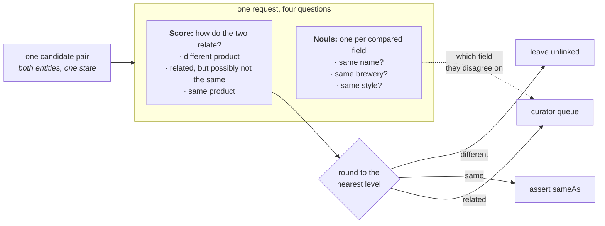

> ## Documentation Index
> Fetch the complete documentation index at: https://docs.typesafe.ai/llms.txt
> Use this file to discover all available pages before exploring further.

# Knowledge graph entity alignment

> Decides which of 450 candidate pairs from two beer catalogues describe the same product. One TypeSafe Score question carries the whole decision, because its three levels are the three things you can do with a pair: merge it, leave it unlinked, or hand it to a curator. There is no threshold to fit, and three Noul questions ride along in the same request to tell the curator which field the two sources disagree on.

*A key problem in knowledge graphs is deciding whether an incoming entity duplicates an
existing one, especially when natural language from disparate sources is all that's
available. Given potential duplicate pairs, a single TypeSafe `Score` decides
whether each pair is a duplicate, or whether it deserves a closer look from a curator.*

Suppose two data sources describe overlapping sets of the same things, and you need to
know which entry on one side is the same thing as which entry on the other. A knowledge
graph calls those entries *entities*, and holds the facts recorded about each. Some cheap
but rough first pass has already compared the two sources and picked out 450 pairs worth a
closer look. What remains is to make a judgment call on each pair.

Merging two entities inappropriately is the more expensive mistake, since every fact about
either entity now describes the merged one, and anything linked to either comes along too.
Undoing it later means working out which fact came from where. Missing a match only leaves
a duplicate, so the judgment call needs a third option: pairs that are neither safe to
merge nor safe to drop.

The judgment is a `Score` question with one level for each of the three outcomes:

* **different product** — leave the two entities unlinked
* **related, but possibly not the same** — hand it to a curator to decide
* **same product** — merge them

We use a Score question because we want to attach a semantic label, the score criteria,
directly to each outcome, including the middle outcome. A Noul question could accomplish
this indirectly through thresholding on its output instead, and a Choice question would
lose the ordered relationship of the three outcomes.

Next, for each field of the entity we want to consider, `Noul` questions about whether
those
fields match can ride along in the same request. These nouls provide more detailed
information for the curator, if the score lands neither in the "same product" nor
"different product" levels.

You end up with a `route()` that takes one candidate pair and returns one of the three
outcomes, with no threshold you had to fit to your own data.



## Setup

```bash theme={null}
pip install matplotlib ipython "typesafe-sdk>=0.5.7" cooksafe --extra-index-url https://pypi.typesafe.ai/
```

then set `TYPESAFE_API_KEY`. Every call is cached to `json_cache.json`, which ships with
the cookbook, so re-rendering replays the published numbers without calling the API. Delete
that file to re-run everything live.

Numbers below came from `jev-1.12` on 2026-08-11.

```python theme={null}
import json
import os
from concurrent.futures import ThreadPoolExecutor
from pathlib import Path

import matplotlib
import matplotlib.pyplot as plt
from cooksafe import JsonCache, make_playground_link
from IPython.display import Markdown, display
from typesafe_sdk import Noul, Score, TypeSafeClient

matplotlib.use("Agg")  # headless render

TYPESAFE_MODEL = "jev-1.12"
MAX_WORKERS = 6  # small pool; the public endpoint rate-limits above roughly eight

client = TypeSafeClient(
    api_key=os.environ.get(
        "TYPESAFE_API_KEY", "cache-only"
    ),  # keyless kernels replay the cache
    base_url=os.environ.get("TYPESAFE_ENDPOINT"),
    timeout=120.0,
)
json_cache = JsonCache(Path("json_cache.json"))
```

## Load the candidate pairs

The pairs come from a published benchmark set, the Beer data from the Magellan collection:
two beer catalogues scraped from different websites, already cut down to 450 pairs by that
first rough pass. Each entity carries four fields: name, brewery, style, and alcohol
content. Each pair also carries `known_same_as`, the benchmark's own answer.

The text is left exactly as published, without pre-processing: HTML entities that were
never converted back to characters, apostrophes split off as separate words, a few
characters decoded wrongly.

One request goes out per pair, so what you spend follows the number of pairs you were
handed rather than the size of either source.

```python theme={null}
PAIRS = json.loads(Path("candidate_pairs.json").read_text(encoding="utf-8"))
BY_ID = {pair["id"]: pair for pair in PAIRS}

print(f"{len(PAIRS)} candidate pairs. The first one, as the model will see it:")
print(json.dumps({k: PAIRS[0][k] for k in ("entity_a", "entity_b")}, indent=2)[:420])
```

```
450 candidate pairs. The first one, as the model will see it:
{
  "entity_a": {
    "name": "C N Red Imperial Red Ale",
    "brewery": "Redwood Lodge",
    "style": "American Amber / Red Ale",
    "abv": "8.10 %"
  },
  "entity_b": {
    "name": "Kinetic Infrared Imperial Red Ale",
    "brewery": "Kinetic Brewing Company",
    "style": "American Strong Ale",
    "abv": "9.30 %"
  }
}
```

## Ask one Score question and three Noul questions per candidate pair

Both entities go into a single state, as `entity_a` and `entity_b`, so the questions are
about the *pair* and not about either side on its own. All four ride in one request.

The three level descriptions below are the entire decision: each level is one outcome.
There is no threshold constant anywhere in this file. You can also write these descriptions
before you have seen a single score, which is not true of a number you have to fit.

The middle level is the one worth writing carefully. Here it covers variants, special
editions, and names that could plausibly refer to either product, so those reach a curator
instead of being merged or dropped.

`OUTCOME` names the three outcomes. The merge outcome is called `assert sameAs` because
`sameAs` is the standard way to record that two entities are the same thing, and writing
one is how the merge actually happens.

Three of the four fields get a `Noul` question: name, brewery, and style. Alcohol content
gets none, because comparing two numbers is arithmetic; compute it in code if you want it.
To use this on another kind of data you rewrite `QUESTIONS` and `LEVELS`. The only other
code that knows about beer is the two functions that print results, which name the fields.

```python expandable theme={null}
LEVELS = [
    "They describe two different products.",
    "They describe closely related products that may or may not be the same one: "
    "a variant, a special edition, or a name that could plausibly refer to either.",
    "They describe one and the same product.",
]
OUTCOME = {0: "leave unlinked", 1: "curator queue", 2: "assert sameAs"}

QUESTIONS = {
    "link_state": Score(
        instructions="How do the two entity descriptions relate as products?",
        criteria=LEVELS,
    ),
    "same_name": Noul(
        instructions="Do the two entities state the same beer name?",
    ),
    "same_brewery": Noul(
        instructions="Are the two entities from the same brewery?",
    ),
    "same_style": Noul(
        instructions="Do the two entities describe the same beer style?",
    ),
}


@json_cache
def score(pair_id: str) -> dict:
    """One request about one candidate pair -> the score plus the three noul answers."""
    pair = BY_ID[pair_id]
    response = client.system_one(
        state={"entity_a": pair["entity_a"], "entity_b": pair["entity_b"]},
        questions=QUESTIONS,
        model=TYPESAFE_MODEL,
    )
    link = response.answers["link_state"]
    return {
        "score": link.score,
        "probabilities": link.probabilities,
        "confidence": link.confidence,
        "properties": {
            k: response.answers[k].noul for k in QUESTIONS if k != "link_state"
        },
        # tokens and requests are the durable units; don't cache a derived cost
        "input_tokens": response.usage.input_tokens or 0,
        "output_tokens": response.usage.output_tokens or 0,
    }


def route(score_value: float) -> str:
    """The whole decision rule: the nearest level names the outcome."""
    return OUTCOME[min(int(score_value + 0.5), len(LEVELS) - 1)]


def show(pair_id: str) -> None:
    pair, result = BY_ID[pair_id], score(pair_id)
    print(
        f"{pair_id}  score {result['score']:.2f}  confidence {result['confidence']:.2f}"
        f"  ->  {route(result['score'])}"
    )
    for side in ("entity_a", "entity_b"):
        e = pair[side]
        print(f"    {e['name'][:44]:<46}{e['brewery'][:30]:<32}{e['style'][:22]}")
    nouls = result["properties"]
    print(
        f"    name {nouls['same_name']:.2f}   brewery {nouls['same_brewery']:.2f}   "
        f"style {nouls['same_style']:.2f}"
    )
```

Four pairs. `c446` is one product and `c427` is two. The other two land in the middle level
for different reasons: `c100` has the same name and brewery but the sources word its style
differently, while `c428` pairs a beer with a fruit-and-hop variant of it.

```python theme={null}
for pair_id in ("c446", "c427", "c100", "c428"):
    show(pair_id)
    print()
```

```
c446  score 1.94  confidence 0.92  ->  assert sameAs
    Thomas Hooker Old Marley Barleywine           Thomas Hooker Brewing Company   American Barleywine
    Thomas Hooker Old Marley Barleywine           Thomas Hooker Brewing Company   Barley Wine
    name 0.97   brewery 0.99   style 0.81

c427  score 0.03  confidence 0.95  ->  leave unlinked
    Frost Quake Bourbon Barrel Aged Barley Wine   Wellington County Brewery       American Barleywine
    Lompoc Bourbon Barrel Aged Proletariat Red A  Lompoc Brewing                  Amber Ale
    name 0.02   brewery 0.09   style 0.08

c100  score 1.30  confidence 0.27  ->  curator queue
    Belle Gueule Rousse                           Brasseurs R.J.                  American Amber / Red A
    Belle Gueule Rousse                           Brasseurs RJ                    Amber Lager/Vienna
    name 0.95   brewery 0.94   style 0.35

c428  score 1.10  confidence 0.77  ->  curator queue
    Ambleside Amber Ale                           Bridge Brewing Company          American Amber / Red A
    Bridge Ambleside Amber Ale - Pomegranate & G  Bridge Brewing Company          Amber Ale
    name 0.63   brewery 0.98   style 0.74
```

## Route every candidate pair

```python expandable theme={null}
# 450 candidate pairs, one request each; a small pool keeps a live run to a few minutes.
with ThreadPoolExecutor(max_workers=MAX_WORKERS) as pool:
    scored = list(pool.map(lambda pair: score(pair["id"]), PAIRS))

scores = [result["score"] for result in scored]
by_outcome: dict[str, list[str]] = {name: [] for name in OUTCOME.values()}
for pair, s in zip(PAIRS, scores):
    by_outcome[route(s)].append(pair["id"])

SURFACE, INK, INK2, MUTED = "#fcfcfb", "#0b0b0b", "#52514e", "#898781"
GRID, AXIS, BLUE, ORANGE = "#e1e0d9", "#c3c2b7", "#2a78d6", "#eb6834"

BINS, TOP = 20, len(LEVELS) - 1
counts = [0] * BINS
for s in scores:
    counts[min(int(s / TOP * BINS), BINS - 1)] += 1
centers = [(i + 0.5) / BINS * TOP for i in range(BINS)]
queued = [c if route(x) == "curator queue" else 0 for c, x in zip(counts, centers)]
settled = [c if route(x) != "curator queue" else 0 for c, x in zip(counts, centers)]

fig, ax = plt.subplots(figsize=(7.2, 3.6), facecolor=SURFACE)
ax.set_facecolor(SURFACE)
for side in ("top", "right"):
    ax.spines[side].set_visible(False)
for side in ("left", "bottom"):
    ax.spines[side].set_color(AXIS)
ax.tick_params(colors=MUTED, labelcolor=INK2, labelsize=9)
ax.set_axisbelow(True)
ax.grid(axis="y", color=GRID, linewidth=0.8)
ax.bar(
    centers, settled, width=TOP / BINS * 0.9, color=BLUE, label="settled automatically"
)
ax.bar(
    centers, queued, width=TOP / BINS * 0.9, color=ORANGE, label="sent to the curator"
)
for edge in (0.5, 1.5):
    ax.axvline(edge, color=INK2, linewidth=1, linestyle="--")
ax.set_xticks([0, 0.5, 1, 1.5, 2])
ax.set_xticklabels(["0\ndifferent", "0.5", "1\nrelated", "1.5", "2\nsame"])
ax.set_xlabel("score for the pair", color=INK2, fontsize=9)
ax.set_ylabel("candidate pairs", color=INK2, fontsize=9)
ax.set_title(
    f"{len(PAIRS)} candidate pairs, scored once each",
    loc="left",
    color=INK,
    fontsize=11,
)
ax.legend(frameon=False, labelcolor=INK2, fontsize=9)
display(fig)
plt.close(fig)

for name in ("assert sameAs", "curator queue", "leave unlinked"):
    n = len(by_outcome[name])
    print(f"{name:<16}{n:>5}  ({n / len(PAIRS):>5.1%})")
```

```
assert sameAs      40  ( 8.9%)
curator queue      50  (11.1%)
leave unlinked    360  (80.0%)
```


The two score values where `route()` changes its answer are the cut points. Most pairs
settle: 360 score below the lower cut point and 40 above the upper one, leaving 50 for the
curator.

On this set the scores do not sit neatly on the whole numbers. Most land near 0.25. Two
beers with nothing in common might still share a style name, and their brewery names might
look alike, so the model gives the middle level some of its probability instead of none.
What decides a pair is which side of a cut point it falls on. How near it sits to a level
does not enter into it.

The two cut points are not equally crowded. Nine pairs sit within 0.1 of the upper one, at
1.5, which is the one deciding what gets merged into the graph. Forty-seven sit that close
to the lower one, at 0.5, which only decides whether a curator sees the pair. Neither
number is something you tune. Both follow from how you worded the levels, and the wording
of the middle level is what moves pairs between the curator and the pairs left unlinked.

## Open it in the playground

The playground link below opens `c428`, which scored 1.10 and went to the curator.
It pairs *Ambleside Amber Ale* with *Bridge Ambleside Amber Ale - Pomegranate & Galena
Hops*: same brewery, same alcohol content. All four questions come with it.

```python theme={null}
playground_link = make_playground_link(
    {"entity_a": BY_ID["c428"]["entity_a"], "entity_b": BY_ID["c428"]["entity_b"]},
    QUESTIONS,
    models=[TYPESAFE_MODEL],
)
display(
    Markdown(
        f"🔗 [Open this pair + questions in the TypeSafe playground]({playground_link})"
    )
)
```

<a href="https://console.typesafe.ai/playground#share/N4IgJg9gxgrgtgUwHYBcAqCAeKQC4AEIwAOiMigJYoCeA+gIakEkhL2JP6kCCcARgBsEAZwpgE+XnwQAnSUNIAaLiD4yEAd1nVOpAEIyxAcwkHNFJEfwBhCHAAO9JDpDLSwmgrwresilCdJfll8AHp8ACUEMHkEJRV6PgA3XRAAVgA6AGYABnwAUlIAXzcyVCo6Pk4WNg5vfUMwEyDBETEJKRDuIXwAWnwABTsEIxknehQJADJ8AHF6ITZ8AAkIe2F40jVNbVSDY1N1DQsrWwcnF1KPai8CHmC5brjXBOTUzNyC4qKXkHsZOz2FDCDDYbxEUgCCwAa1oHgmz2YpBo9kRKmEUAg6k2ICghkmhkY3gA2qQ0AALBDUfDiDGGaT4FAaCA0igAMzZsnI+H+EDAMCgwIyOIpVJpIjxFAZUAEEGECAE1PUAgRMV5-MFwkZ5Im+Dg9GpWL1BvwSAgKHwDJQlPwwnYEggSAQBHo+CS9EJqGUruEqKgFAW+GiVAojuURtdtQk1t1mJgAjVKpgokESoQnLkKBZCColJkwpeZMp1NpkoZjokThi1okdsQPIBGpQBYAuqULB4ZALKI6NvUQKsNDSWTXGcyg+UaOK6RQgaGkFrlQj8PQteru8IAPzFK722hR6rI6io1Jm+M4jsoLuC+d9u4gAAiI5tTOzk4oIltKGXo7rEmkIRRtuIAlOie7bFoMguEiIAomipBngIF4Lle3a3qk3DqNq0bjuQIafmyAJwNhtr2paRzaMBoHuHu1y3PgLBwaeEDnoWICXtePYLqkT4ka+E6UJQn6lvS0Y2n+loICEdEIFRPzKCA9D2BQABqsiiI64JJAAjL88pCIK0QALJ8gqwgkiAABWCBJL02kZNpABMIAtkUQA" target="_blank" rel="noreferrer" className="text-primary">Open this pair + questions in the TypeSafe playground →</a>
