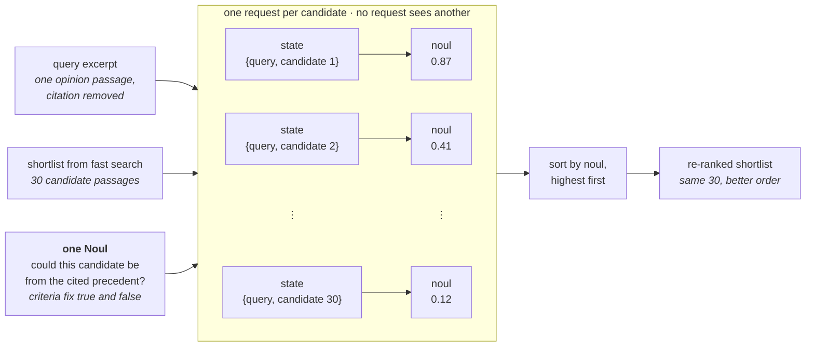

> ## Documentation Index
> Fetch the complete documentation index at: https://docs.typesafe.ai/llms.txt
> Use this file to discover all available pages before exploring further.

# Re-ranking

> Builds 30-passage BM25 shortlists for 40 CLERC legal queries, then uses one TypeSafe question per query-candidate pair to raise top-1 accuracy from 5% to 18% and top-10 accuracy from 38% to 62%.

You have thousands of documents, and you need to find the one that answers a specific
question. So how do you find it?

First, use a quick method such as keyword matching to cut those thousands of candidates
down to a shortlist of plausible ones. We call this fast search.

Fast search is good at that, but it can't tell you which candidate on the shortlist is
correct. That's where re-ranking comes in. It scores every candidate on the shortlist
against the query directly, and puts the best one first.

Both steps run below on 3,565 court opinion passages from the CLERC dataset: BM25 builds a
fast search shortlist of 30 candidates for each of 40 queries, then TypeSafe re-ranks each
shortlist. With re-ranking, the correct passage lands in first place for 18% of queries, up
from 5% with fast search alone.

**Along the way, you're going to learn:**

* What fast search does, and why it isn't the whole answer
* What re-ranking is, and how it fits after a fast search step
* How TypeSafe scores one candidate against a query, and how much that improves the result

## Try it yourself

[Open a query, candidate, and re-ranking question in the TypeSafe Playground](https://console.typesafe.ai/playground#share/N4IgJg9gxgrgtgUwHYBcAqCAeKQC4AEIwAOiAI4wIBOAngPpZTUAOKpBpUANgIYCWcfADMIVfADc+EXiilIAzvghD8AaWQoYUANY18UPpK75mVaAjAwqCADT4UACwR6h-Yygj55KHigT4efV4BfBhmCCR8AHcHPigHfGsuPgQVKB5IgCN-AHMqDL8wADp8NCd8AFk+bUVIfCQIFHw+MA0+IRpAFAIMsCUrRIR5BB4qePxIQfrGgfFhrm79HhghpRUeKFkI4VEJKRk5RWU1DS1dfUM+YwByEzMmS2sSitEECFmqOwAxazAwFMr1tEeIoGk1AswRig9B57OURNZuBB5FZ-OtNpEeoskKD8Nl8E4uL1rPJwgo+JkuP54QEkHpTOYHjxjK0hAgNoo+JFHP56UwLJycvISmhPNz8Fg-KhYb5Yf4qjUvAgENp7J5MlQBQEgvxBNTJNJfAdVrK+GJLDy7oNFBqcg4UIoYEhWmIxZ92o58ABBRBOn1NGFigCqSD4hXwAGUfH5FABhCLeUMwdF2bkuNyqrxR1HakJhLYxOIJJIpNIZXG5fKoCzl9LLfzfCx-OWAvgg6aBHJvahIP0BDY7GKedJZfwE3rJHgUqk7KDx2SadFM3YG9FC-AASUi+AASgBRAAinpjaAP+FlEbC1kQ+DjViagx8FNbTl6gSE+UQUVEKuprT8VDgTlNRiZAtU7d4ew0ABaEl4xeXpZyocJ8nRZpFA7LsqEgqU0R2alZwUeckzkJdmCscIhjXdcmjHaUmkAHAIQOsfAilY88AHFMOwpooGsXxJkCRDkMNLZMj0Ek2T4JdeCiOxqTFIQ7ycSsmGNcDuz9JcIEyAArNlZFmeQ7ExawfE5RRqVDIYuBUZhqDgDINACJMHFEUNoU8HhmHCTkwXwBydLcqFjTFP4EQ8KhDhURwZSE0QRKQFNyjilC5DQkxISgkLyk4iDe2pMikKRSYjldU1vC9H0wD9IpAFwCDdigCJoAGYAE5WrsABGTqAFYIyKGMUBKVqADZOqKOxg2dc8ABkEHVABnyJ3x4T9vy+H4mwBKB0pxDC8qc3CxEHLFy3xBBCXwCcp22MR9X2eNsvrd0Em9ZBqo0QBMAkUfdKHwAAFS15FjXg6xKcMlTsBAihyCbKpKAAhDJtGoRRnioFBYZvURmBKcQSk+CwSgACQga8ZogMt0cxko4yQuGAHY+s+Ipmt6TqABYAAZOq67mRqgrnWvwAAKVqPRjU0ik69qRoASlIOxOB6Fp+LoCFgZ4HIEHYfBSB8bRNWUFQtjjUR5E+gIwHeWR5GA2IxjrRQxXkLgIByMsjkADAJw0ud58ARmAuEpFBLcs+1y2oLEjPPPxsFuaBgjgZ2HBlM3IvSr2yn8X2uH9wPg4Qf1U7BARFGz-BPhGHc+FtUPFHCZJZHSYwtfewIZTFJxIWNN6NXSIpLfqgAObrK-BsJcfwdrmrsdq+pF8N9wAOQATXwGXWuauWSm9FB8m0b7dlU0xBhaJy-nkLz6VmXoxR4a3qFthA-TsTlxAgQ2kBySr954Q+G7SDiDQN+SBlKhmrO+MmzQI6n1aEwYGOxgRXR6G7KgvQjj-WQJESMCUkr+CwdieQNA84ZCkjuNwZgH7YzgBCWkdh6IxSaKGaIlxjB7WDhAKIJggHNyXA-G2rYjZcnKAAbXDDpOyGx1hB2rgIp+Qjv5eFrkgOqXpvIlAAEzDx6iUOai0RGgSEJcasyIWFa34IRX+B8aS9DQPudcdhuA6gFKA-8AQJxJU7uUawikr7uE8MwXgqlYjoUfhjVsL8nJbDFOGKRPhYC8DEKnXo91+K9FCZXcqYInRZKEB6N6vonI2jtGuT0+So5YDsn8MMl9ZzvBAeefcrZ95xCaLeDGiQg7ViYdY-+dhsi1hWEcKyQRir2BSM7UU5RCbOiXLlDSGg7BRGQYEBZWFexHWMk0SkwImjUjdJFJohSPpSkKhRQYxlcm9NGdYPSGw0pHH0WYJAR96QXNfOE5+myHQKBgKGSclJbrjFbEEngehOQA2wRGKMaUUnLhkD0mZ2TKrvRqqUZKEA7z4DyAUaszylo0maEgHSjoHlbExKIZ01Y942MxPY9cGZL5gr0M8iIR95ERKGL2GJ5Q4n6RkUk4U5RgwQN6Lg6M2NsVHE9N5OYFkdixLZBEXoktRj-KaNYd4QxGqdU0ePfAbNDXD2HqLTe29hU8kclwI+EBmBAS2MYo5Uwwy9Npf-IEMcxKx3slFc8lIcitgeiI2KfEwyhjsHtfA6zuLilQO5N+xRtmGtalzAA3LY2UkQCLcBgK0O+JdzyzOoPMrivYVltiaPITw79pC31YQUuAf8VS9LFDIf8R94FCMerOIOvQ8QETttS3orI5mt3JYlZoSamops6lBNqmjaaxFSPgAAUnm7W+Bl4ICiA5SIl8hhVkagAdQrHihCCj4oahKD1MegZwYlG6lzBem8OY7w3Iy09+IeCzHOpdCITA7CBwxlsfG+Bj2XEAt-DwkR-ojC-j-T0LkgqNOaiNPq97+r4AZr1M1o1Opyyub0K+LR-IZGhAIS5dE+yrmNKYQw-E43zkmadatiBZCIEUHiawHt0HVmQepDZGh+ETuBYOoii5jDnOKmuCGthxQlFhnYcMZZvgZAMPIWcXoMaKAAGRekcCHOIMdNxQDxiUUVYYJWTAAPJcBoLQuINC4Bww5sPZq+BMPhhvZozRdgeocxGnh4eDM5YZoRlweAEgSirxGEXeQug7Acx6gzTzD7p6tV5hvLmXMObBc0WFyoEBxkUzAJu5eEBH1c1S2B9cVBJAx25qlrzj6Rqzw3gzfVIsZadffdRdKrhTQZivtCQt9EsViHSJRcYkk-hKJApEej4hGNojSoBOuZ1WhRILTKUq5RvCMdTr+nE2RkCkAAL4gDsCAektD7QYGwHgQgJAQCtjoAYQodBq1WCYLrF7UI7K61IA0IOis9avcIlQLQq4gcgArhQagehGAsB4mTSYUDBCBEDOGYQFgS3GF7Z0u1DqMS5IrdEDUKBJTNDgIgP4-F7MBDMI6V85xYUxM8rcNkePUAZrFB9hKMDrIqFTlxpUkQrxdkareS6-OVZgEYxrK+m68QY+ox96sp97hOU6OMCAkwWEPkBc+c8EkDDGJ2gG0iZgKKhjSmKBHtBxSYCYEhZhSAP4o3QswiOAvUI+VQAAfjB5wSn1ApJ-f1lDnWT3SAV2HH8BXfgMqa03QdyVOwjdPnkE4FO-gzftCc1DykdgDtOhGGAOwrlCSuKUGIVwGwMpU+7NRh3lAnfI7d01VpmQkyTBhLcl+Uu2cJSKCHkArguBDFh-H+XivgTK-8K2fy1ALp6ApcowCSTVT2p2jsSAGwNRIAQBmlhExK1eEnozl2UjC87XeUiO3vL-CO6Ry7lHAxkglVURd87l3rteR8AABqqMcgT2IA4gnUV2hA1k+kFgzwrQU+T2oiIAEkFgdAiK3gIAAAuudkAA)

## How do we find one document in thousands?

You have a pile of documents, and a query, a piece of text describing what you're looking
for. Somewhere in the pile is the one document that answers it.

Checking every document against the query one at a time works, at one comparison per
document: millions of documents means millions of comparisons per query. You can improve
performance with a two-step approach:

1. Cut the pile down to a short list of likely candidates, using a method fast enough to
   run on the whole pile.
2. Apply a more accurate step to that short list, to find the exact right answer.


This cookbook tests that setup on a dataset of court opinions, in
[Re-ranking on a real example](#re-ranking-on-a-real-example) below.

## What is fast search?

Fast search is any method that can compare a query against every document in a large corpus
and quickly return a ranked shortlist. Common methods include keyword search, such as BM25,
and dense embeddings, which compare passages by meaning. Systems often combine both
methods.

The first step here is BM25 and nothing else. BM25 ranks passages by shared words.
Keeping this step simple leaves the attention on re-ranking, which is the point of the
cookbook. The choice of fast search method is a side issue: re-ranking only ever sees
the passages that make the shortlist.

## What is re-ranking?

Re-ranking takes the shortlist fast search already produced and puts it in a better order.
Instead of comparing the query against the whole corpus at once, it compares the query
against each candidate on the shortlist individually, and sorts the shortlist by that
score.


The score can come from a language model. Give it the query and one candidate together
and ask how well the candidate answers the query. Re-ranking then finds the best match
on the shortlist even when its wording differs from the query's.

## Re-ranking with TypeSafe

A re-ranker needs a comparable score for every query-candidate pair. A general-purpose
language model can produce these scores, or rank the whole shortlist directly. For
independent pair scoring, however, you need to define a scoring scale and prompt the model
to apply the same standard to every candidate. Repeated calls can still produce different
scores for the same pair, while general-purpose generation adds time and cost to a task
that only needs one number.

### What TypeSafe returns

With TypeSafe, the scoring request can remain a yes/no question:

```text theme={null}
Could this candidate passage be from the cited precedent?
```

A plain yes or no would not be enough to rank 30 candidates. A `Noul` instead
returns a number between 0 and 1, called a
[noul](/primitives/noul). The noul is TypeSafe's estimate
of how likely the answer is to be yes.

The question's criteria define what counts as true and false. TypeSafe applies them to
every query-candidate pair and returns the noul directly. That noul is the score the
application sorts on. No scoring scale has to be invented for a general-purpose model, and
TypeSafe is built to do this repeated scoring faster, cheaper, and more consistently.

In simplified pseudocode, one TypeSafe scoring call looks like this:

```python theme={null}
question = Noul(
    instructions="Is this candidate the cited case?",
    criteria=NoulCriteria(
        true="The candidate states the specific rule the query cites.",
        false="The candidate is only on a similar topic.",
    ),
)
response = client.system_one(state={...}, questions={"is_cited_source": question})
response.answers["is_cited_source"].noul  # -> 0.87
```

TypeSafe reads the query and one candidate together against that question, and returns a
noul.

You can use this to re-rank a shortlist by running the same question against every
candidate on it, then sorting the shortlist by the noul each call comes back with, highest
first.

```python theme={null}
nouls = {candidate: ask_typesafe(query, candidate) for candidate in shortlist}
reranked = sorted(shortlist, key=lambda c: nouls[c], reverse=True)  # highest noul first
```

The diagram below shows how one request per candidate produces the scores used to reorder
the shortlist.



## A re-ranking example

Fast search and re-ranking now run on
[CLERC](https://aclanthology.org/2025.findings-naacl.441/), a legal retrieval dataset.
This example uses 3,565 court opinion passages and 40 queries.

### Setup

The first step installs the packages this walkthrough depends on.

* `bm25s` and `datasets` build the fast search shortlist.
* `typesafe-sdk` and `cooksafe` handle re-ranking and API caching.
* `matplotlib` draws the result charts.

```bash theme={null}
pip install bm25s datasets matplotlib "typesafe-sdk>=0.5.7" cooksafe --extra-index-url https://pypi.typesafe.ai/
```

The next block sets up the TypeSafe client and the constants the rest of the walkthrough
uses, such as which TypeSafe model to call and how large a shortlist fast search hands to
the re-ranker. Calling TypeSafe needs a `TYPESAFE_API_KEY`.

```python theme={null}
import hashlib
import json
import os
import random
from concurrent.futures import ThreadPoolExecutor
from pathlib import Path

import msgspec
from cooksafe import JsonCache
from IPython.display import display
from typesafe_sdk import Noul, NoulCriteria, TypeSafeClient

TYPESAFE_MODEL = "jev-1.12"
PRICE = (
    0.042,
    0.00,
)  # $ per 1M tokens (input, output); TypeSafe jev-1.12 as of 2026-08
N_ROWS = 170  # CLERC rows pooled into the shared corpus
N_QUERIES = 40  # rows we evaluate
TOP_K = 30  # candidates the shortlist hands to the re-ranker, per query

client = TypeSafeClient(
    api_key=os.environ.get(
        "TYPESAFE_API_KEY", "cache-only"
    ),  # keyless kernels replay the cache
    base_url=os.environ.get("TYPESAFE_ENDPOINT"),
    timeout=120.0,
)
json_cache = JsonCache(Path("json_cache.json"))
```

### Ranking the passages with fast search

The dataset used here is a corpus of US court opinions, 170 rows pooled together. Each
row breaks down like this:

* **Query**: an opinion excerpt with a citation removed.
* **Gold**: the passage the removed citation pointed to, the one correct answer to the
  query.
* **Candidates**: every other passage in the corpus, each one something the query could be
  matched against by mistake.

Of the 170 rows, 40 are picked to evaluate as queries. The other 130 only ever appear as
candidates.

The next cell builds the shortlist, using the technique described above:

1. Load the corpus.
2. Rank it against every query with BM25.

There's no TypeSafe here yet, this is only the fast search step.

```python expandable theme={null}
CLERC_FILE = (
    "https://huggingface.co/datasets/jhu-clsp/CLERC/resolve/main/"
    "teva_train_dir/train_data.jsonl.gz"
)


def cid(text: str) -> str:
    """Corpus id: a content hash, so passages shared across queries dedupe."""
    return hashlib.sha1(text.encode("utf-8")).hexdigest()[:16]


@json_cache
def build_slice(n_rows: int, n_queries: int, seed: int) -> dict:
    """Stream CLERC rows, pool ``n_rows`` of them into a corpus, pick ``n_queries`` to evaluate."""
    from datasets import load_dataset  # heavy import, keep local

    stream = load_dataset("json", data_files=CLERC_FILE, streaming=True, split="train")
    rows = []
    for row in stream:
        if (
            row.get("positive_passages")
            and len(row.get("negative_passages") or []) == 20
        ):
            rows.append(row)
        if len(rows) >= 1000:
            break

    rng = random.Random(seed)
    picked = rng.sample(rows, n_rows)
    corpus, pool = {}, []
    for row in picked:
        gold = row["positive_passages"][0]["text"]
        corpus[cid(gold)] = gold
        for neg in row["negative_passages"]:
            corpus[cid(neg["text"])] = neg["text"]
        pool.append(
            {"qid": str(row["query_id"]), "query": row["query"], "gold": cid(gold)}
        )
    # hold out the first 20 pooled rows; evaluate on the rest
    queries = rng.sample(pool[20:], n_queries)
    # sort the corpus by id so every run — live or cache replay — iterates it identically
    return {"queries": queries, "corpus": dict(sorted(corpus.items()))}


def bm25_rankings(corpus: dict[str, str], queries: dict[str, str], k: int = 100):
    """Rank every passage in the corpus by word overlap with each query."""
    import bm25s

    cids = list(corpus)
    retriever = bm25s.BM25()
    retriever.index(bm25s.tokenize([corpus[c] for c in cids], stopwords="en"))
    qids = list(queries)
    idxs, _ = retriever.retrieve(
        bm25s.tokenize([queries[q] for q in qids], stopwords="en"), k=min(k, len(cids))
    )
    return {q: [cids[i] for i in idxs[row]] for row, q in enumerate(qids)}


def gold_rank(ranked: list[str], gold: str) -> int | None:
    """1-based rank of the gold id, or None if it isn't in the list."""
    return ranked.index(gold) + 1 if gold in ranked else None


SURFACE, INK, INK2, MUTED = "#f8f8f2", "#34342f", "#34342f", "#7c7c77"
GRID, AXIS, BLUE, GREEN = "#d8d8cf", "#d8d8cf", "#5d76a2", "#6f9b52"


def bar_chart(labels: list[str], shares: list[float], title: str) -> None:
    """A small single-series bar chart of shares (0-1, shown as percentages)."""
    import matplotlib.pyplot as plt

    fig, ax = plt.subplots(figsize=(5, 3.2), facecolor=SURFACE)
    ax.set_facecolor(SURFACE)
    for side in ("top", "right"):
        ax.spines[side].set_visible(False)
    for side in ("left", "bottom"):
        ax.spines[side].set_color(AXIS)
    ax.tick_params(colors=MUTED, labelcolor=INK2, labelsize=9)
    ax.set_axisbelow(True)
    ax.grid(axis="y", color=GRID, linewidth=0.8)

    bars = ax.bar(labels, shares, width=0.55, color=[BLUE, GREEN][: len(labels)])
    ax.bar_label(
        bars,
        labels=[f"{s * 100:.0f}%" for s in shares],
        padding=4,
        color=INK,
        fontsize=11,
    )
    ax.set_ylim(0, 1.1)
    ax.set_yticks([0, 0.25, 0.5, 0.75, 1.0])
    ax.set_yticklabels(["0%", "25%", "50%", "75%", "100%"])
    ax.set_ylabel(f"share of {len(queries)} queries", color=INK2, fontsize=9)
    ax.set_title(title, loc="left", color=INK, fontsize=11)
    plt.tight_layout()
    display(fig)
    plt.close(fig)


ds = build_slice(N_ROWS, N_QUERIES, seed=0)
corpus: dict[str, str] = ds["corpus"]
queries = {q["qid"]: q["query"] for q in ds["queries"]}
golds = {q["qid"]: q["gold"] for q in ds["queries"]}

candidates = {q: ranked[:TOP_K] for q, ranked in bm25_rankings(corpus, queries).items()}

in_top_k = sum(golds[q] in candidates[q] for q in queries)
at_rank_1 = sum(candidates[q][0] == golds[q] for q in queries)

bar_chart(
    [f"In top {TOP_K}", "At rank 1"],
    [in_top_k / len(queries), at_rank_1 / len(queries)],
    f"Where the correct passage lands, {len(queries)} queries against {len(corpus):,} candidates",
)
```


### Fast search is unlikely to rank the right passage first

The chart shows where fast search puts the correct passage, out of 3,565 candidates.

Fast search reliably narrows the corpus down to a shortlist that contains the right answer.
It contains the right answer for 100% of the 40 queries. But that passage is rarely the
top-ranked one on the shortlist, only 5% of the time.

Re-ranking below only reorders the top 30 candidates already on the shortlist. It cannot
add a passage that fast search did not select. Here, the shortlist contains the correct
passage for all 40 queries, so re-ranking can focus on putting each one in a better
position.

### Re-ranking it with TypeSafe

Re-ranking scores every candidate on the shortlist against its query, then sorts by that
score. The question TypeSafe asks about each pair is whether the candidate could be the
passage the query's removed citation points to.

The next cell does the following:

1. Define that question.
2. Ask it once per candidate on every shortlist, 40 queries times 30 candidates, 1,200
   calls in total, run concurrently instead of one after another.
3. Sort each shortlist by the score TypeSafe returns, producing the re-ranked result.

```python expandable theme={null}
is_cited_source = Noul(
    instructions=(
        "The query excerpt comes from a US federal court opinion and was written "
        "immediately around a citation to a precedent; the citation itself has been "
        "removed. Could the candidate passage be from that cited precedent — does it "
        "establish the specific legal proposition the query excerpt invokes at its "
        "citation point?"
    ),
    criteria=NoulCriteria(
        true=(
            "The candidate passage states or establishes the specific rule, standard, "
            "holding, or fact pattern that the query excerpt attributes to its removed "
            "citation."
        ),
        false=(
            "The candidate passage is merely on a similar topic or doctrine; it does not "
            "supply the specific proposition the query excerpt relies on."
        ),
    ),
)


@json_cache
def score_candidate(model: str, query: str, candidate: str, question_json: str) -> dict:
    """One TypeSafe call about one (query, candidate) pair: a noul, plus token usage."""
    # the SDK takes a question as its JSON dict, so the cached string decodes straight in
    question = json.loads(question_json)
    response = client.system_one(
        state={"query_excerpt": query, "candidate_passage": candidate},
        questions={"is_cited_source": question},
        model=model,
    )
    return {
        "noul": response.answers["is_cited_source"].noul,
        "input_tokens": response.usage.input_tokens or 0,
        "output_tokens": response.usage.output_tokens or 0,
    }


# Each of the 40 queries has 30 candidates, so re-ranking every shortlist means 1,200 independent
# calls — cheap enough to fire all at once with a thread pool instead of one after another.
pair_list = [(q, c) for q in queries for c in candidates[q]]
question_json = msgspec.json.encode(is_cited_source).decode()
with ThreadPoolExecutor(max_workers=12) as pool:
    results = pool.map(
        lambda p: score_candidate(
            TYPESAFE_MODEL, queries[p[0]], corpus[p[1]], question_json
        ),
        pair_list,
    )
pair_scores = {q: {} for q in queries}
for (q, c), result in zip(pair_list, results):
    pair_scores[q][c] = result

reranked = {
    q: sorted(candidates[q], key=lambda c: -pair_scores[q][c]["noul"]) for q in queries
}


def chart_before_after(
    runs: dict[str, dict[str, list[str]]], thresholds: list[int]
) -> None:
    """Grouped bar chart: how often the correct passage lands in the top N, for each run."""
    import numpy as np
    import matplotlib.pyplot as plt

    labels = list(runs)
    colors = [BLUE, GREEN]

    def share_in_top(rankings, k):
        return sum(
            gold_rank(rankings[q], golds[q]) in range(1, k + 1) for q in queries
        ) / len(queries)

    fig, ax = plt.subplots(figsize=(6.5, 3.6), facecolor=SURFACE)
    ax.set_facecolor(SURFACE)
    for side in ("top", "right"):
        ax.spines[side].set_visible(False)
    for side in ("left", "bottom"):
        ax.spines[side].set_color(AXIS)
    ax.tick_params(colors=MUTED, labelcolor=INK2, labelsize=9)
    ax.set_axisbelow(True)
    ax.grid(axis="y", color=GRID, linewidth=0.8)

    x = np.arange(len(thresholds))
    width = 0.35
    for i, (label, rankings) in enumerate(runs.items()):
        shares = [share_in_top(rankings, k) for k in thresholds]
        offset = (i - (len(labels) - 1) / 2) * width
        bars = ax.bar(x + offset, shares, width * 0.92, color=colors[i], label=label)
        ax.bar_label(
            bars,
            labels=[f"{s * 100:.0f}%" for s in shares],
            padding=3,
            color=INK2,
            fontsize=8.5,
        )

    ax.set_xticks(x, [f"top {k}" for k in thresholds])
    ax.set_ylim(0, 1)
    ax.set_yticks([0, 0.25, 0.5, 0.75, 1.0])
    ax.set_yticklabels(["0%", "25%", "50%", "75%", "100%"])
    ax.set_ylabel(f"share of {len(queries)} queries", color=INK2, fontsize=9)
    ax.set_title(
        "How often the correct passage lands near the top",
        loc="left",
        color=INK,
        fontsize=11,
    )
    ax.legend(frameon=False, labelcolor=INK2, fontsize=9, loc="upper left")
    plt.tight_layout()
    display(fig)
    plt.close(fig)


chart_before_after(
    {"Fast search": candidates, "+ TypeSafe re-rank": reranked}, [1, 5, 10]
)

calls = [pair_scores[q][c] for q in queries for c in pair_scores[q]]
input_tokens = sum(call["input_tokens"] for call in calls)
output_tokens = sum(call["output_tokens"] for call in calls)
cost = input_tokens / 1_000_000 * PRICE[0] + output_tokens / 1_000_000 * PRICE[1]
print(
    f"{len(calls)} TypeSafe calls used {input_tokens:,} input and "
    f"{output_tokens:,} output tokens, costing ${cost:.4f}."
)
```

```
1200 TypeSafe calls used 1,536,002 input and 25,200 output tokens, costing $0.0645.
```


### Re-ranking moves the right answer toward the top

The chart compares fast search against fast search plus re-ranking, at three thresholds.
Re-ranking moves the correct passage closer to the top at every one of them:

* **Top 1** — 5% → 18%
* **Top 5** — 15% → 35%
* **Top 10** — 38% → 62%

The reported token count and cost cover all 1,200 TypeSafe calls used to re-rank the 40
shortlists.

Each CLERC row contains one correct passage and 20 negative passages. This walkthrough
pools the passages from 170 rows into one shared corpus. For each of the 40 evaluation
queries, BM25 selects 30 candidates from that full corpus, not only the 20 negatives
supplied with that row. TypeSafe then reads the query against each selected candidate and
re-ranks those 30 passages.

This walkthrough asked one question per pair for clarity. A real application would
ask several questions about the same pair in one call. See the [parallel questions
cookbook](/cookbooks/parallel_questions) and the
[Speculative Fan-Out pattern](/patterns/fan-out) for how.

***

## What's next

The same building blocks show up elsewhere in TypeSafe's docs:

* [Noul](/primitives/noul), for how TypeSafe turns a yes/no
  question into a score.
* [Speculative Fan-Out](/patterns/fan-out), for asking
  several questions about one document in a single call.
* [Line-by-line Search](/cookbooks/semantic_find),
  for another way to search a corpus by meaning rather than keywords.
