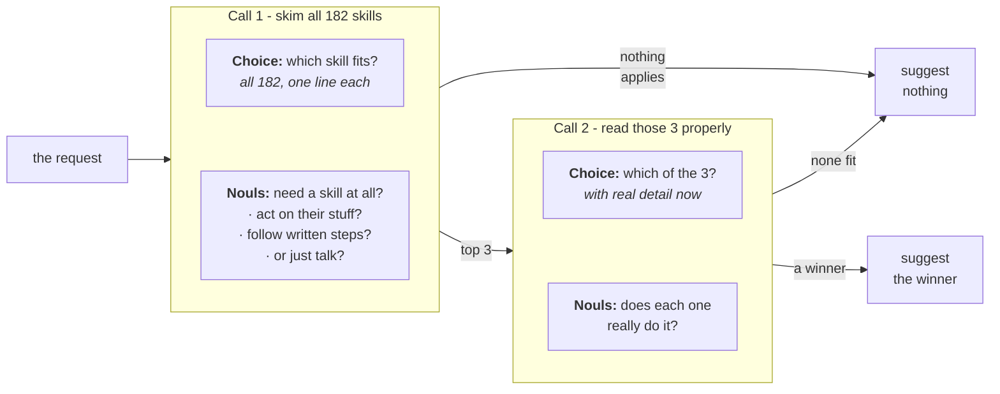

> ## Documentation Index
> Fetch the complete documentation index at: https://docs.typesafe.ai/llms.txt
> Use this file to discover all available pages before exploring further.

# Skill suggestion

> Picks at most one skill for an agent turn out of the 182 in Nous Research's Hermes catalog: one TypeSafe request ranks every skill and asks whether the turn needs one at all, a second reads the top three properly and can reject all of them. The winner's name goes into a single line of the agent's system prompt, and both the wrong skills it loads and the ones it loads when nothing fits drop by more than half.

*Agents choose skills by truncating and loading them all into the system message, which
increases costs, degrades skill selection performance, and induces context rot for the rest
of the session. We address this by using two TypeSafe requests per turn, one to rank skills
and one to verify the choice, and reduce incorrect skill loads by more than half.*

An agent with a large skill roster makes its choice on almost no information. The roster
reaches it as an index: one line per skill, with the description truncated so the full text
doesn't crowd out the conversation. Hermes, the agent harness used here, cuts it to 60
characters by default. For example, at that width the skill that *edits* `.pptx` files
reads nearly the same as the one that *authors* them. Ask for a pitch deck and the agent
may load the wrong one. On a turn where no skill fits at all, it may still load
one anyway, because a list of names invites a guess.

This cookbook leaves the descriptions alone and uses progressive disclosure instead,
reading all 182 skills cheaply and then reading three of them in detail. Two TypeSafe
requests go in front of the decision on which skill to load, if any. The first ranks every
skill in the roster against the user's turn and answers whether the turn needs a skill at
all. The second re-reads only the top three, now with each skill's full description and the
opening of its instructions, and is free to reject all of them.

The winner's name goes into one extra line of the agent's system prompt for that turn:

```
<skill_relevance>
Relevant to the current request: pptx-author. Ignore this if it does not fit what the user
actually asked for.
</skill_relevance>
```

The agent keeps its full index and its own judgement, and that one line only tells it which
entry to look at first. The roster itself never changes, so any prefix caching over it
still holds. Over 488 requests against `claude-haiku-4-5-20251001`, using skills from the
Hermes roster:

|                                      | loads the wrong skill | loads one when nothing fits |
| ------------------------------------ | --------------------- | --------------------------- |
| agent alone, with just its roster    | 16.8%                 | 9.8%                        |
| **agent with a TypeSafe suggestion** | **7.3%**              | **4.0%**                    |
| agent handed the right answer        | 2.5%                  | 1.2%                        |

The third row shows the floor for making mistakes is not zero, because an agent given the
right skill still does not always load it, and no selection method, however good, gets past
that.

You end up with a `suggest()` function that returns at most one skill name, a
`suggestion_block()` that wraps it for the system prompt, and the harness that produced the
table above, ready to point at your own roster.



## Setup

* Install the TypeSafe client, the Anthropic client, and the shared cookbook helpers.
* Set a [TypeSafe API key](https://console.typesafe.ai/keys), and an Anthropic key for the
  agent being measured.

```bash theme={null}
pip install anthropic matplotlib ipython "typesafe-sdk>=0.5.7" cooksafe --extra-index-url https://pypi.typesafe.ai/
export TYPESAFE_API_KEY=your-key-here
export ANTHROPIC_API_KEY=your-key-here
```

> **Note:** the code blocks below are one script, in order. To follow along, put them in a
> single file in the order shown.

## Caching results

`JsonCache` saves each call's result, keyed on its inputs, so re-running replays the
numbers below instead of calling either API. Delete `json_cache.json` to run live. The
published run used `jev-1.12` and `claude-haiku-4-5-20251001`, rendered 2026-07-31.

```python expandable theme={null}
import json
import os
from collections import defaultdict
from concurrent.futures import ThreadPoolExecutor
from pathlib import Path
from time import perf_counter

import anthropic
import matplotlib
import matplotlib.pyplot as plt
from matplotlib.ticker import PercentFormatter
from cooksafe import JsonCache, make_playground_link
from IPython.display import Markdown, display
from typesafe_sdk import Choice, Noul, TypeSafeClient

matplotlib.use("Agg")  # headless render

TYPESAFE_MODEL = "jev-1.12"
AGENT_MODEL = (
    "claude-haiku-4-5-20251001"  # the agent under test, pinned so scores are stable
)

SHORTLIST = 3  # candidates carried from the first request into the second
EXCERPT_CHARS = (
    700  # SKILL.md characters each candidate brings; the roster file stores 1600
)
GATE_THRESHOLD = (
    0.30  # mean of the three request nouls, below which nothing is suggested
)
FITS_THRESHOLD = (
    0.30  # a shortlist whose best "does this fit" noul is under this is dropped
)
WORKERS = 8  # small pool: enough to keep a live run to minutes, gentle on rate limits

assert EXCERPT_CHARS <= 1600, (
    "the shipped roster file stores 1600 body characters per skill"
)

client = TypeSafeClient(
    api_key=os.environ.get(
        "TYPESAFE_API_KEY", "cache-only"
    ),  # keyless kernels replay the cache
    base_url=os.environ.get("TYPESAFE_ENDPOINT"),
    timeout=120.0,
)
agent = anthropic.Anthropic(api_key=os.environ.get("ANTHROPIC_API_KEY", "cache-only"))
json_cache = JsonCache(Path("json_cache.json"))
```

## Step 1: load the roster

`hermes_roster.json` holds the 182 skills of
[NousResearch/hermes-agent](https://github.com/NousResearch/hermes-agent) (MIT) at one
pinned commit. Each record holds a skill's name and category, the description as the index
shows it, the full description, and the opening of its `SKILL.md`.

The index below, and the instructions above it in the prompt, are copied from Hermes.

```python expandable theme={null}
ROSTER = json.loads(Path("hermes_roster.json").read_text(encoding="utf-8"))
BY_NAME = {skill["name"]: skill for skill in ROSTER}

# Verbatim from hermes-agent agent/prompt_builder.py:build_skills_system_prompt.
PREAMBLE = (
    "## Skills (mandatory)\n"
    "Before replying, scan the skills below. If a skill matches or is even partially relevant "
    "to your task, you MUST load it with skill_view(name) and follow its instructions. "
    "Err on the side of loading — it is always better to have context you don't need "
    "than to miss critical steps, pitfalls, or established workflows. "
    "Skills contain specialized knowledge — API endpoints, tool-specific commands, "
    "and proven workflows that outperform general-purpose approaches. Load the skill "
    "even if you think you could handle the task with basic tools like web_search or terminal. "
    "Skills also encode the user's preferred approach, conventions, and quality standards "
    "for tasks like code review, planning, and testing — load them even for tasks you "
    "already know how to do, because the skill defines how it should be done here.\n"
    "Whenever the user asks you to configure, set up, install, enable, disable, modify, "
    "or troubleshoot Hermes Agent itself — its CLI, config, models, providers, tools, "
    "skills, voice, gateway, plugins, or any feature — load the `hermes-agent` skill "
    "first. It has the actual commands (e.g. `hermes config set …`, `hermes tools`, "
    "`hermes setup`) so you don't have to guess or invent workarounds.\n"
    "If a skill has issues, fix it with skill_manage(action='patch').\n"
    "After difficult/iterative tasks, offer to save as a skill. "
    "If a skill you loaded was missing steps, had wrong commands, or needed "
    "pitfalls you discovered, update it before finishing.\n"
    "\n"
)
FOOTER = "\n\nOnly proceed without loading a skill if genuinely none are relevant to the task."
IDENTITY = (
    "You are Hermes, a capable AI assistant with access to tools and a library "
    "of skills. You help the user with coding, research, and everyday tasks.\n\n"
)


def render_index() -> str:
    """The body of <available_skills>: skills grouped by category, both sorted by name."""
    by_category = defaultdict(list)
    for skill in ROSTER:
        by_category[skill["category"]].append(skill)
    lines = []
    for category in sorted(by_category):
        lines.append(f"  {category}:")
        for skill in sorted(by_category[category], key=lambda s: s["name"]):
            lines.append(f"    - {skill['name']}: {skill['description']}")
    return "\n".join(lines)


CATALOG_PROMPT = (
    IDENTITY
    + PREAMBLE
    + "<available_skills>\n"
    + render_index()
    + "\n</available_skills>"
    + FOOTER
)

widths = [len(skill["description"]) for skill in ROSTER]
print(f"{len(ROSTER)} skills in {len({s['category'] for s in ROSTER})} categories")
print(f"roster prompt: {len(CATALOG_PROMPT):,} characters")
print(
    f"index description: {sum(widths) / len(widths):.0f} characters on average, "
    f"{max(widths)} at most"
)
print("\none category, as the agent reads it:")
index_lines = render_index().splitlines()
start = index_lines.index("  apple:")
end = next(
    i
    for i in range(start + 1, len(index_lines))
    if not index_lines[i].startswith("    ")
)
print("\n".join(index_lines[start:end]))
```

```
182 skills in 33 categories
roster prompt: 16,089 characters
index description: 54 characters on average, 60 at most

one category, as the agent reads it:
  apple:
    - apple-notes: Manage Apple Notes via memo CLI: create, search, edit.
    - apple-reminders: Apple Reminders via remindctl: add, list, complete.
    - findmy: Track Apple devices/AirTags via FindMy.app on macOS.
    - imessage: Send and receive iMessages/SMS via the imsg CLI on macOS.
```

## Step 2: score the agent on its own

`requests.json` holds 488 single-turn requests, 315 of them covered by exactly one skill
and the other 173 covered by nothing.

The covered requests were written by Claude Sonnet 5 from each skill's own `SKILL.md`, so
the labels are trustworthy and the requests are easier than the ones users send.

The 173 uncovered ones were all written to punish guessing: 85 everyday requests, 42
technical questions no skill serves (*explain what a monad is*), and 46 that ask for
something specific the roster has no skill for, like *post this to Mastodon* on a roster
that covers X and nothing else.

Scoring reads the agent's first response only. Both numbers are error rates, so lower is
better on each:

* **wrong load**: of the covered requests, the share where the first `skill_view` call was
  not the covering skill. A turn that loaded nothing at all counts as a miss.
* **needless load**: of the uncovered requests, the share where the agent called
  `skill_view` at all.

```python theme={null}
REQUESTS = json.loads(Path("requests.json").read_text(encoding="utf-8"))
POSITIVES = [p for p in REQUESTS if p["gold"]]
NEGATIVES = [p for p in REQUESTS if not p["gold"]]

print(
    f"{len(REQUESTS)} requests: {len(POSITIVES)} covered by a skill "
    f"({len({p['gold'] for p in POSITIVES})} distinct skills), {len(NEGATIVES)} covered by none"
)
print(f"\ncovered   [{POSITIVES[0]['gold']}]  {POSITIVES[0]['text']}")
print(f"uncovered  {NEGATIVES[0]['text']}")
```

```
488 requests: 315 covered by a skill (171 distinct skills), 173 covered by none

covered   [1password]  I've got a config.yaml with `{{ op://app-prod/db/password }}` placeholders in it — can you set up my project to pull the real values in at runtime instead of hardcoding them?
uncovered  Add these three cards to our Trello backlog.
```

The suggestion goes in its own block of the system prompt, after the roster rather than
inside it, so the roster text is identical on every turn to maintain prefix caching.

The agent has a minimal set of tools, including `skill_view` to load a skill using a
free-text name. The name must match the skill exactly for a correct load.

```python expandable theme={null}
# Verbatim from hermes-agent tools/skills_tool.py:SKILL_VIEW_SCHEMA.
SKILL_VIEW_DESCRIPTION = (
    "Skills allow for loading information about specific tasks and workflows, as "
    "well as scripts and templates. Load a skill's full content or access its "
    "linked files (references, templates, scripts). First call returns SKILL.md "
    "content plus a 'linked_files' dict showing available references/templates/"
    "scripts. To access those, call again with file_path parameter."
)
TOOLS = [
    {
        "name": "skill_view",
        "description": SKILL_VIEW_DESCRIPTION,
        "input_schema": {
            "type": "object",
            "properties": {
                "name": {"type": "string", "description": "The skill name."}
            },
            "required": ["name"],
        },
    },
    {
        "name": "terminal",
        "description": "Run a shell command on the user's machine and return its output.",
        "input_schema": {
            "type": "object",
            "properties": {"command": {"type": "string"}},
            "required": ["command"],
        },
    },
    {
        "name": "read_file",
        "description": "Read a file from the user's filesystem.",
        "input_schema": {
            "type": "object",
            "properties": {"path": {"type": "string"}},
            "required": ["path"],
        },
    },
    {
        "name": "web_search",
        "description": "Search the web and return result snippets.",
        "input_schema": {
            "type": "object",
            "properties": {"query": {"type": "string"}},
            "required": ["query"],
        },
    },
]


@json_cache
def run_turn(model: str, arm: str, request: str, suggestion: str) -> dict:
    """One measured turn. ``arm`` is in the key so each arm samples independently."""
    system = [
        {"type": "text", "text": CATALOG_PROMPT, "cache_control": {"type": "ephemeral"}}
    ]
    if suggestion:
        system.append({"type": "text", "text": suggestion})  # after the breakpoint
    response = agent.messages.create(
        model=model,
        max_tokens=1024,
        system=system,
        tools=TOOLS,
        messages=[{"role": "user", "content": request}],
    )
    usage = response.usage
    return {
        "loaded": [
            str(block.input.get("name", ""))
            for block in response.content
            if block.type == "tool_use" and block.name == "skill_view"
        ],
        "input_tokens": usage.input_tokens or 0,
        "output_tokens": usage.output_tokens or 0,
    }


def summarise(turns: dict[str, dict]) -> dict[str, float]:
    """Two failure rates: wrong loads on covered requests, needless ones on uncovered."""
    hits = [turns[p["text"]]["loaded"][:1] == [p["gold"]] for p in POSITIVES]
    over = [bool(turns[p["text"]]["loaded"]) for p in NEGATIVES]
    return {
        # both metrics are errors, so the two columns read the same direction
        "wrong_load": 1 - sum(hits) / len(hits),
        "needless_load": sum(over) / len(over),
    }


def run_arm(arm: str, suggestions: dict[str, str]) -> dict[str, dict]:
    """One measured turn per request, in a small pool. 488 calls."""
    texts = [request["text"] for request in REQUESTS]
    with ThreadPoolExecutor(max_workers=WORKERS) as pool:
        turns = pool.map(
            lambda t: run_turn(AGENT_MODEL, arm, t, suggestions.get(t, "")), texts
        )
        return dict(zip(texts, turns))
```

The agent runs first with nothing but its roster, the way it works today. Its two error
rates are the baseline the rest of the cookbook measures against.

```python theme={null}
baseline = run_arm("baseline", {})
base_scores = summarise(baseline)
print(
    f"wrong loads    {base_scores['wrong_load']:.1%}   ({len(POSITIVES)} covered requests)"
)
print(
    f"needless loads {base_scores['needless_load']:.1%}   ({len(NEGATIVES)} uncovered requests)"
)

# where the wrong loads land: a neighbour of the right skill, or somewhere unrelated?
misses = [
    (p["gold"], baseline[p["text"]]["loaded"][0])
    for p in POSITIVES
    if baseline[p["text"]]["loaded"] and baseline[p["text"]]["loaded"][0] != p["gold"]
]
same_category = sum(
    1
    for gold, got in misses
    if got in BY_NAME and BY_NAME[got]["category"] == BY_NAME[gold]["category"]
)
print(
    f"\nof {len(misses)} wrong first picks, {same_category} came from the right skill's own "
    f"category"
)
```

```
wrong loads    16.8%   (315 covered requests)
needless loads 9.8%   (173 uncovered requests)

of 36 wrong first picks, 10 came from the right skill's own category
```

Wrong loads land in the right skill's own category far more often than chance would put
them there, so the hard part is telling a few lookalikes apart. The agent is already
looking in roughly the right place.

## Step 3: rank the whole roster

One request carries two kinds of question:

* **`which`** is a [`Choice`](/primitives/choice) question
  over all 182 skill names, with the index description as each option's criteria (the same
  text the agent itself gets). Its probabilities are the ranking.
* **three [`Noul`](/primitives/noul) questions about the
  request**, printed below, each asking a different way whether it wants an action taken
  rather than an explanation given. `prose_suffices`
  counts the other way round. Their mean decides whether to suggest anything at all, and
  under 0.30 nothing is suggested.

Both go out in one request, so the ranking and the check cost one round trip.

Write these three to ask whether an action is wanted. A question about subject matter will
not separate *explain what a monad is* from a request that needs a skill, since both are
software.

One `Choice` question holds a roster this size comfortably. A few times larger and you
would
split it into chunks and rank each one, then run this same shortlist step over the winners.

```python expandable theme={null}
CHOICE_INSTRUCTIONS = (
    "Which of these skills, if any, is the right one to load to help with the "
    "user's latest request?"
)
GATE_QUESTIONS = {
    "acts_on_user_system": (
        "Is the assistant being asked to act on the user's files, accounts, devices, "
        "or online services, rather than only to explain or advise?"
    ),
    "would_follow_documented_procedure": (
        "Would a careful expert answering this consult a specific documented procedure "
        "or set of commands, rather than answering from general understanding?"
    ),
    "prose_suffices": (
        "Could a knowledgeable generalist fully satisfy this request in prose, with "
        "no tools, no documentation, and no access to the user's files or accounts?"
    ),
}
INVERTED = {"prose_suffices"}  # a yes here points away from needing a skill


def build_state(request: str) -> dict:
    return {"request": request, "recent_context": ""}


@json_cache
def rank_wide(request: str) -> dict:
    """Request 1: rank all 182 skills, and score the request for whether a skill applies."""
    questions = {
        "which": Choice(
            instructions=CHOICE_INSTRUCTIONS,
            criteria={skill["name"]: skill["description"] for skill in ROSTER},
        )
    }
    for key, text in GATE_QUESTIONS.items():
        questions[f"gate::{key}"] = Noul(instructions=text)
    started = perf_counter()
    response = client.system_one(
        state=build_state(request), questions=questions, model=TYPESAFE_MODEL
    )
    ranked = sorted(
        response.answers["which"].probabilities.items(), key=lambda kv: -kv[1]
    )
    values = {
        key.removeprefix("gate::"): answer.noul
        for key, answer in response.answers.items()
        if key.startswith("gate::")
    }
    oriented = [(1.0 - v) if k in INVERTED else v for k, v in values.items()]
    return {
        "ranked": ranked[
            :12
        ],  # more than any shortlist needs, and keeps the cache small
        "gate": sum(oriented) / len(oriented),
        "values": values,
        "seconds": round(perf_counter() - started, 2),
        "input_tokens": response.usage.input_tokens or 0,
        "output_tokens": response.usage.output_tokens or 0,
    }


DEMO = [
    "Can you save this recipe as a new note in my 'Recipes' folder in Notes.app so it syncs"
    " to my phone? Just write it up in whatever editor pops up.",
    "Can you put together a pitch deck skeleton (cover, situation overview, comps, precedent"
    " transactions, DCF, LBO) as a .pptx, using our firm-template.pptx for branding and"
    " footnoting each valuation number back to the cell it came from in the model?",
    "Post this announcement to my Mastodon account.",
]
for request in DEMO:
    wide = rank_wide(request)
    verdict = "suggest" if wide["gate"] >= GATE_THRESHOLD else "stay quiet"
    print(f'"{request[:78]}"')
    print(f"  needs a skill {wide['gate']:.2f} -> {verdict}   ({wide['seconds']}s)")
    for name, probability in wide["ranked"][:SHORTLIST]:
        print(f"    {probability:.3f}  {name:<38}{BY_NAME[name]['description']}")
    print()
```

```
"Can you save this recipe as a new note in my 'Recipes' folder in Notes.app so "
  needs a skill 0.75 -> suggest   (0.31s)
    0.990  apple-notes                           Manage Apple Notes via memo CLI: create, search, edit.
    0.010  computer-use                          Drive the user's desktop in the background — clicking, ty...
    0.000  concept-diagrams                      Generate flat, minimal educational SVG visuals as HTML.

"Can you put together a pitch deck skeleton (cover, situation overview, comps, "
  needs a skill 0.76 -> suggest   (0.16s)
    0.700  powerpoint                            Create, read, edit .pptx decks, slides, notes, templates.
    0.300  pptx-author                           Build PowerPoint decks headless with python-pptx.
    0.000  chroma                                Embedding database for RAG and semantic search.

"Post this announcement to my Mastodon account."
  needs a skill 0.78 -> suggest   (0.16s)
    0.550  xurl                                  X/Twitter via xurl CLI: raw post search, posting, DM, media.
    0.140  computer-use                          Drive the user's desktop in the background — clicking, ty...
    0.080  openhands                             Delegate coding to OpenHands CLI (model-agnostic, LiteLLM).
```

The Notes.app request is unambiguous, and its top option is the right one. Nothing a
ranking can do will save the Mastodon one: the three questions say a skill is wanted,
because posting to an account is an action, and with a skill for posting to X and nothing
for Mastodon the closest skill wins anyway.

That leaves the deck. Both leaders are `.pptx` skills, and on 60 characters the wide Choice
question puts the editing skill ahead of the authoring one, for a request about
authoring a deck.

## Step 4: rerank the top three

Three options leave room for the full description plus the opening of each skill's own
`SKILL.md`, so the second request puts the same question to better evidence:

* **`which`** is a `Choice` question over the shortlist, with that longer text as each
  option's criteria.
* **`fits::{name}`** is one `Noul` question per candidate: does this skill do the
  specific
  thing the request asks for? Each is answered on its own, so they can all come back low,
  and a shortlist whose highest one lands under 0.30 gets dropped entirely.

```python expandable theme={null}
RERANK_INSTRUCTIONS = (
    "Exactly one of these skills is the right one to load for the user's latest "
    "request. Which one? Read what each actually does, not just its name."
)


def rerank_criteria(names: tuple[str, ...], excerpt: int) -> dict[str, str]:
    return {
        name: f"{BY_NAME[name]['description_full']} — {BY_NAME[name]['body'][:excerpt]}"
        for name in names
    }


def rerank_questions(names: tuple[str, ...], excerpt: int) -> dict:
    questions = {
        "which": Choice(
            instructions=RERANK_INSTRUCTIONS, criteria=rerank_criteria(names, excerpt)
        )
    }
    for name in names:
        questions[f"fits::{name}"] = Noul(
            instructions=(
                f"Does the skill '{name}' do the specific thing the user's request asks "
                f"for? It is described as: {BY_NAME[name]['description_full']}"
            )
        )
    return questions


@json_cache
def rerank(request: str, names: tuple[str, ...], excerpt: int) -> dict:
    """Request 2: the same Choice over a shortlist, plus one absolute noul per candidate."""
    started = perf_counter()
    response = client.system_one(
        state=build_state(request),
        questions=rerank_questions(names, excerpt),
        model=TYPESAFE_MODEL,
    )
    return {
        "winner": response.answers["which"].choice,
        "fits": {
            key.removeprefix("fits::"): answer.noul
            for key, answer in response.answers.items()
            if key.startswith("fits::")
        },
        "seconds": round(perf_counter() - started, 2),
        "input_tokens": response.usage.input_tokens or 0,
        "output_tokens": response.usage.output_tokens or 0,
    }


for request in DEMO:
    wide = rank_wide(request)
    if wide["gate"] < GATE_THRESHOLD:
        print(f'"{request[:78]}"\n  scored too low, nothing suggested\n')
        continue
    shortlist = tuple(name for name, _ in wide["ranked"][:SHORTLIST])
    result = rerank(request, shortlist, EXCERPT_CHARS)
    best = max(result["fits"].values())
    verdict = result["winner"] if best >= FITS_THRESHOLD else "nothing fits"
    print(f'"{request[:78]}"')
    print(f"  was {shortlist[0]} -> {verdict}   ({result['seconds']}s)")
    for name in shortlist:
        print(f"    fits {result['fits'][name]:.2f}  {name}")
    print()
```

```
"Can you save this recipe as a new note in my 'Recipes' folder in Notes.app so "
  was apple-notes -> apple-notes   (0.12s)
    fits 0.60  apple-notes
    fits 0.54  computer-use
    fits 0.01  concept-diagrams

"Can you put together a pitch deck skeleton (cover, situation overview, comps, "
  was powerpoint -> pptx-author   (0.09s)
    fits 0.73  powerpoint
    fits 0.38  pptx-author
    fits 0.02  chroma

"Post this announcement to my Mastodon account."
  was xurl -> xurl   (0.09s)
    fits 0.56  xurl
    fits 0.38  computer-use
    fits 0.05  openhands
```

The two `.pptx` skills separate once each one brings its own text: the deck request flips
to the authoring skill.

The `fits` nouls and the Choice disagree there: the nouls score the editing skill higher
while the Choice picks the authoring one. They are deciding different things. The Choice
settles *which* skill, and the nouls settle *whether* to say anything at all.

The Mastodon request survives both checks: its best `fits` noul lands above 0.30, so the
recipe suggests the X skill for a request about Mastodon. Most requests like it are caught.
The second pass can only reject what the wide ranking hands it, and here that was three
near-misses.

The function below is the whole recipe: two requests and two thresholds, with at most one
skill name coming back.

To point it at your own roster, replace `hermes_roster.json`. Every question above reads
`name`, `description`, `description_full`, and `body` out of that file, and nothing else
knows about Hermes.

```python theme={null}
def suggest(request: str) -> tuple[str, ...]:
    """At most one skill name for a request, or () for "nothing here applies"."""
    wide = rank_wide(request)
    if wide["gate"] < GATE_THRESHOLD:
        return ()
    shortlist = tuple(name for name, _ in wide["ranked"][:SHORTLIST])
    result = rerank(request, shortlist, EXCERPT_CHARS)
    if max(result["fits"].values()) < FITS_THRESHOLD:
        return ()
    return (result["winner"],)


def suggestion_block(names: tuple[str, ...]) -> str:
    """What gets appended after the roster, in the suggestion.

    This string is a measured input rather than prose: it goes to the agent, so it is part
    of every graded turn's cache key. Editing a word here silently invalidates the shipped
    results and costs a live re-run to restore them.
    """
    body = (
        f"Relevant to the current request: {', '.join(names)}. Ignore this if it does not "
        "fit what the user actually asked for."
        if names
        else "No skill in the roster appears relevant to this request."
    )
    return f"\n\n<skill_relevance>\n{body}\n</skill_relevance>"


print(suggestion_block(suggest(DEMO[1])))
print(suggestion_block(suggest(DEMO[2])))
```

```


<skill_relevance>
Relevant to the current request: pptx-author. Ignore this if it does not fit what the user actually asked for.
</skill_relevance>


<skill_relevance>
Relevant to the current request: xurl. Ignore this if it does not fit what the user actually asked for.
</skill_relevance>
```

## Step 5: measure the suggestion

Each of the 488 requests goes to the agent three times, one measured turn each. The runs
differ only in what the agent is told:

|                         | what goes in the system prompt                                     |
| ----------------------- | ------------------------------------------------------------------ |
| agent alone             | nothing                                                            |
| agent with a suggestion | whatever `suggest()` returned                                      |
| agent given the answer  | the covering skill's name, or "nothing applies" when there is none |

The third is not achievable; it is the ceiling the other two get measured against.

The wording of that suggestion is doing two jobs. It says the suggestion can be ignored,
because pushing harder wins compliance on wrong suggestions too, and a wrong one is worse
than none. And a turn with nothing to suggest still sends a sentence saying so; sending
nothing at all would leave the roster's own "err on the side of loading" instruction
unopposed.

```python expandable theme={null}
texts = [request["text"] for request in REQUESTS]
with ThreadPoolExecutor(max_workers=WORKERS) as pool:  # up to 488 x 2 TypeSafe requests
    suggested = dict(zip(texts, pool.map(suggest, texts)))
WIDE = {text: rank_wide(text) for text in texts}  # all cache hits now; reused below

arms = {
    "baseline": {},
    "TypeSafe": {
        request["text"]: suggestion_block(suggested[request["text"]])
        for request in REQUESTS
    },
    "oracle": {
        request["text"]: suggestion_block((request["gold"],) if request["gold"] else ())
        for request in REQUESTS
    },
}
scores = {
    arm: summarise(run_arm(arm, suggestions)) for arm, suggestions in arms.items()
}

print(f"{'run':<10}{'wrong loads':>13}{'needless loads':>16}")
for arm, row in scores.items():
    print(f"{arm:<10}{row['wrong_load']:>13.1%}{row['needless_load']:>16.1%}")


def fewer(metric: str) -> str:
    """The plain ratio between the two arms' error rates."""
    return f"{scores['baseline'][metric] / scores['TypeSafe'][metric]:.1f}x fewer"


print(
    f"\nbaseline -> TypeSafe:  {fewer('wrong_load')} wrong loads, "
    f"{fewer('needless_load')} needless ones"
)
```

```
run         wrong loads  needless loads
baseline          16.8%            9.8%
TypeSafe           7.3%            4.0%
oracle             2.5%            1.2%

baseline -> TypeSafe:  2.3x fewer wrong loads, 2.4x fewer needless ones
```

```python theme={null}
moved = [
    (
        baseline[p["text"]]["loaded"][:1] == [p["gold"]],
        run_turn(AGENT_MODEL, "TypeSafe", p["text"], arms["TypeSafe"][p["text"]])[
            "loaded"
        ][:1]
        == [p["gold"]],
    )
    for p in POSITIVES
]
print(
    f"of {len(POSITIVES)} covered requests: {sum(not b and a for b, a in moved)} the suggestion "
    f"fixed, {sum(b and not a for b, a in moved)} it broke"
)
```

```
of 315 covered requests: 37 the suggestion fixed, 7 it broke
```

The suggestion fixes many more requests than it breaks, but it does break some the agent
had right on its own. A confident wrong suggestion is more persuasive than no suggestion at
all, which is the price of putting one in front of the turn.

```python expandable theme={null}
SURFACE, INK, INK2, MUTED = "#fcfcfb", "#0b0b0b", "#52514e", "#898781"
GRID, AXIS, BLUE, ORANGE = "#e1e0d9", "#c3c2b7", "#2a78d6", "#eb6834"

ARM_COLOR = {"baseline": BLUE, "TypeSafe": ORANGE, "oracle": MUTED}


def style(ax):
    ax.set_facecolor(SURFACE)
    for side in ("top", "right"):
        ax.spines[side].set_visible(False)
    for side in ("left", "bottom"):
        ax.spines[side].set_color(AXIS)
    ax.tick_params(colors=MUTED, labelcolor=INK2, labelsize=9)
    ax.set_axisbelow(True)


panels = [
    ("wrong_load", f"wrong loads\n{len(POSITIVES)} covered requests"),
    ("needless_load", f"needless loads\n{len(NEGATIVES)} uncovered requests"),
]
names = list(scores)
fig, axes = plt.subplots(1, 2, figsize=(8.4, 3.6), facecolor=SURFACE)
for ax, (metric, title) in zip(axes, panels):
    style(ax)
    ax.grid(axis="y", color=GRID, linewidth=0.8)
    values = [scores[arm][metric] for arm in names]
    bars = ax.bar(
        names,
        values,
        0.58,
        color=[ARM_COLOR[arm] for arm in names],
        # the oracle is a ceiling, not a competitor: gray, and hatched so it never depends
        # on colour alone
        hatch=["", "", "///"],
        edgecolor=SURFACE,
        linewidth=1.2,
    )
    ax.bar_label(
        bars,
        labels=[f"{v:.1%}" for v in values],
        padding=3,
        color=INK2,
        fontsize=9,
    )
    ax.set_title(title, loc="left", color=INK2, fontsize=9.5)
    ax.set_ylim(0, max(values) * 1.28)
    ax.yaxis.set_major_formatter(PercentFormatter(xmax=1, decimals=0))
    ax.set_ylabel("% of those requests - lower is better", color=INK2, fontsize=9)
fig.suptitle(
    f"Hermes' {len(ROSTER)}-skill roster, {len(REQUESTS)} requests, {AGENT_MODEL}",
    x=0.02,
    ha="left",
    color=INK,
    fontsize=11,
)
fig.tight_layout()
display(fig)
plt.close(fig)
```


## What the results show

* Wrong loads fell from 16.8% to 7.3% and needless ones from 9.8% to 4.0%, which is most of
  the gap between guessing from a truncated index and being handed the answer.
* Some requests the agent had right on its own come back wrong once a suggestion is
  attached. Counts are above.

Copy this shape when an agent of yours carries a large roster: a cheap ranking over
everything, then a close look at two or three. Either step may come back empty-handed.

## Open it in the playground

Build a playground link for the deck request from step 4, using each candidate's full
description and body excerpt as its criteria.

```python theme={null}
demo_shortlist = tuple(name for name, _ in rank_wide(DEMO[1])["ranked"][:SHORTLIST])
playground_link = make_playground_link(
    build_state(DEMO[1]),
    rerank_questions(demo_shortlist, EXCERPT_CHARS),
    models=[TYPESAFE_MODEL],
)
display(
    Markdown(
        f"🔗 [Open the shortlist + questions in the TypeSafe playground]({playground_link})"
    )
)
```

<a href="https://console.typesafe.ai/playground#share/N4IgJg9gxgrgtgUwHYBcAqCAeKQC4AEIwAOiAE4ICOMCAziqQaQMICGS+AnhDPgA4wU+FBADmCFAAsEZfK34BLFFEn4wCKAGt8tTQgA2EiBwAUUCADcZAGh1KYrFAuP5LMiwoQB3W+bh9aWz4KKAR1VGEydlpWKCdjQPwAEWYAMVsAGQAhAHkASjlaOXwAOj4+FExbGFoFJFFXGFkAMwUyOABaFAR-fUcEMorMfGaIWQAjKKQwOob2MBGICBQkZdn8BFjVC1Z9B3iOJHhxmXxx2O0RYWl8UP19fCVb1kQRsgg4R44pBHw4CHU+gA-KRbKQQsgUAB9cyoLAMPD4UikAC+IFsIGCHwqtAw2ERRFIXkkChUjHwJBAKE4fAQ5NIKggpLp6KRICgZCUMgUrHJlL4EC8MgFdQRTBAzAo-VsUrAtjCT0GlTUGk0iVo+gU6kSq26iW6vX6tBK+EAKAT4ADE+AACoLhUyIgBlTQKe74SWbboyzZyuTTDYzIS2oVkW2ilVaIrm5rvTq0DmOFT4cRIGSOZwcLxKVTlSopgBW+p6fD63Q651oYQDSnWHnkMxCQgAGgBZDJ-dgKASljO2Wi01h6WS6ui+SSsMgoRLzFW1UQcACKAEETUv8AADJWYdePIryABaAElrXIyCoFFZXM18K3261DMbLVaAOrSb4QfAAVUrX5-UgURS6K6DzsJwwgKK88hbq4shlMswz3r8AFfBYED6FYCx1H6YFeKwYHmqwRR1AIKC2DwKAkWREzLJIBAcp66walqvzqJGQRKEmrFqlR-AUJWqDpgkADc+CyusYwbNgURxOs3TYG8HzYaUuaYCJCpOPUkkARpDTBHQkKCUgtAiX44x1OJsj9pqKA6TomrqCMrp0CJXhjC6mlZlIwjFqWdD4CYcGVHkth9NwgjqgOQ74COiQSX4iCoI+aCcqI4iyMSyAIFYsg-PgNSnAlBxFMQJXgKq1glaQSKlUx2oVaV1WkHp-EoIZ9VVRJFDNDIyChHuylDAA9IFCFOUgLwDE+NoUBQ1AAVyoJsipHSsIIkhjPSIBZDAroLMGMhhhEXFFNIrBgA+RSeTmnBSMYHQqSa5pWstq23bI1rvGAMChMU0GIa4HAzLoeW1Jp658Dd61IPdQybr+vwZRwYXRQgVZXICF6nPWqqFMU-0Tk4zSxKR0XLGonKXvImqXvtoYOkIla0LUxirmArAVFWMaKUuqCSO8fCkgA5EU4NDCta1jDuM7gxxkgdFxO5AfcREcAA2uwUj86StCDa041IFAPL6B0lZkB4fUALomJINkBLgg2DaI2YwOMJR+INGt8xAAtQDrevsIbuwm+4zK0HkJpoDcLbMCeg34DkzStKEHQAFKOmcUwqH5EDXrlYwKE7436HuFDk97tILOa-57kz8B+ad510EU1qQyz+CpBJuWTBAZ02HI+iypwJskuUVa04dQivetnKaUrDwmLVo46JFpwxfKcAnGAiSIDMrDBToqPXL84w7foKAdFh4N2mQIqoIrLr3BHJKAQ-DzIVTBc2zIHRCp-Qh8I4boZBvgwFTAsUYsh-iAnLBcKsx1-IC2UKoY6thDzMD+D0CAiRNjANmEUGKBQMqlyyjIMCRwN4FRqEIFA0lfhXHkLQHgZ4EZuXGEsTQJoLRWhyIIPgi0GRezgLyREpAACiFCwAzE0mzVqFZfgQPwAAJSXAAcT9AsSsQjUCkgPhOFQj1LTukEfIDo8daTQ0dEwn64jN5SIaEkRwrA5H4Ejr8Jch4OjjScJeGRTjCLyIkifXa6wMgZBbHIcomooCGUutmDB-wyCcE4S+N8wgPz5SMbGeQAAqbJ35fjMGMfgRGuBcn4FMdtYJmllFqJMBQGhngdjG1WqIQqVYUxpgOAUdmJZSQxPKfgAAcqjBY+hoC7EGpWfQzQOjrXoFWKwcQJK+OcaY58GtXDmJNlY34jC9gHH8kuABWd8AACYSgAAYCimI+ssZYNJ1hYRHGwiAaoBmOh6BrHRlY9GqDcLISAsBCpFFMY6EQM8Gg9FsXg4pcTECtV8fgXJLYJCcl9rkggpjcmnIACzWAAMwXIuQAanwCopQAAJF2OhWpkFoGUrF2SACM1gACcRLSUQLVAypF2SLBMpKPiwVZSF6yMMLYIUCBND6DAhQQw-iw4DNyUcrYvxzkXPwFE5AlYym5Pyf3IBXjMYq3mWdDFSrsnWjqBoYwCBzUtnYKwcQCwoBjJgL6V6EATbRM1JpRlqR3GOkdOa60TRdkQVdBOJQYEflnkkLYVYGCEWOItc+TYdZughs+t9A5bZPHph8Y41ZvKFxgCmCgc1FLP5shRGCEAdR6BkBzRmWgm1RGYGJjKgGvwc5Hx-HPIiRRcopRtt2tJmqe7gM7jcfKZBhaaqNEIWaNB6AmlfKSP5qYgRKJ9MU8cQhNhJmJg4e4YFIBL11PgfMVDHhTmihNEoqI62tCnLgXAAoQy3zFBSUg1JaSbVWDAfQ-D61GRoc2hIm0kgQD8rlOe+BBYfvtKKQWagPxwdpIbJO1xZIztNvO5ddBJ66CKBA7dh4hDIW1ByBQm9CgEA9NKUSPp5SBgGsqFBdlmI6mWEvA0JYjSPpALWtkL7aBvpehLMgfJf00hZOKQDwHWSkAbeBmSkGREgGg7Bm48HENiynmMVDkAj7Lw0AobD-5NK5VnQRqgK7iNvLI-gCju5Zw0bo4RAglT9B7WvhPCMbyG4XVhV5CGt1oYPSfaJpQ4ncAqCyTJqkcmAM8CU3W1TTb1NGSgzBodunX4IYSx8Vgxn0O6cwxZnRVmGg2fw0UQj9BChObGORyjRRqOck8+J-ANiwh2LUEW-xixZA1PUQfLRTgoC6LjUJlEaIMTswUAANRkMzJABJ+WshAFMjQ3QwAtgBAYWgiJVYgHzFlDoAqmWnJABbFEQA" target="_blank" rel="noreferrer" className="text-primary">Open the shortlist + questions in the TypeSafe playground →</a>

## What's next

The same shape shows up elsewhere:
[Intent Routing](/patterns/intent-routing) for routing to a
handler rather than a skill, [Confidence](/confidence) for
picking the two thresholds, and
[Speculative Fan-Out](/patterns/fan-out) for putting every
question in one request.
