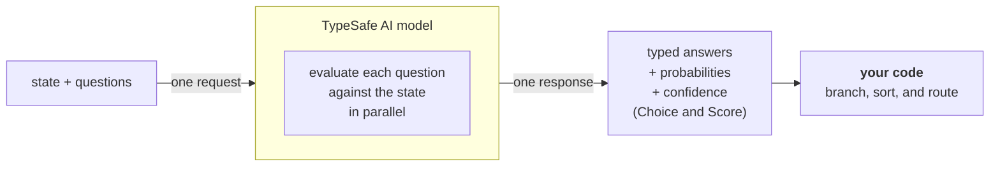

> ## Documentation Index
> Fetch the complete documentation index at: https://docs.typesafe.ai/llms.txt
> Use this file to discover all available pages before exploring further.

# Introduction

> Jev is TypeSafe's flagship model and the first System One model. Send state and typed questions; get structured answers your code can use directly.

Large language models (LLMs) are designed to produce text for humans to read. When you need a model to make a judgment that your code will consume, that creates a mismatch: you are coercing a text-generation system into outputting structured decisions, then parsing the results back into something your code can depend on.

Jev is TypeSafe's flagship model and the first [System One model](/concepts/system-one). System One models are built to make fast, structured decisions that software can use directly. Jev evaluates typed *questions* against a *state* and returns structured results directly. No text generation, no parsing. You get typed values and probability distributions that your code can branch on, sort by, and route with. Choice and Score also return [confidence](/confidence), which your code can use to decide whether and how to act on an answer.

## TypeSafe primitives

TypeSafe exposes three *AI primitives*. Similar to software primitives, our AI primitives are modular, composable, structured, reliable, and fast. Each asks a different type of *question* and returns a different type of answer.

| Question type                | Goal                         | Returns                                 |
| ---------------------------- | ---------------------------- | --------------------------------------- |
| [Choice](/primitives/choice) | Choose an option from a list | `choice`, `probabilities`, `confidence` |
| [Score](/primitives/score)   | Score the state on a rubric  | `score`, `probabilities`, `confidence`  |
| [Noul](/primitives/noul)     | Is this statement true?      | `noul` (0–1)                            |

All three *question* types can be mixed in a single API call. Every *question* is evaluated in parallel and in isolation against the same *state* in one go. Adding questions barely changes the response time. Each question is evaluated independently, so adding more questions does not create context-rot.

## Atomic questions, composed in code

System One models work best when each question asks one specific, well-scoped thing. Think of each question as a gut-check determination: the kind of judgment a highly knowledgeable person could make in a few seconds given the right context.

If the question you want to ask would require extended reasoning or weighs multiple independent factors, decompose it. Ask each factor as a separate question, then combine the results with logic in your code. This keeps each individual evaluation reliable and gives you full control over how dimensions are weighted.

For example, instead of "rate this startup pitch," ask separately about market size, technical feasibility, and differentiation. Combine the scores with your own formula. When priorities shift, change a coefficient in your code rather than rewriting a prompt.

## Next steps

* [Quick Start](/introduction/quickstart) — Everything you need to get started immediately.
* [AI Primer](/introduction/machine-learning-primer) — Why TypeSafe trains models for calibrated decisions instead of generated text.
* [Primitives (Questions)](/primitives) — How to define questions, choose between Choice, Score, and Noul, and ask several at once.
* [Confidence](/confidence) — How TypeSafe reports certainty, and how to use it architecturally.
* [Patterns](/patterns) — Common patterns for building systems with TypeSafe.
