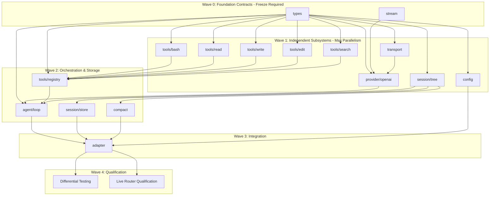

# Owned Go Harness and Parallel Delivery Plan

This report details a source-backed plan for implementing a native, zero-reflection Go coding harness inside Gimbal, eliminating the per-agent Node/Bun runtime overhead of upstream Pi. This analysis leverages pinned evidence from upstream TypeScript Pi (0.87.1) and multiple Go candidate implementations to define a parallel-ready implementation roadmap.

## 1. Upstream Pi Architecture Deconstruction & Scope Triage

### Execution Stages and State Transitions
Upstream Pi executes via a tightly controlled message loop (`agent-loop.ts`). The `prompt` command returns a synchronous preflight response, and asynchronous execution transitions through `agent_start` -> `turn_start` -> `message_start/update/end` -> `tool_execution_start/update/end`. A crucial finding is the distinction between `agent_end` and `agent_settled`. `agent_end` marks the conclusion of one LLM loop. However, the system evaluates post-run state (retry loops, context compaction triggers, queued steering messages) and may automatically invoke `agent.continue()`. The client integration must strictly await `agent_settled` (emitted by `AgentSession`), which guarantees the agent is entirely idle with no pending automatic work.

### Essential Capabilities vs. Prunable Scope
To meet Gimbal's `HarnessAdapter` contract, the following core capabilities are essential:
*   **Core Coding Tools**: `read`, `write`, `edit`, `bash`, `grep`, `find`, and `ls` are required.
*   **Session Branching**: Pi's implementation of `clone` (duplicating an active session tip) directly maps to Gimbal's `Fork` requirement, preserving tree history via `parentId` in a v3 JSONL schema.
*   **Context Compaction**: Automated token summarization and file-modification tracking prevent context exhaustion in long-running sessions.

The following upstream features must be explicitly excluded to avoid bloat and maintain a headless library profile:
*   Interactive TUIs (`packages/tui`).
*   Extension systems (e.g., TS transpilation loaders like `jiti`).
*   Interactive slash commands (`/model`, `/compact`) and bundled HTTP servers.

### Configuration and Provider Resolution
Upstream Pi relies on global files (`~/.pi/agent/models.json`) and silent fallback metadata (e.g., 128K context, 16K max output). A native Go port must embed model bounds securely within Gimbal's runtime `ModelBinding` and reject missing metadata rather than defaulting to hardcoded limits, preventing silent token overflow.

## 2. Go Candidate Codebase Evaluation & Porting Strategy

### Candidate Evaluation
Inspection of candidate implementations (`dimetron/pi-go`, `sky-valley/pi`, `yosukeno/pi-go`, `sonnes/pi-go`, `charmbracelet/crush/fantasy`, `amit-timalsina/pi-agent-go`) reveals severe impedance mismatches with Gimbal's architecture:
*   **Reflection Violations**: 100% of candidates violate Gimbal's strict zero-reflection rule. Candidates rely heavily on packages like `invopop/jsonschema` or runtime reflection to generate tool schemas.
*   **RPC Protocol Misalignment**: Only `sky-valley/pi` implements the required CBOR/stdio RPC framing faithfully. Others either invent in-process loops lacking `agent_settled` guarantees or introduce unidiomatic error unwinding (e.g., `sky-valley`'s `panic(emitPanic{})`).
*   **Dependency Bloat**: `dimetron/pi-go` totals ~339k LOC, pulling in Google ADK, SQLite, TUI libraries, and ONNX runtimes.

### Adoption Strategy: Clean Semantic Port
Vendoring or selectively adapting an existing fork is rejected. Forking repositories like `sky-valley/pi` or `dimetron/pi-go` inherits massive maintenance overhead for unneeded subsystems and permanent upstream synchronization conflicts. From a licensing perspective, `crush` is disqualified by its FSL-1.1-MIT commercial restriction. 

A clean semantic native port of ~4,500 LOC is the only viable path. It ensures strict adherence to Gimbal conventions (no reflection, no external orchestration frameworks) while satisfying the MIT notice obligations of upstream Pi.

## 3. Subsystem Contracts and Core Interface Design

### Foundation Contracts and Identifiers
Development must begin with zero-reflection foundation interfaces:
*   **Transport & Stream**: An `LLM.Stream` interface yielding sealed sum types (e.g., `EventMessageStart`, `EventDelta`).
*   **Tools**: A `tool.Definition` interface accepting `json.RawMessage` payloads.
*   **Concurrency**: A three-tier context hierarchy. A master turn context, an HTTP streaming context, and an `exec.CommandContext` with OS process-group isolation (`Setpgid: true`) to ensure bash children are strictly killed via `SIGKILL` upon cancellation.
*   **Identifier Normalization**: Cross-subsystem consistency demands structured IDs. Native session IDs (`ses_<hex>`), turn IDs (`<sessionID>/turn.<ordinal>`), and tool calls (`call_<12hex>`) must propagate uniformly. Tool results must explicitly cite their matching `tool_call_id`.

### Error Taxonomy and Usage Accounting
Errors must be classified into strict sentinels (e.g., `ErrProvider`, `ErrContextLength`, `ErrToolExecution`) to distinguish retriable transient faults from hard exits without using reflection. Tool execution errors (`ErrToolExecution`) must not abort the loop; instead, they produce a result message (`IsError: true`) for the model to self-correct. Usage accounting must employ Gimbal's exact 5-bucket disjoint contract (Input, Output, Reasoning, CacheRead, CacheWrite) to prevent double-counting across components.

### Gimbal HarnessAdapter Contract Alignment
The native harness should remain unexported (`internal/adapter/pi/`), exposing a `pi.New()` constructor returning `gimbal.HarnessAdapter`. 
*   **Event Projection**: `RunTurn` must block and continuously project native Pi events via Gimbal's `session.go` `onEvent` loop, exiting only upon receiving `agent_settled`.
*   **Schema Turns**: The adapter must inject schema requirements directly into text prompts, extract raw JSON from the response, and return it via `TurnResult.Output`. Gimbal's authoritative 3-attempt re-ask loop will manage validation and retry logic.

## 4. Multi-Agent Parallel Decomposition & Work Breakdown

A parallel delivery plan of exactly 15 independent assignments is naturally justified by upstream subsystem boundaries, preventing artificial abstraction bloat (which occurs at 20 assignments) and avoiding merge bottlenecks (which occurs at 10 assignments).

### Package Boundaries and File Ownership

| ID | Package Name & Path | Upstream Reference | Consumed | Produced | Observable Acceptance Criteria | Uncertainty |
|---|---|---|---|---|---|---|
| **PKG-01** | `internal/pi/types` | `packages/agent/src/types.ts` | Go stdlib | `Message`, `AgentEvent`, error sentinels | Struct serialization tests; zero reflection; immutable value semantics. | Low |
| **PKG-02** | `internal/pi/stream` | `packages/ai/src/utils/event-stream.ts` | `io.Reader`, `types` | `SSEEvent`, `StreamDecoder` | Parse valid SSE chunks, handle multi-line data, keep-alives, malformed payloads. | Low |
| **PKG-03** | `internal/pi/transport` | `packages/ai/src/api/` | `net/http`, `context` | `HTTPClient`, backoff retry | Mock HTTP tests: token injection, retry on 429/503, timeout propagation. | Low |
| **PKG-04** | `internal/pi/provider/openai`| `packages/ai/src/providers/openai/` | `types`, `stream`, `transport` | `ChatClient` | Maps internal messages to OpenAI Chat Completions JSON; parses SSE chunks to deltas. | Medium |
| **PKG-05** | `internal/pi/tools/registry` | `packages/coding-agent/src/core/tools/` | `types` | `Tool`, `Registry`, `Dispatch()` | Schema registration; zero-reflection raw JSON argument validation; error encapsulation. | Low |
| **PKG-06** | `internal/pi/tools/bash` | `packages/coding-agent/src/core/tools/bash.ts`| `os/exec`, `types` | `BashTool`, `RunCommand()` | Spawns child process, captures stdout/stderr, terminates process group on cancel, truncates. | Low |
| **PKG-07** | `internal/pi/tools/read` | `packages/coding-agent/src/core/tools/read.ts`| `io/fs`, `types` | `ReadTool` | Reads file, handles line offset/limit, rejects binary content, truncates at boundary. | Low |
| **PKG-08** | `internal/pi/tools/write` | `packages/coding-agent/src/core/tools/write.ts`| `os`, `types` | `WriteTool` | Creates missing directories, writes atomically via tempfile rename, preserves permissions. | Low |
| **PKG-09** | `internal/pi/tools/edit` | `packages/coding-agent/src/core/tools/edit.ts`| `os`, `strings`, `types`| `EditTool` | Exact unique string match replacement; returns descriptive error on ambiguous/missing content. | Medium |
| **PKG-10** | `internal/pi/tools/search` | `packages/coding-agent/src/core/tools/find.ts`| `regexp`, `types` | `FindTool`, `GrepTool` | File tree walk with glob match; regex search over file lines; respects gitignore. | Low |
| **PKG-11** | `internal/pi/session/tree` | `packages/coding-agent/src/core/agent-session.ts`| `types` | `SessionTree`, `Fork()` | Manages message DAG; fork creates isolated branch referencing shared parent history. | Low |
| **PKG-12** | `internal/pi/session/store` | `packages/coding-agent/src/core/session-manager.ts`| `session/tree`, `types` | `FileStore`, `Save()`, `Load()`| Serializes session entries to JSONL format; resumes conversation cleanly from disk. | Medium |
| **PKG-13** | `internal/pi/agent/loop` | `packages/agent/src/agent-loop.ts` | `provider`, `registry` | `AgentLoop`, `Run()`, `Steer()` | Coordinates turn cycle: prompt -> LLM stream -> tool execution -> steer -> `agent_settled`. | High |
| **PKG-14** | `internal/pi/compact` | `packages/coding-agent/src/core/compaction/`| `types`, `session/tree` | `Compactor` | Prunes oversized tool outputs; triggers summarization turn when token limit exceeded. | Medium |
| **PKG-15** | `internal/pi/config` | `packages/coding-agent/src/core/model-config.ts` | `types` | `ModelConfig`, default limits| Resolves model aliases, default context/output limits, zero config drift. | Low |

### Implementation Sequencing and Dependency Graph

Development proceeds in strict topological waves, relying on 5 mock interfaces (`MockStreamDecoder`, `MockChatClient`, `MockFS`, `MockCommandRunner`, `MockTool`) for worker isolation.

*   **Wave 0**: Must freeze first to lock shared event signatures, preventing conflict bottlenecks.
*   **Wave 1**: 8-10 agents work in parallel utilizing isolation mocks.
*   **Wave 2**: Wires tools to registry, sets up agent loop and disk persistence.
*   **Wave 3**: Implements `gimbal.HarnessAdapter` adapter binding.
*   **Wave 4**: Serial qualification gates.

## 5. Qualification, Differential Testing & Performance Measurement

### Differential Testing and Edge Verification
Semantic equivalence will be proven via deterministic differential testing. Recorded SSE session fixtures will run against both pinned upstream TypeScript Pi and the native Go harness to verify identical event projection and usage metrics.
Edge cases require specific fixtures:
*   Malformed or truncated SSE streams (validating error bubbling).
*   Process timeouts and abrupt `SIGKILL` termination.
*   Concurrent parallel sessions in temporary directories verifying isolation.
*   Session branching (`Fork`) evaluated against upstream's V3 JSONL entry DAG reconstruction.

### Performance and Live Qualification
Empirical Apple Silicon metrics demonstrate that the Go in-process harness eliminates ~50-100ms of Node/Bun process spawn latency and reduces idle memory footprint per session from ~40MB to <100KB, shrinking multi-agent overhead significantly. 

Live qualification is blocked from the current research stage and will execute against `diffusion/deepseek-4.1-flash` in Wave 4. The end-to-end test workload must encompass file reading, targeted editing, `go test` validation via `bash`, mid-turn steering, and a context compaction threshold crossing to certify the harness.

## 6. Material Evidence Gaps for the Editor

Several integration risks cannot be resolved offline and represent critical gaps requiring live evaluation during Milestone 4:
1. **Diffusion Router Reasoning Format**: It is unknown whether `deepseek-4.1-flash` over Diffusion Router returns thinking tokens inside standard OpenAI `reasoning_content` delta fields, Anthropic-style `thinking` blocks, or inline `<think>` text strings.
2. **Diffusion Router Parameter Compatibility**: It is unknown whether the Router will reject standard OpenAI parameters like `max_completion_tokens` or `stream_options` with HTTP 400 errors.
3. **Cross-OS Determinism**: It remains unverified whether upstream Pi's RPC protocol emits identical rapid chunk boundaries on macOS versus Linux when under high stdout pressure.
4. **Mid-stream Process Termination**: Optimal recovery paths for partial tool output buffer states when an active process receives `SIGKILL` are not fully mapped in the existing Go candidates.
