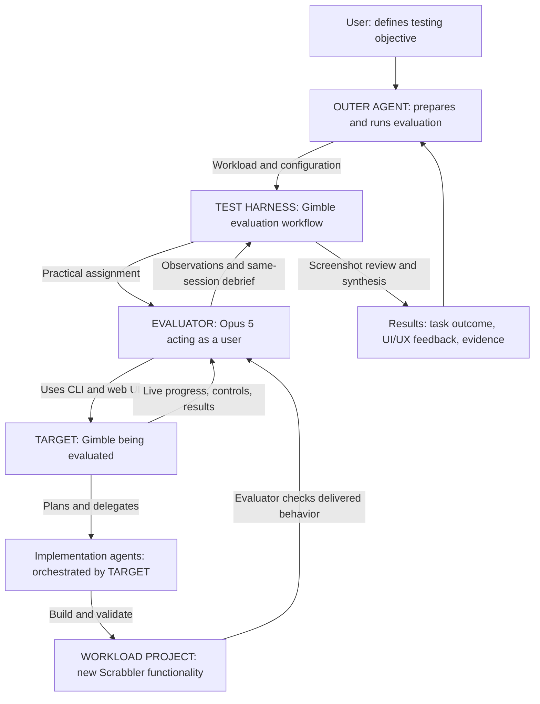

# Practical user testing: documentation foundation

Status: agreed intent, recorded 2026-09-20 before the next live evaluation.
This note is intended to become both external usage documentation and an
internal reference for evaluating Gimble itself. It is not a claim of proof.

## The contract

The TEST HARNESS arranges a user experience; the TARGET must actually deliver
that experience. Testing a product means using it for its intended purpose.
There is no substitute: replacing the assignment with an easier activity can
produce convincing artifacts while falsifying the conclusion.

1. The workload must require the TARGET's intended capability. For Gimble,
   that means orchestrating agents to perform actual new work.
2. The EVALUATOR accomplishes the assignment through the TARGET: initiates
   work, experiences execution, interacts with the product, and assesses the
   delivered result. Reviewing historical runs is a different use case.
3. The OUTER AGENT and TEST HARNESS preserve the assignment. Neither silently
   simplifies it, performs it on the evaluator's behalf, or bypasses the TARGET.
4. Source blindness applies to every primary product A under test. Its source
   must never inform the evaluator's assessment; public user docs are allowed.
   When A operates on another project B, B's source is permitted, but the
   evaluator should normally rely on A. A's implementation agents may inspect B.
5. Harness completion and target success are separate outcomes. A completed
   evaluation may honestly discover that the target failed. A polished report
   does not establish that the required user journey happened.
6. Evidence supports the assignment; it does not redefine it. Screenshots,
   recordings, elapsed time, agent turns, and reports cannot replace actual use.
   Duration follows the real work, not a desired completion time.
7. Interventions remain visible: instruction repairs, model changes, and
   recovery assistance belong in the account. Delivery of steering is not proof
   of compliance, nor proof that the agent could not have recovered unaided.

## External documentation: how to use the evaluator

Assign practical work as in a human user-testing session. Ask a neutral user to
accomplish a useful task and report usability, obstacles, and success. Avoid
exhaustive test scripts that duplicate unit or conventional E2E tests.

Prepare the desired product build, authenticated model providers,
`playwright-cli` and its browser, and one to three isolated workload directories.
For each workload provide a local assignment file describing the useful outcome,
permitted actions, and completion expectation. Provide local product user guides.
Use JSON or YAML with `product`, `guides`, `output_dir`, and `workloads`; each
workload supplies `name`, `assignment_file`, `workdir`, and `url`. Optional
foreground `start` and readiness `ready` commands let the harness own a service.
Paths resolve relative to the suite file. The current CLI help is authoritative:

```sh
gimble run validate-product --help
gimble run validate-product --suite-file /absolute/path/suite.yaml --no-web
```

The harness runs assigned tasks, then asks each same evaluator session for an
overall assessment and its three favorite and least favorite aspects of UX and
UI separately. Concrete observations matter; do not pad lists. Gemini Flash
opens screenshots to check readability and caption accuracy. A final agent
synthesizes findings. Keep this simple, flat, and explicit.

Screenshots should be ordered and captioned at meaningful moments. Video is for
optional human review. The output directory contains task reports, screenshots,
recordings, measured task durations, visual review, and final findings. Debrief
time is separate from task time. A failed agent turn is an execution error;
finding a product defect is a valid evaluation outcome.

Omit `issue_repo` for reports only. Set it to an authorized `owner/repository`
to publish actionable deduplicated product findings. Downstream project defects
do not belong in the target's issue tracker. The current workflow supports one
issue destination; downstream findings otherwise remain report-only.

## Internal reference: using the evaluator on Gimble



Gimble is both harness implementation and target here, with distinct
responsibilities. Scrabbler supplies a real purpose for using Gimble. Its
delivered feature demonstrates whether Gimble helped accomplish the task;
the evaluator's principal UI/UX assessment concerns Gimble.

The outer agent prepares an isolated B worktree and materializes the issue
locally. Keep the evaluator assignment outside B and pass only the feature
definition to Gimble's implementation agents, avoiding recursive delegation.
Use Opus 5 for evaluation and Sonnet or stronger for implementation and
implementation validation. Never use a cheap builder merely to shorten a smoke.

The evaluator launches the target implementation workflow with its own web
listener, omitting `--no-web`, and uses that listener for live observation.
A standalone history viewer can retain stale snapshots of externally owned
runs. Keep the real target process alive while observing; its terminal result
resolves stale-view disagreements. Preserve `.git` and `.gimble`.

The evaluator delegates coding and review, observes/interacts with Gimble during
execution, exercises the delivered feature, and opens a PR when authorized.
It does not inspect Gimble source or implement Scrabbler itself. The outer agent
observes rather than taking over. Any assistance must be reported.

## Next authorized exercise and the remaining proof gap

Run one workload: Scrabbler issue #1, drag-and-drop tiles, through to a PR.
Use the existing evaluator workflow, capture the real experience, and preserve
the user's separate public Scrabbler preview. No merge of the feature PR is
part of this assignment.

Earlier Scrabbler trials exercised real orchestration. The later short Opus
trial inspected recorded runs and proved same-session debrief plumbing only.
The complete Opus-led new-feature journey remains unproven until this exercise
actually happens. Report separately: harness execution, target delivery,
overall Gimble UX/UI, evidence limitations, and outer-agent interventions.

## Intended documentation destinations

- External: a task-oriented evaluator usage guide covering preparation, suite
  inputs, invoking the workflow, interpreting outcomes and artifacts, and issue
  publication. Use a concise example without this conversation's history.
- Internal: retain the role diagram, non-substitution contract, Gimble-on-Gimble
  setup, known monitoring pitfalls, and an honest account of live-run lessons.

Fold this note into those destinations after incorporating the upcoming run's
observations. No official documentation has been changed by this note.

## First new-work Opus trial: lifecycle limitation observed

The 2026-09-20 trial used Opus 5 for evaluation, Sonnet 5 for all target
implementation roles, Flash for screenshot review, and Astra for synthesis.
Opus started new work and explored the live Gimble UI, saving 13 screenshots.
After 6m11s it returned a waiting message expecting its background command to
notify it later. The harness treated that return as the completed task turn,
requested the debrief (which returned no text), and closed the recorded browser.
The target implementation was still running. No outer steering occurred.

The harness subsequently exited 0, while its synthesis correctly reported the
practical assignment incomplete. There was no evaluator verification of the
delivered feature, no PR, and no final user-experience debrief at that point.
This is direct evidence for distinguishing harness execution from assignment
completion, not evidence that the target implementation failed.

Operational guidance to carry into the next assignment: the evaluator must
remain in its active task turn, using its tool's supported wait mechanism while
delegated work runs, then verify delivery and produce the final report. Returning
an idle message is not a supported continuation mechanism for this workflow.
That instruction has not yet been tested as a repair. Do not claim the lifecycle
problem is resolved or add a general retry framework on the strength of this note.

The target later completed in 13m24s. Its independent Sonnet validator reported
passing browser checks for the required drag interactions and 18 passing unit
tests. This was the target's validation, not the missing evaluator's acceptance
exercise. The resulting Scrabbler change remains in its isolated worktree;
no feature PR was created. The outer agent did not implement, repair, or finish
the evaluator's assignment. Test listeners stopped and the user's separate
preview remained running.

Screenshot review and synthesis still yielded useful UI findings: inspector
overflow/readability, difficulty locating watcher outcomes, and search excluding
visible unstarted nodes. Synthesis correctly separated those observations from
unproved claims such as a broken fit-to-view control. Useful partial findings
do not turn this incomplete practical evaluation into a completed one.

## Sol rerun: complete practical journey

At the user's request, the next run selected `gpt-5.6-sol:medium` through
`--product-operation`, retaining Sonnet 5 implementation roles, Flash screenshot
review, Astra synthesis, and the same Gimble build and practical assignment.
A fresh Scrabbler worktree started from the same baseline; the previous attempt
was preserved. No waiting-workaround prompt change was introduced.

Sol initiated new implementation, observed the live UI through coding and QA,
recovered from the run-owned listener closing at completion, inspected the saved
validation result, and personally exercised the built feature in the recorded
browser. It then committed/pushed the Gimble-produced change and opened Scrabbler
PR #8, unmerged. The task took 14m49s and its same-session UI/UX debrief took 29s.
No outer-agent steering, code repair, or rescue was needed. This demonstrates the
intended practical journey for this run; it does not establish that Claude's
background-task lifecycle defect is fixed or that one model is universally better.

Sol disclosed its own shell-wrapper failure (assigning zsh's read-only `status`
variable after successful target completion) separately from the target result.
It recovered without restarting implementation. This distinction belongs in
outcome reporting: an observer's tooling error is not automatically a product
failure.

Independent screenshot review remained valuable: Flash spotted an initial 500
screen omitted by the tester's caption, two claims about activity below the
visible viewport, and an incorrect screenshot reference. Preserve those limits
alongside the successful task result. Screenshot review checks visual evidence;
it does not replace the actual interaction record or establish hidden behavior.
