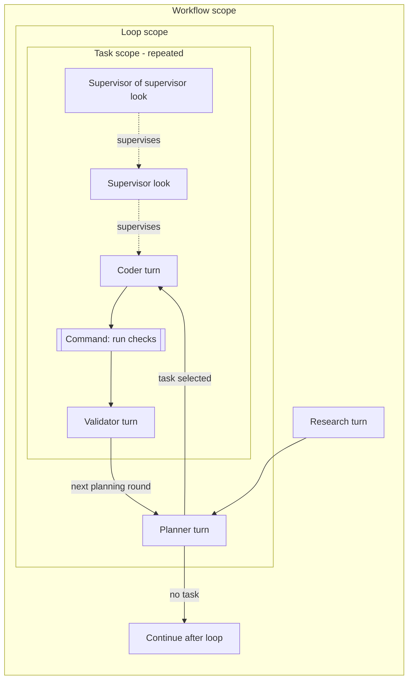

# Workflow graph and linting direction

Research against the repository revision in `repo-snapshot.txt` and GitHub issues retrieved 2026-09-14. This is a design recommendation, not an implemented graph generator. The smaller-model reports, primary-source downloads, and research probe are linked from the index.

**Latest direction from Tyler:** prefer an imperfect/incomplete linter over limiting workflow authors; keep dynamic Set keys supported for now, and avoid genuinely hard analysis while establishing the design. Historical constant-key rules below are evidence of earlier intent, not a current release prerequisite. A separate agent is assessing constant-key authoring in `keys-recommendation.md`. The immediate deliverable slices are in [delivery-slices.md](delivery-slices.md).

**Yes: a useful workflow graph can be extracted from this Go API.** The scope boundaries and blocking calls give the extractor considerably more structure than an arbitrary Go application. That does not make every possible Go program statically decidable, nor does a generated graph create runtime observations. The right contract is a graph of possible operations and relations, with actual instances and outcomes supplied by the runtime.

## Existing tasks

The complete coverage assessment and draft task sequence are in [milestone-assessment.md](milestone-assessment.md). Updated after user steering: #162 is the bounded Set analyzer and #201 is the bounded source graph extractor; both belong in Beta. #173 supplies the runtime scope/turn timeline and #120 proves supervision. Commands are missing from the current workflow observation contract. Useful program shape belongs in Beta; exhaustive analysis and exact runtime correlation do not gate the first delivery.

## Shape of the data

Use a **hierarchical graph with typed edges**, not one DAG of agents. Containment is a tree; loops and supervision need other relations. The model should be independent of the renderer.

| Element | Meaning |
| --- | --- |
| Workflow / scope region | Root, explicit Scope, Group with its child scopes, Loop region and repeated task body. A plain Go function call is not automatically a scope. |
| Session | Conversation/resource, owned by its creation scope. A fork is a distinct session with an origin relationship. |
| Agent call | One Generate source site; runtime may produce several turns from this site, including validation re-asks. Its execution scope can be below its session's owner. |
| Command operation | A workflow-owned external process execution. Construction with exec.CommandContext is not execution; Run/Output/CombinedOutput execute, Start begins and Wait joins. Shell contents can remain opaque. |
| Control points | Branch alternatives, repeated body/back edge, parallel launch and join. These can be visually small or hidden, but their semantics must remain in the data. |
| Scope values | Constant keys and write sites as inspectable metadata initially. Do not flood the first view with inferred dataflow. |

Relations have distinct meanings: `contains`, `uses-session`, `forked-from`, sequential/conditional/repeated control, parallel launch/join, `supervises`, and runtime `steers`. A lexical source order is useful layout metadata; it is not necessarily a must-happen-before edge. A known blocking A followed by B gives order if B is reached. Sibling Group children have no order between their executions even when their registrations are ordered.

A supervisor is a **session in a supervisory role**, not a special species of agent. Its attachment targets a particular worker call/turn and carries instruction and interval. Its periodic looks are turns, and a supervisor of that supervisor watches those looks. Represent the implicit look operation from the WithSupervisor contract, so the nested attachment has a precise target. An attachment is neither a completion dependency nor an approval gate. Keep planned attachments separate from actual look/steer occurrences: a short worker can finish before the first look.

The Loop contract similarly contributes an implicit planner call and a repeated task-scope template. These are semantically known API behavior, not workflow wrapper functions to add.

## An illustrative view

This is an explanatory template, not extracted output or the user's mockup. Solid arrows are control flow; dotted arrows are supervisory relations. Session ownership is omitted from this small drawing, but retained in the data.

For a parallel group, draw separate child regions with an explicit join before continuation. For a run, put those same regions on the wall clock, expand repeated task instances, and attach statuses and cost to observed turns. The timeline already requested in #173 is a natural runtime projection of this model.

## Session scope is ownership, not confinement of every call

Current design explicitly permits creating a researcher/planner/validator in a parent and using it in children. The built-in sprint relies on this. A child-created session must not outlive its owner; transferring ownership or using it in unrelated scopes is a different question from borrowing an ancestor's session for a child turn.

The static model needs both **owner scope** and **execution scope**. The runtime already records the execution scope on turns separately from the owner encoded in the session ID. Closing owned sessions at scope exit does not itself prove that all Go aliases, sibling uses, detached contexts, and goroutines comply. The lint needs a stated supported ownership discipline and must not treat current runtime checks as a complete borrow checker.

## Extraction and linting should share scope analysis

Load selected workflow entrypoints and reachable helpers with Go's package/type machinery. Identify Gimble and os/exec operations by resolved symbols, not spelling. Preserve AST source structure for regions and labels; use CFG/SSA where aliasing, branches, joins, and lifetimes require them. Treat valid context derivations as the same Gimble scope until a Gimble scope boundary creates a new one.

Direct helper calls matter: the current sprint passes context and sessions into `runTask`, and commands live in `command` and `git`. A function-local scanner would miss real graph structure. Start by following statically resolved helpers in the selected workflow package and binding their context/session parameters. Leave recursion, indirect calls, and difficult cross-package effects visibly unresolved. Package facts and more general function summaries are available later if real workflows need them. Do not make whole-program analysis a prerequisite.

Use the recognized scope/site facts for both diagnostics and generation, adding only the dataflow needed by a concrete check. Begin with the source shapes that the current built-in and compiling examples actually use, and exercise a separate importing module. An unsupported shape reduces analysis coverage; it does not prohibit the workflow from running.

Generate a compact JSON manifest via go generate; embed that JSON if the binary needs it. A Go literal is also workable, but it does not improve inference, and JSON is directly inspectable by both Go and the page. The manifest needs nodes/regions, typed edges, source locations, declared names, repetition/conditions, and explicit unresolved alternatives. It describes templates, not a predicted number of tasks, exact prompts, or concrete dynamic command arguments. Associate a run with the graph generated for its program so later source edits cannot reinterpret an old run.

Run the analyzer in the build/CI gate. Neither go generate nor go vet is implicitly run by every go build; adding a generator directive alone would not meet the user's build-time feedback requirement.

The checked toolchain already has the required foundation: Go 1.27 supports this repository's generic Generate method; x/tools provides typed package loading, CFG/SSA, analyzer facts, and the public inspector Cursor traversal API. Go 1.26's go fix rewrite shares the analysis framework used by vet. Those improvements help implementation and integration; they do not supply Gimble-specific lifetime inference. See the downloaded official release notes and `go-report.md` for version details and the local probe.

## Two limitations to expose while shipping the first visualization

**1. Identity.** Today a path of declared names, with runtime ordinals, identifies scopes and sessions. It does not uniquely identify every source site. Distinct sites can deliberately reuse the same name (the Group example does); several Generate calls on one session also share the same turn-name family. Runtime turn ordinals include re-asks and implicit planner/supervisor turns, so matching by ordinal is not reliable.

The graph can preserve source sites and say which runtime instances have multiple candidate sites. Ship that limitation: aggregate indistinguishable sites in the runtime view, or mark the source mapping ambiguous. Exact source-site lighting is not a first-release gate. An explicit named Scope is available where an author wants distinct runtime identity, including important command operations. Repeated executions of that declaration become instances. Where extra scopes are intrusive, retain the ambiguity rather than forcing them. A future call-site metadata mechanism is a separate decision; a generated JSON file cannot inject it. Do not use reflection, runtime.Caller, or silent source rewriting.

**2. Command observation.** Static extraction can locate ordinary exec calls today. The runtime cannot see their start, duration, exit status, or output merely because the manifest contains them. The current sprint records some command summaries through Set after execution; that misses the live interval, and its git helper is not equivalent to a command lifecycle record. Commands run by the agent inside a harness are a separate transcript detail.

The smallest first implementation to evaluate is a named Scope for one command operation, with ordinary os/exec inside and explicit result values. The manifest can render that region as a command operation. It yields a real scope interval and end state without hiding command semantics in a wrapper. Scope duration includes surrounding bookkeeping, however, and scope error need not equal process exit status; record command outcomes explicitly. A command begun with Start must be waited before that operation boundary ends if the interval is to represent the completed operation. Do not label the scope interval as exact process telemetry. If exact process timing, structured stdout/stderr references, or separate Start/Wait spans are required, the command task must add a small explicit runtime observation boundary. This is a product/API decision to settle, not something the analyzer can synthesize out of an unmodified binary.

## What to enforce first

Ship the useful subset of #162: local duplicate constant keys, direct reserved `task` writes, direct Background/TODO misuse, and obvious wrong-ancestor/raw-go writes. Include inexpensive aliases or recognized context derivations where straightforward. Skip a context relation the checker cannot establish; in particular, do not reject a derived child context merely because it is a different identifier. Keep runtime panics and cleanup as backstops. A clean lint result means no supported misuse was found, not that the workflow is proven safe.

Keep dynamic keys legal. They do not prevent finding scopes, agent calls, supervisors, commands, or control flow. The static value inspector can show the key expression or an unknown key; the run supplies the actual keys. Do not migrate the sprint merely to satisfy the analyzer. Constant keys may become an authoring recommendation after the separate case study, but that is distinct from rejecting programs. General Group-join and session-escape proofs can wait. `Get`, `GetJSON`, and `Each` are still open in #105, so target the API that exists rather than treating design examples as available calls.

## Display choices

Default to scope regions and execution flow. Show supervisor attachments as an overlay or side lane, and make command operations visible peers of agent calls. Expand repeats and transcripts on demand. Keep call/callee relations internally for analysis and source navigation, but make their visual overlay opt-in: otherwise every ordinary helper obscures the workflow. Fork and steer edges can likewise be inspected without turning the default view into a general call graph.

Set values and ScopeText are useful inspection surfaces; they are not proof that a particular prompt included a value. The workflow explicitly constructs prompts, and Generate injects nothing. Do not infer semantic data dependencies merely from temporal adjacency or shared scope.

## Proof boundary

This research establishes a supported path, not a completed analyzer, complete lifetime proof, or implemented UI. The research probe checks the current toolchain's ability to recover relevant typed sites/SSA, as detailed in the Go report. Each small delivery slice has its own narrow proof in `delivery-slices.md`; the complete graph can grow to demonstrate parent-session/child-turn placement, exclusive branches, repeated scopes, parallel children, nested supervision, commands, and consumer modules. Runtime replay must agree with the observations it claims to show, and unresolved source mappings must stay visible. None of the harder cases is a reason to delay the useful subset.

No screenshot attachment was present in the received task. The visualization assessment used the repository's web design document and code.

## Constant-key case study outcome

The separate smaller-model review recommends constant outer keys as a default convention, while retaining dynamic keys. The sprint's fixed check list could become one `repository checks` slice, but aggregation delays updates and can lose partial evidence on early return unless separately handled. Putting results only in child scopes also changes Loop planner feedback, which currently reads direct task values. These are authoring/behavior tradeoffs, not reasons to block the linter or graph. See [keys-recommendation.md](keys-recommendation.md) and [keys-evidence.md](keys-evidence.md). The immediate priority remains the small deliveries in `delivery-slices.md`.
