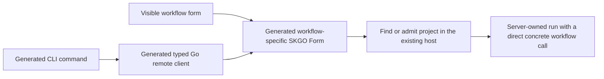

# Implementation plan: one remote entrypoint per compiled workflow

Status: planned, not implemented. Based on Gimble `cde79c24` and the subsequent
conversation with Tyler. Completion is defined in
[definition-of-done.md](definition-of-done.md).

## Scope amendment (2026-09-23)

At the user's direction, visible human start forms and their browser/UI proof
are deferred from the current CLI integration outcome. This outcome covers the
five generated CLI-to-SKGO-client paths, their shared Form handlers, removal of
generic workflow dispatch, and the focused/lifecycle evidence named by its task.
Do not implement start-form pages or claim UI acceptance here. The separate UI
outcome will not run in this workflow; visible forms remain an explicit gap for
the caller to track outside this delivery.

This plan supersedes the separate JSON launch endpoint recommendation in
[assessment.md](assessment.md). Browser and CLI will call the same generated
SKGO remote endpoint. The dependency correction is the first implementation
step toward that agreed architecture.

## Intended result

A human can start any existing built-in from the web application. The ordinary
CLI, including an agent invoking it, starts the same workflow through the same
remote function. The serving process admits the supplied project on first use,
starts the workflow, and returns its run ID. Closing either client leaves the
accepted run under the server's ownership.

Workflow definitions are ordinary Go written at design time. Generation and
compilation produce their remote handlers, CLI clients, and graph metadata
before the server starts. Runtime requests supply inputs and directories;
they never add workflow definitions or select an executable from a workflow
name registry.

The five built-ins in this scope are `review`, `implement`, `research-document`,
`pyramid-summary`, and `validate-product`.

## 1. Make the package dependencies point one way

The present generated workflow file combines the body package's graph with
Cobra/client code importing `web`. A remote handler importing that workflow
would complete `web -> internal/skgo -> routes -> workflow -> web`.
Moving only the CLI code is insufficient if the remote handler still needs
to import `web` to admit a project or own a run.

Separate the existing responsibilities as follows. This is relocation of
existing ownership, not a new workflow framework:

| Responsibility | Location and allowed dependencies |
| --- | --- |
| Workflow bodies, parameters, and generated graphs | Existing workflow packages; depend on Gimble, without importing CLI code, generated remote bindings, or web assembly. |
| Project admission, project/run context, run lifetime, and conversation association | An internal host package below web assembly; uses the existing Gimble, observation, live-control, and conversation machinery. It knows no built-in workflow implementations. |
| Concrete remote handlers | Go beside the web routes; depend on workflow packages and host ownership. Each calls a particular workflow directly. |
| Generated remote clients and Cobra commands | Application/client packages outside workflow-body packages; use the generated input/result contracts and SKGO transport. |
| Listener and page assembly | `web/`, retaining `web/server.go` as the shared production handler assembly for binary and tests. Depends on host ownership and generated bindings. |

Move the necessary context helpers out of `web/src` when lower-level ownership
would otherwise import the web application. The root `gimble` package must
continue to be independent of the host and web assembly. Update callers of
moved code directly; do not leave compatibility aliases or forwarding layers.

Keep ordinary lifecycle callbacks where already useful: a remote can pass a
closure containing a concrete workflow call to the run owner. Do not use a
name-to-function map, erased parameter callback, or workflow-specific methods
on a host interface to break the import cycle.

Primary changes: `internal/generate/command.go`, `internal/generate/source.go`,
generated workflow files, `cmd/gimble/workflows.go`, and the ownership portions
of `web/runtime.go`, `web/control.go`, and `web/src/project.go`.

Result: both a generated route and application assembly can import a workflow
without a cycle, and workflow bodies remain readable ordinary Go.

## 2. Teach SKGO to generate Go clients for these remote Forms

Implement this in an isolated SKGO worktree, following that repository's
instructions. Gimble currently pins SKGO v0.5.0; inspect the implementation
checkout before changing it rather than assuming the pinned source is latest.

SKGO should generate a typed Go call for each selected remote Form using the
same declaration, endpoint identity, input type, and result type as its server
and browser bindings. Shared transport code in SKGO owns the enhanced-form
envelope and response decoding. Generated Gimble commands must not contain
private copies of the SvelteKit wire protocol.

The client accepts the configured HTTP transport, so Gimble can use its Unix
socket. It returns the typed result or field/server errors, honors caller
cancellation, and does not automatically retry a submitted mutation. Browser
query refreshes and navigation do not need to be reproduced in Go.

Support the scalar inputs these workflows need, including omitted Optional
values and explicitly supplied zero, false, and empty values. Fix SKGO's form
binding, which currently bypasses Polytype codecs and cannot assign a scalar
to `Optional[T]`. Reuse the existing Polytype devalue support. Do not add
general map support, reflection-based workflow discovery, or support for every
remote kind as a prerequisite to launching workflows.

Primary SKGO areas: `internal/gen/`, `remote_form.go`, `internal/formdata/`,
and the new supported Go client transport. Verify the encoder against real
SvelteKit-produced fixtures and the same handlers called by a browser, rather
than relying only on an encoder/decoder round trip written together.

Result: a generated Go client and a real browser form can call one SKGO Form
and obtain equivalent admission results and field errors. Land and publish
the needed SKGO change, then pin that version in Gimble; leave no local module
replacement in the delivered build.

## 3. Generate concrete starts and admit projects on first use

For each built-in, generate a distinct typed start function declared as a
`skgo.Form`. Its handler contains the concrete workflow call and a constant
workflow name used for recording. There is no executable selection from an
input name, union discriminator, or generic submission envelope.

The request contains the owning project directory, execution workdir,
workflow-specific parameters, known role model choices, and optional
conversation association. Generate fields for the actual roles instead of
putting a free-form model map on the wire; construct the existing binding map
inside the server. Add the appropriate `json:",omitzero"` tags to Optional
inputs. Preserve current meanings of omitted and explicitly supplied values.

Use one source for role defaults, currently `cmd/gimble/defaults.json`, accessible
to server admission, generated help, and the forms. A default or override must
mean the same thing in either client. Keep provider/executable configuration
in the server's startup environment.

The handler decodes and validates inputs, finds or admits the canonical project,
validates workdir/conversation ownership and model choices, and starts the
concrete body under the project/server context. Reject admission errors before
creating a run. Preserve workflow-internal validation that legitimately occurs
during execution; transport work does not redefine each workflow's algorithm.

Reuse the existing admission lock, live publication, panic handling, active-run
tracking, and conversation bookkeeping. Return the run ID and project identity
needed to open its existing page only after the run is registered. Completing
the HTTP request must not end the workflow's context.

Start remotes are instance-scoped: their request supplies the project, including
a directory the server has never seen. They cannot sit behind middleware that
requires a pre-admitted project. Existing project-scoped observations and
controls retain their ownership checks. Make instance discovery/liveness
independent of a project's admission, retaining explicit instance selection
and startup.

Mount the same generated start remotes on the browser listener and the existing
control socket, including with `--no-web`. They use the same remote identities,
typed handlers, and validation. Preserve browser origin handling; the local
client must not need to fabricate a browser Referer to select a project.

Result: an already-running server accepts first use of an arbitrary valid
project directory through a concrete workflow remote, without another server
process, listener, or project-registration command.

## 4. Connect the CLI and human start forms

Generate each existing Cobra command to call its corresponding SKGO Go client.
Keep its meaningful flags, help, project/workdir separation, model overrides,
conversation association, immediate run-ID output, and `--follow` behavior.
Missing or incompatible endpoints should produce actionable errors; do not
fall back to local execution or introduce a compatibility dispatcher.

Add a visible start form for each of the five built-ins, reachable from the web
application without asking a conversation agent to launch it. Let the user
select or enter the owning project, including a previously unknown directory,
then supply the workflow inputs and optional overrides. Keep forms typed to
their generated remote, with labels/help derived from the workflow's documented
inputs and the existing UI primitives.

Use real `skgo.Form` bindings on visible forms, including pending and field
issues. Optional override controls must distinguish using the default from
explicitly entering zero or an empty value. Return admission data rather than
a browser-only redirect: the page opens the admitted run through SvelteKit
navigation; the CLI prints/follows it. Page identity stays in route paths.

Conversation agents keep using the ordinary CLI, so their launches inherit this
same path. Update the two example commands affected by generated-command
relocation to work as explicit standalone examples; their workflows do not
become new stock built-ins as a side effect.

Result: humans and agents can start all existing built-ins, and the initiating
client does not change the meaning or ownership of a run.

## 5. Remove replaced wiring and establish completion

Delete `/control/submit`, its generic `Submission`, the executable workflow
registry, `WorkflowEntry`, `WithWorkflows`, and generated `Hosted` adapters.
One build-time built-in selection must produce the CLI and remote wiring
consistently. SKGO's normal generated HTTP routing remains; it is not an
additional workflow execution registry.

Update generator tests to cover the actual typed call chain instead of requiring
the old dispatcher. Generation must recover from missing/stale generated files
and be reproducible from a clean checkout. Update README, rendered help, the
maintained Gimble skills, and affected architecture/web documentation to describe
the implemented behavior. Remove design-record suggestions of a generic
workflow union dispatcher where they conflict with this decision.

Demonstrate the claims in [definition-of-done.md](definition-of-done.md) through
the real binary and browser, with focused package tests for the transport and
ownership boundaries. An independent validator assesses whether those
observations establish the requested behavior. Report proof in chat or the PR;
keep repeatable checks as ordinary package tests.

## Scope boundary

This plan includes the dependency correction, the required SKGO client/form
work, shared remote starts, first-use project admission, and human start forms.
It does not add runtime workflow definitions, plugin loading, a separate REST
launch API, a general form-builder product, automatic server startup, mutation
retry/deduplication, or a new scheduler. Existing standalone `gimble.Run` and
`run-prompt` remain separate modes.

The assessment's retention, SIGTERM, and lint-index observations are separate
follow-ups unless a concrete regression in the moved code makes one necessary
for these completion claims. Do not make them new gates for this change.
