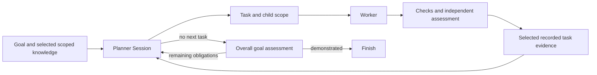

# Gimble / Loop review — 2026-09-12

Reviewed merged commit `2a52971730d7e193b38e882e5b26b9885bd3edce`, [PR #140](https://github.com/tylergannon/gimble/pull/140), against its parent `253b54d`. This is a review, not an implementation or a merge recommendation. Production source was not changed. Review programs, evidence and a deliberately isolated toy project live beside this document.

**Judgment:** Keep this paradigm. A planner-driven iterator yielding a scope and a useful assignment is a worthwhile abstraction for an outer agent loop. The programming model is substantially closer to the desired ordinary-Go DSL after #140. Its strongest quality is the division of authority: the planner proposes work, the Go program decides what to execute and validate, and the enclosing workflow decides whether the goal is fulfilled. The weak areas are context selection, enforcement of runtime lifetimes and bounds, and the operator's view of the workflow.

The useful comparison with Go is not how few lines the library contains. It is how much a reader can predict from a small vocabulary. `Run`, `Scope`, `Group`, `Session`, and `Loop` mostly combine predictably. The exceptions below are places where the runtime does something important that the surface program does not reveal or cannot control.

The composition I would preserve is:

The diagram describes the workflow's responsibilities. Loop itself implements dispatch and direct task-record feedback; it does not implement the validator or final assessment.

## Three positive marks

### 1. The control flow remains the program

`for ctx, task := range loop.Tasks` is a good interface. The assignment and its lifetime arrive together. Local branching, retries, independent checks, nested workflows, worktree creation, and explicit joins can all remain ordinary Go. Nothing requires a separate graph language, a callback registry, or named delivery tactics. A workflow author can inspect the code and see who plans, who works, who reviews, and what happens after a failure.

The important gain in #140 is moving automatic command execution out of Loop. `Task.Validation` is data; the program decides whether and how to run its command or question. This lets an investigation, an implementation, and a manual demonstration share the same dispatch mechanism. The root Loop implementation is only 217 lines including its task type, file handling, validation and prompt. That is an appropriately small amount of machinery for the capability.

`Group.Go` and `Wait` also provide a familiar composition boundary. The live review workflow uses a group for deterministic checks and an independent agent review, then explicitly joins their results. No new framework was required.

### 2. The new Task is an assignment an agent can actually use

Replacing `Task{Lap, Text}` with Name, Description, DefinitionOfDone, and Validation is a real semantic improvement. A worker can distinguish the desired result from the evidence that would establish it. An investigative task can succeed while finding that the wider goal is still unmet. The task has no fake progress score and does not confuse the planner's work decomposition with the user's promises.

The same structured assignment travels through the planner response, backlog, yielded Go value, task-scope value, and durable lifecycle record. Value copying and serialization preserve the dispatched assignment even if the backlog later changes. The PR's focused tests exercise those representations, malformed assignments, direct scoped feedback and early exit/cancellation.

Keeping dispatch exhaustion separate from fulfillment is correct. An outer program can independently assess the result and start another Loop with the remaining obligations. This does require a visible final gate; `loop.Err() == nil` alone is not a success certificate. That requirement belongs in the canonical examples so a new author learns the complete idiom.

### 3. The runtime has a credible foundation for composition and evidence

Scopes use immutable snapshots and nearest-scope shadowing. `Generate` does not silently add scoped text to a caller-supplied prompt. A workflow can create a fresh session or deliberately reuse/fork conversation history. Those choices matter to agents, and keeping them explicit is valuable.

The harness boundary supports Codex, Claude and Antigravity without exposing each native protocol to the workflow. The web package depends on the runtime, rather than the runtime depending on web assembly. Observation uses a runtime-owned registry, snapshots plus ordered live updates, isolated subscriber queues and native provenance. The session-state port has prefix-by-prefix oracle comparisons. Supervisor recent-history retention and prompt size are explicitly bounded. These are concrete signs of care beyond happy-path orchestration.

The complexity is concentrated in native event translation and session projection, where much of it is warranted. I would preserve that separation rather than trying to make internals look as tiny as the public workflow.

## Three things to fix, in priority order

### 1. Make scoped context selectively composable

**Current limitation, not a regression introduced by #140.** The public API has the write half and an all-visible-values renderer, but no typed selective reads. [Issue #105](https://github.com/tylergannon/gimble/issues/105) already records the missing read half. `ScopeText` in [scope.go](/Users/tyler/.codex/worktrees/loop-api-review/gimble/scope.go:153) renders every visible key. Loop calls it internally in [loop.go](/Users/tyler/.codex/worktrees/loop-api-review/gimble/loop.go:98). A workflow cannot select just requirements, current evidence and one research result from the store without retaining a separate Go-side copy of them.

There is also a sharp composition boundary: Loop's next prompt includes only the values written directly in the completed task scope, via `localText` at [loop.go](/Users/tyler/.codex/worktrees/loop-api-review/gimble/loop.go:138). A validator nested under `Scope` or `Group` can record a failed check durably while the next planner never sees it. The focused public-API probe prints `direct=true nested=false`. This is consistent with the current contract; the problem is ergonomic completeness, not that all descendants should automatically leak upward.

In the live workflow I held the nested results in Go variables, joined the group, and explicitly recorded selected results again in the task scope. That works and preserves intentional information flow. It also shows the current cost: the author must maintain both a scope store and ordinary variables because the store cannot be selectively read.

**Concrete next work:** Write a two-role workflow in which each agent gets a different selection of the same recorded research, and a nested validator returns selected evidence to the next planner. Complete the smallest scoped-read/projection support that this program actually needs. Preserve explicit promotion; do not make all child values automatically visible. Retain the original evidence once and make provenance available when rendering or referring to it. Prove which values each actual agent received, including omission and shadowing.

Only the latest task record is supplied automatically; older evidence survives through planner conversation history or whatever the planner retains in its backlog. That is a reasonable small starting point, but it is not yet an explicitly queryable body of run knowledge.

A scope controls the next prompt projection, not the agent's entire memory. A reused or forked session retains previous turns; shadowing a value does not remove it from that history. Native host instructions, skills, memory and workspace files also contribute context. The live Codex transcript visibly read global skills and memory in addition to the supplied scoped prompt. This makes it particularly important to document and display the complete input composition. Scopes are not a confidentiality or filesystem-isolation mechanism.

### 2. Make hidden Loop work bounded and session ownership real

**A new Loop defect plus an existing ownership defect.** At [loop.go](/Users/tyler/.codex/worktrees/loop-api-review/gimble/loop.go:107), every invalid revised backlog causes another planner call before the iterator yields. A counter inside the range body cannot bound those calls. In the probe, eight malformed answers caused nine planner calls and zero yielded tasks despite a one-task limit; the fake harness stopped the ninth call. An ordinary context deadline still bounds elapsed time, but the task limit does not bound planning attempts or cost. Missing or inconsistent selected tasks, meanwhile, fail immediately. The retry policy is both hidden and inconsistent.

The live exercise hit this path too: while incorporating the new parallelism requirement, the planner wrote a description containing an unquoted colon, producing a YAML scanner error and an extra repair turn before dispatch could continue. The synthetic probe shows what happens when those repairs never succeed.

The current protocol also asks the planner to edit a YAML file and return the exact same Task in a structured result. The runtime checks consistency, which is good, but the two-step protocol creates opportunities for partially completed decisions. This is an operational design cost of the otherwise simple iterator.

Separately, [scope.go](/Users/tyler/.codex/worktrees/loop-api-review/gimble/scope.go:85) marks sessions closed and emits `SessionClosed` without releasing adapter resources. The Codex adapter retains a fresh app-server connection for a fork until its first turn. A fork that is abandoned leaks the process past scope and Run completion. The probe used the real Codex adapter against a mock app-server, primed a parent, created an unused scoped fork, and found the fork's process still alive after Run returned. It then explicitly terminated that process. This confirms existing [issue #108](https://github.com/tylergannon/gimble/issues/108); it is not a new #140 regression.

**Concrete next work:** Make malformed planner responses terminate or repair under a visible finite policy, so a caller can use ordinary Go to choose subsequent retries. Prove that a perpetually invalid planner stops predictably without entering the task body. Close and join every native resource owned by a scope, including unused forks and error paths. Prove process disappearance, not just the closed-session error on the next Generate. Long-lived outer loops multiply these small lifecycle holes.

Keep the iterator, the chosen planner Session, and visible workflow validation. These repairs do not require adding a management framework.

### 3. Give the operator a truthful workflow view and working controls

**Incomplete runtime capability, with demonstrated outcome-reporting defects.** I opened the running merge-queue workflow in the production web app. It streamed planner/worker transcript content, model names, tool activity and accounting. That is useful. It does not yet give an operator the Loop's current task, backlog, scope contents, nested validation, unresolved obligations or dispatch-stop reason as first-class workflow state. There are no run-start, steer, interrupt or cancel controls in the current page. The home page is documentation rather than a run list.

This is not just a missing visualization. [RunSnapshot](/Users/tyler/.codex/worktrees/loop-api-review/gimble/internal/observation/snapshot.go:60) contains run/session information and invocations; it does not contain the scope-data or planner-decision state needed to restore that view. The frontend lifecycle reducer likewise drops those event kinds. A designer cannot recover this information by restyling the transcript viewer alone. The existing run JSONL does retain it.

The terminal story also needs repair:

- Passing the actual cancellation event stream through the TypeScript `RunObservation` gives `failed`; the Go snapshot says `cancelled`. The frontend's unconditional `run_ended` case overwrites the earlier cancellation, whereas the server preserves it. See [index.ts](/Users/tyler/.codex/worktrees/loop-api-review/gimble/web/src/lib/observation/index.ts:81) and [cancel-parity.txt](/Users/tyler/.codex/worktrees/loop-api-review/gimble/ephemeral/review/loop-api/cancel-parity.txt).
- [Session.turn](/Users/tyler/.codex/worktrees/loop-api-review/gimble/session.go:189) records execution success and an error-free TurnEnded before [Generate](/Users/tyler/.codex/worktrees/loop-api-review/gimble/session.go:80) validates and decodes the output. The rejection probe returned a schema error while the turn's recorded error remained empty. A failed typed Generate needs an authoritative observable outcome at that level.
- Returning an error from a Loop range body closes the task and loop with empty scope errors; the error is visible only at the enclosing Run. The iterator cannot see the surrounding Go return value. Treat those scope events as lifecycle termination, and provide a clear explicit task-result convention instead of interpreting an empty scope error as validated success.

**Concrete next work:** Make the running page show the current assignment and its Definition of Done, the selected context and evidence, nested work, and why dispatch stopped. Wire the existing session controls to live runtime ownership and show whether steering actually landed; existing [issue #107](https://github.com/tylergannon/gimble/issues/107) identifies the acknowledgement gap. Use the same outcome rules for the initial snapshot, live events and reload. Demonstrate an operator intervening during a real Loop and then reloading to see the same evidence and result.

## Review of PR #140 specifically

The PR moves the design in the right direction. It removes the iteration counter from task identity, restores meaningful assignments, exposes validation in the sprint's Go code, introduces useful feedback, and preserves dispatched tasks in durable events. The sprint still performs an overall validator pass after the planner stops, and can dispatch objections in another round. Those are the right authority boundaries.

The live evidence retained by the PR establishes a controlled failure-to-repair sequence and a planning-only departure from a supplied phase order. It does not establish a long-running production scheduler or the full monitoring/interaction experience. Its fixture primarily changes status/guide files. This review therefore adds a more substantial coding exercise, described below, and targets failure paths not covered by its happy-path proof.

The largest conceptual tradeoff left in Loop is its opinionated planner protocol. It supplies a fixed planning prompt, includes all visible scoped values, requires filesystem access to a runtime-owned backlog, and calls a persistent Session. That is useful for the supported local coding harnesses, but it is more than a generic iterator and not entirely host-neutral planning. An adapter that can only return structured JSON cannot implement this protocol without a way to edit the backlog. The existing adapter tests parse that path out of English. Keep this limitation explicit; do not claim the `HarnessAdapter` interface alone establishes compatibility with arbitrary remote planners.

The fixed Task shape currently seems sufficient. Generic Task payloads, automatic CEO logic, a promise registry, custom scheduling DSLs and high-level delivery wrappers would add concepts before there is evidence they are necessary. The real pressure points found here are reliable ownership, selective context and observation of the program already being run.

## Evidence and limits

- Production code inspected: root API/runtime, #140 diff and design records, sprint consumer, three adapter implementations/event bridges, observation store and routes, session projection structure and tests, and the web observer/viewer.
- `just build`: passed.
- `go test -race -count=1 ./...`: passed after building web assets.
- `go vet ./...`: passed after build.
- Web test command: eight tests passed. `pnpm check`: zero errors and warnings.
- The first test attempt in the fresh checkout failed because the generated web manifest was absent. Build resolved it; this is the known fresh-checkout prerequisite in issue #112.
- The [public-API probes](/Users/tyler/.codex/worktrees/loop-api-review/gimble/ephemeral/review/loop-api/probes/main.go) and [results](/Users/tyler/.codex/worktrees/loop-api-review/gimble/ephemeral/review/loop-api/probes.txt) establish context projection, retry behavior and recorded outcomes using a fake harness. The [fork probe](/Users/tyler/.codex/worktrees/loop-api-review/gimble/ephemeral/review/loop-api/fork-probe/main.go) uses the real adapter and a mock process protocol.
- No new live claim is made about Fork's conversation fidelity, supervisor steering, Antigravity, parallel coding worktrees, process-crash recovery, or day-long loops. Their source and existing tests were reviewed; this exercise does not re-attest every harness capability.

## Live exercise

The first task implemented a dependency-aware merge-queue CLI with strict JSON input validation, whole-graph cycle checks, deterministic scheduling, transitive blocking, tests and a README. All 25 fixed external base cases passed, including 12 generated DAGs, and Claude Haiku returned PASS.

The test then disclosed a new requirement in the task's recorded feedback and SPEC.md: `--parallel N` must cap each wave and reject invalid limits. All six new checks initially failed. The same planner incorporated the new evidence, revised its remaining work, repaired a malformed YAML backlog, and dispatched “Implement --parallel scheduling and update its proof.” The second task passed all six new cases, retained all 25 base passes, and received another Haiku PASS. The planner then ended dispatch; the enclosing workflow independently reran both external suites and returned nil. The final snapshot is `completed`, and the terminal `Complete` record has no recording error. I separately executed both README examples and checked their exact JSON outputs.

The reproducible workflow is [main.go](/Users/tyler/.codex/worktrees/loop-api-review/gimble/ephemeral/review/loop-api/main.go), with fixed external [base acceptance](/Users/tyler/.codex/worktrees/loop-api-review/gimble/ephemeral/review/loop-api/acceptance.py) and [parallelism acceptance](/Users/tyler/.codex/worktrees/loop-api-review/gimble/ephemeral/review/loop-api/parallel.py). All artifacts are local; none were published.

| Observation | Result |
| --- | --- |
| Models | Codex `gpt-5.6-luna` planner/workers; Claude `haiku` reviewers |
| Coding assignments | Two, both chosen by the planner |
| Planner turns | Four: initial dispatch, adaptation with malformed YAML, repair/dispatch, stop |
| Initial fixture | 0/25 base cases passed |
| First implementation | 25/25 base cases; Haiku PASS |
| Newly disclosed parallelism requirement | 0/6 initially, then 6/6 after the second assignment |
| Final independent commands | 25/25 base and 6/6 parallelism cases; exit 0 for each |
| Role context | Recorded prompts show planner, worker and reviewer role shadowing correctly |
| End state | Planner STOP, Run returned nil, checkpoint completed, no recording error |
| Duration | Approximately 15 minutes 26 seconds |

The run is retained in [run.jsonl](/Users/tyler/.codex/worktrees/loop-api-review/gimble/ephemeral/review/loop-api/project/runs/20260912-061254.mergequeue-review/run.jsonl), with individual native transcripts beside it. The compact [summary.json](/Users/tyler/.codex/worktrees/loop-api-review/gimble/ephemeral/review/loop-api/summary.json) records tasks, prompt composition, assessments and gate results; [live.txt](/Users/tyler/.codex/worktrees/loop-api-review/gimble/ephemeral/review/loop-api/live.txt) records the sequence and the YAML repair. [README proof](/Users/tyler/.codex/worktrees/loop-api-review/gimble/ephemeral/review/loop-api/readme-proof.txt) contains the directly verified examples.

This is a non-trivial toy CLI, not proof of production delivery in merge-herder or go-github-server. It demonstrates adaptive implementation, role shadowing, grouped validation, explicit evidence promotion, and independent fulfillment checks. It also demonstrates some of the cost of the native host's orientation and Loop's planner/file protocol; it is not a comparative latency or cost benchmark.

The review web server was stopped after the workflow had completed and its final records were verified. The enclosing `go run` process therefore ended by termination during its post-run serving delay; this was not a workflow cancellation or failed acceptance run. The isolated worktree and evidence remain available. The root checkout is unchanged at the reviewed SHA.
